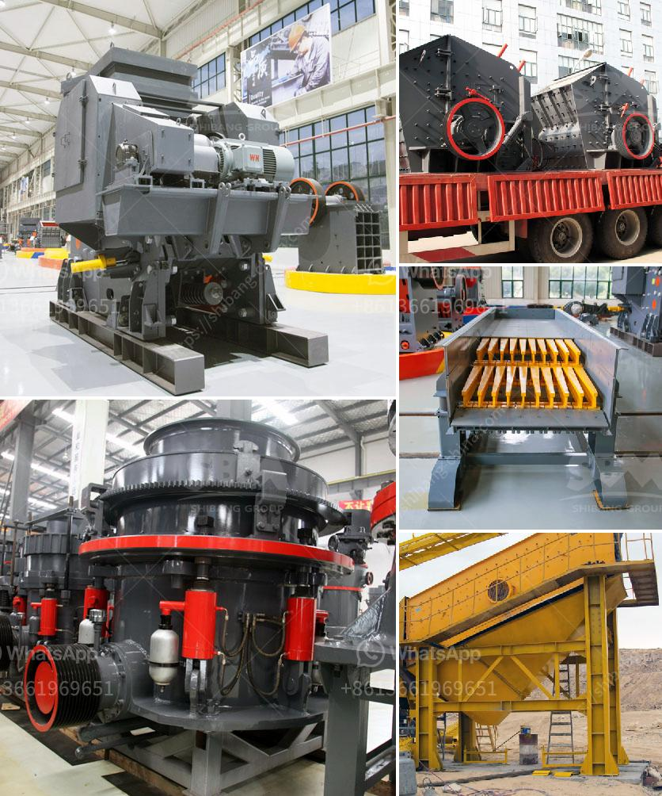

<h3>What is the difference between impact cone jaw crushers ?</h3>
Crushing equipment is widely used in all kinds of industries nowadays. The working principle of crushing machines is different from each other and crushing equipment has its own characteristics. Jaw crusher and impact crusher are commonly used crushing equipment in crushing operations. Although both of them are big crushing apparatus and consist of fixed jaw plate and movable jaw plate, there are lots of differences between them in actual operation.

Firstly, the application of jaw crusher is the widest range, mainly used in mining, building materials, chemical industry, metallurgy and so on. Its crushing cavity is deep and can handle various materials with high hardness and large particle size. While impact crusher is usually used for secondary crushing or tertiary crushing, which can meet the requirements of small particle size.

Secondly, the working principle of jaw crusher is different from that of impact crusher. The crushing cavity of jaw crusher is composed of fixed jaw plate and movable jaw plate. The fixed jaw plate is fixed vertically on the fuselage body, and the movable jaw plate is in the inclined position. The movable jaw plate continuously moves to the fixed jaw plate periodically. When the two jaw plates meet, materials are squeezed, impacted and crushed. On the contrary, the impact crusher has a vertical shaft rotor, and it mainly relies on the impact hammer to complete the crushing operation.

Thirdly, the discharging granularity of the materials produced by impact crusher is uniform, and the grain shape is good, which can meet the requirement of second-class crushing and fine crushing. Therefore, the materials crushed by the impact crusher have an excellent particle shape. The jaw crusher adopts the extrusion technology. This principle achieves a "mutual squeeze" between the movable jaw plate and the fixed jaw plate materials will be crushed. When the movable jaw plate moves away from the fixed jaw plate, the crushed materials will be discharged from the lower part of the crushing cavity.

With the continuous development of economy and the increasing demands of mining equipment in the market, the jaw crusher, cone crusher, and impact crusher have become more and more popular. In the actual production, jaw crusher can be used wisely in mining, construction, building materials, etc. But cone crusher is more often used in ore processing and impact crusher in construction and building materials. Therefore, the different crusher cavity has different requirements for the feeding size.

Lastly, jaw crusher is also mostly used in complex stone crushing operations. It always deals with large pieces of materials with high hardness. As a result, it has a high failure rate. The jaw crusher is a reliable crusher with a high crushing efficiency. However, it is difficult to control the shape of the final product.

Lastly, the impact crusher is suitable for crushing stone materials with low hardness, including limestone, limestone, etc. Its discharge size can be adjusted according to the different needs of users. Xuzhenybiaoti effect of two stage crusher crusher can be widely used in crushing high hardness materials, such as river gravel, granite, basalt, iron ore and so on.

In conclusion, the choice of crushing machinery depends on the characteristics of different materials. Horizontal shaft impact crusher (HIS) and vertical shaft impact crusher (VS) are the two main types of impact crusher. Short head cone crusher price used is a medium-sized model in the stone crusher series. Its feed size is less than 100mm, and the finished product size is 5-10mm, 10-20mm, or similar size. But the particle size of the upper screen is finer.
<h3>Contact us</h3><ul><li><strong>Whatsapp:&nbsp;<a href="https://wa.me/8613661969651">+8613661969651</a></strong></li><li><a href="https://swt.shibang-china.com/?git&amp;zhl&amp;What is the difference between impact cone jaw crushers "><strong>Online Service(chat now)</strong></a></li></ul><h3>Related</h3><ul><li><a href='What is 42 and 65 in 42×65 gyratory crusher.md'>What is 42 and 65 in 42×65 gyratory crusher?</a></li><li><a href='What is the purpose of using hydraulic cylinders in cone crushers.md'>What is the purpose of using hydraulic cylinders in cone crushers?</a></li><li><a href='What equipment is used to extract iron ore .md'>What equipment is used to extract iron ore ?</a></li><li><a href='What is the best iron ore mobile crushing plant？.md'>What is the best iron ore mobile crushing plant？</a></li><li><a href='What type of flywheel is used in the double toggle jaw crusher.md'>What type of flywheel is used in the double toggle jaw crusher</a></li></ul>