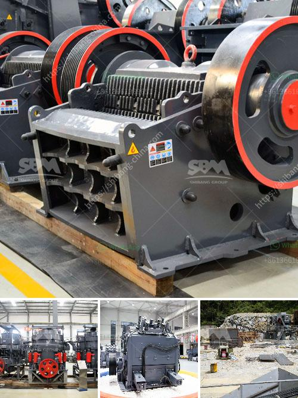

<h3>What is the difference between impact crusher and jaw crusher?</h3>
When it comes to crushing equipment, impact crushers and jaw crushers are among the most commonly used machinery. Both perform a similar job of breaking rocks into smaller pieces, but there are several key differences that set them apart. Understanding these differences can help you make an informed decision when selecting the right crusher for your operations.

Firstly, let's understand the basic principle of an impact crusher and a jaw crusher. An impact crusher is a machine that uses striking as opposed to pressure to reduce the size of material. It utilizes a rotor, which revolves at high speed within a chamber, impacting against hammers or blow bars to break up the material. On the other hand, a jaw crusher works by using compressive force to break down material. It consists of a fixed jaw and a movable jaw that moves back and forth to apply sufficient pressure on the material.

One key difference between these two crushers is the method of crushing. While impact crushers rely on impact as their name implies, jaw crushers use pressure to crush the material. Impact crushers produce more uniform and cubical-shaped end products compared to jaw crushers, which tend to produce more elongated and flaky particles. This makes impact crushers ideal for materials with higher degree of hardness or abrasiveness, such as granite or basalt, while jaw crushers are better suited for softer materials like limestone or recycled concrete.

Another distinguishing factor between the two crushers is their capacity. Jaw crushers typically have a larger feed opening and a higher throughput rate than impact crushers. This means that jaw crushers can process more material at once, resulting in higher production efficiency. In contrast, impact crushers have a smaller feed opening and may not have the same processing capability as jaw crushers. However, they are still effective at producing high-quality end products.

Maintenance and operating costs are also important considerations when choosing between impact crushers and jaw crushers. Impact crushers tend to require more maintenance and have a higher operating cost compared to jaw crushers. This is primarily due to the higher number of moving parts in an impact crusher, as well as the need for regular maintenance tasks such as rotor balancing and bearing lubrication. In contrast, jaw crushers have fewer moving parts, thereby reducing the risk of mechanical failure and making maintenance less time-consuming and costly.

In conclusion, both impact crushers and jaw crushers are capable of crushing rocks and producing fine aggregates, but they have different characteristics and applications. Impact crushers are best suited for materials with higher hardness or abrasiveness, and they tend to produce more uniform and cubical-shaped end products. Jaw crushers, on the other hand, are better suited for softer materials and have a higher processing capacity. Other factors such as maintenance requirements and operating costs should also be taken into account when selecting the appropriate crusher for a specific application.
<h3>Contact us</h3><ul><li><strong>Whatsapp:&nbsp;<a href="https://wa.me/8613661969651">+8613661969651</a></strong></li><li><a href="https://swt.shibang-china.com/?git&amp;zhl&amp;What is the difference between impact crusher and jaw crusher"><strong>Online Service(chat now)</strong></a></li></ul><h3>Related</h3><ul><li><a href='What is the process for mining manganese ore.md'>What is the process for mining manganese ore?</a></li><li><a href='What mill should be used for crushing rocks.md'>What mill should be used for crushing rocks?</a></li><li><a href='What is a construction waste crusher ？.md'>What is a construction waste crusher ？</a></li><li><a href='What is gradation in a crusher.md'>What is gradation in a crusher?</a></li><li><a href='What is the difference between a singletoggle and doubletoggle crusher.md'>What is the difference between a single-toggle and double-toggle crusher?</a></li></ul>