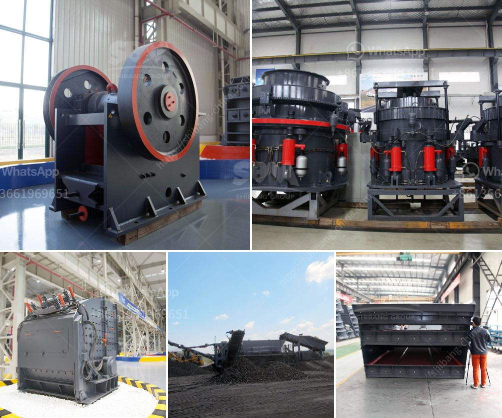

<h3>What is the difference between jaw crusher and cone crusher？</h3>
When it comes to crushing equipment, the two primary options available are jaw crushers and cone crushers. Jaw crushers are typically used as primary crushers, and cone crushers are typically used as secondary or tertiary crushers. Both types of crushers can break down large rocks into smaller pieces, but there are differences in their capabilities and applications.

One key distinction between jaw crushers and cone crushers is their crushing abilities. Jaw crushers are capable of crushing larger rock sizes than cone crushers. However, cone crushers are ideal for secondary crushing, providing high reduction ratios and cubic-shaped end products. Unlike jaw crushers, cone crushers are often used in mineral processing, sand and gravel operations, and recycling applications.

Another difference between the two is the way they deliver their crushing action. Jaw crushers use compression to crush materials, while cone crushers use both compression and attrition to break down materials. Compression crushers are generally used in situations where the material is hard and tough, whereas cone crushers are better suited for softer materials with low abrasiveness.

One major advantage of cone crushers is their ability to produce a narrow particle size distribution. This allows end users to produce more consistent products, which is crucial in industries such as construction and mining where product quality is of utmost importance. Jaw crushers, on the other hand, typically produce a more irregularly shaped product and have limited control over the maximum size of the output material.

The maintenance requirements of jaw crushers and cone crushers also differ. Jaw crushers are typically subject to more wear and tear than cone crushers, resulting in higher maintenance costs. Cone crushers can be used in various stages of the crushing process, thereby minimizing the number of equipment required compared to a jaw crusher.

Furthermore, cone crushers tend to be more expensive than jaw crushers. However, this does not mean that cone crushers are necessarily better for every application. Choosing the right type of crusher largely depends on the desired product size and the required capacity.

In conclusion, both jaw crushers and cone crushers are capable of breaking down large rocks into smaller pieces. However, there are several differences between the two, including their crushing capabilities, delivery of crushing action, particle size distribution, maintenance requirements, and cost. Understanding these differences will help you make an informed decision when selecting the appropriate crusher for your specific application.
<h3>Contact us</h3><ul><li><strong>Whatsapp:&nbsp;<a href="https://wa.me/8613661969651">+8613661969651</a></strong></li><li><a href="https://swt.shibang-china.com/?git&amp;zhl&amp;What is the difference between jaw crusher and cone crusher？"><strong>Online Service(chat now)</strong></a></li></ul><h3>Related</h3><ul><li><a href='What is the cascading effect in a ball mill.md'>What is the cascading effect in a ball mill?</a></li><li><a href='What type of crusher produces the least amount of fines.md'>What type of crusher produces the least amount of fines?</a></li><li><a href='What is the cost of roller mills.md'>What is the cost of roller mills?</a></li><li><a href='What method of mining is used to obtain calcite.md'>What method of mining is used to obtain calcite?</a></li><li><a href='What are the cement mill precrushing equipment .md'>What are the cement mill pre-crushing equipment ?</a></li></ul>