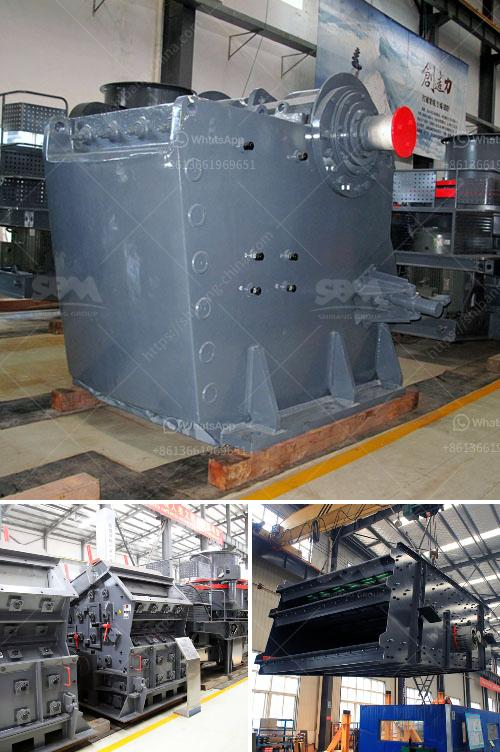

<h3>What is the difference between mining and crushing?</h3>
Mining and crushing are two fundamental processes in the extraction of minerals. These processes have different objectives, techniques, and machinery involved. Understanding the difference between mining and crushing is crucial for both professionals in the industry and individuals interested in the subject. Let's explore the dissimilarities between these two essential operations.

Mining refers to the process of extracting valuable minerals or other geological materials from the earth's crust. This process involves various techniques depending on the nature and location of the mineral deposit. There are two general methods of mining: surface mining and underground mining.

Surface mining involves extracting minerals or substances that are close to or near the surface of the earth. This technique is commonly used for minerals like coal, oil sands, or limestone. Surface mining methods include open-pit mining, strip mining, mountaintop removal, and quarrying. It usually involves the use of heavy equipment such as excavators, haul trucks, and loaders to remove the overlying soil and rock layers before accessing the mineral deposit. Once the minerals are extracted, further processing may be required before they can be put to use.

On the other hand, crushing is the process of reducing large-sized materials into smaller particles, suitable for further processing or use. Typically, crushing is applied to rocks, ores, coal, and similar raw materials to make them more manageable in size. There are various types of crushing equipment available, including jaw crushers, gyratory crushers, impact crushers, and cone crushers. Each type of crusher is designed to handle specific materials and produce desired particle sizes.

The primary objective of crushing is to reduce the size of the raw materials for further processing or use in various industries. By crushing the materials into smaller pieces, they become more manageable and easier to transport. Crushing is often a necessary step before materials can be subjected to other beneficiation processes, such as grinding, screening, or flotation.

While mining and crushing are distinct operations, they are often interconnected. Mineral processing plants require both mining and crushing operations to be functioning correctly. Mines and large-scale quarries rely on heavy equipment, such as excavators, bulldozers, dump trucks, and wheel loaders, for efficient operation. Crushing plants, on the other hand, are primarily designed to process materials in a continuous manner, such as cement, asphalt, or construction aggregates.

In conclusion, mining and crushing are two vastly different operations with separate objectives, machinery, and techniques involved. Mining refers to the extraction of valuable minerals or geological materials from the earth's crust, while crushing is the process of reducing large-sized materials into smaller particles for further processing or use. Both processes are crucial in the extraction and utilization of minerals, and they often complement each other within the mining industry.
<h3>Contact us</h3><ul><li><strong>Whatsapp:&nbsp;<a href="https://wa.me/8613661969651">+8613661969651</a></strong></li><li><a href="https://swt.shibang-china.com/?git&amp;zhl&amp;What is the difference between mining and crushing"><strong>Online Service(chat now)</strong></a></li></ul><h3>Related</h3><ul><li><a href='What is a construction waste crusher ？.md'>What is a construction waste crusher ？</a></li><li><a href='What method of mining is used to obtain calcite.md'>What method of mining is used to obtain calcite?</a></li><li><a href='What type of jaws are in the crusher plant.md'>What type of jaws are in the crusher plant?</a></li><li><a href='What is the waste from an orecrushing plant.md'>What is the waste from an ore-crushing plant?</a></li><li><a href='7 different vibrating screens how do you choose.md'>7 different vibrating screens, how do you choose?</a></li></ul>