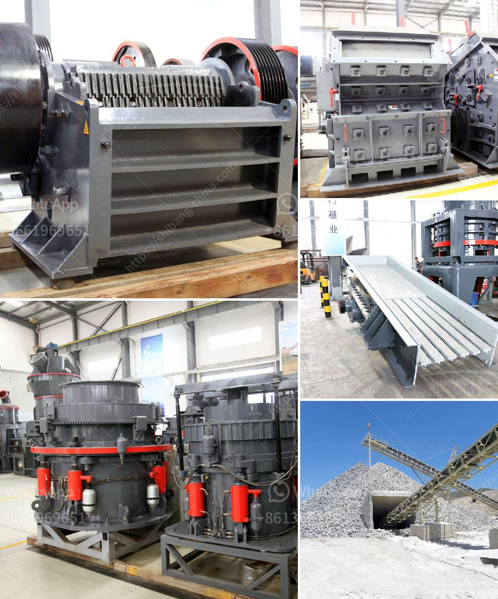

<h3>What is the disk spacing in a jaw crusher known as?</h3>
A jaw crusher is a mechanical device used to break down large rocks into smaller pieces. It uses compressive force to crush the material between two vertical jaws, one stationary and one movable. These jaws are known as the crushing chamber and are lined with replaceable liners. The spacing between the vertical jaws in a jaw crusher is known as the disk spacing.

The disk spacing plays a crucial role in determining the size and shape of the final product. It affects the capacity of the crusher, the power consumption, and the particle size distribution. The disk spacing is adjustable and can be changed to suit different crushing requirements.

In a jaw crusher, the disk spacing is typically controlled by adjusting the position of the movable jaw. This is achieved by using a toggle plate system, which allows the jaw to move back and forth in an eccentric motion. By changing the position of the movable jaw, the disk spacing can be increased or decreased.

The disk spacing has a direct impact on the throughput capacity of the jaw crusher. A smaller disk spacing results in smaller final product size and higher capacity, while a larger disk spacing will produce larger final product size but with reduced capacity. Therefore, the disk spacing needs to be carefully selected based on the desired final product size and the crushing requirements.

The disk spacing also affects the power consumption of the jaw crusher. A smaller disk spacing requires less power to crush the material, while a larger disk spacing requires more power. This is because a smaller disk spacing allows the material to be crushed more efficiently, resulting in lower energy consumption. Therefore, optimizing the disk spacing can help reduce the overall energy consumption of the crushing process.

Furthermore, the disk spacing influences the particle size distribution of the crushed material. A smaller disk spacing produces a more uniform particle size distribution, while a larger disk spacing results in a wider particle size distribution. This is important for certain applications where a specific particle size distribution is required.

In conclusion, the disk spacing in a jaw crusher refers to the spacing between the vertical jaws in the crushing chamber. It plays a crucial role in determining the size and shape of the final product, the capacity of the crusher, the power consumption, and the particle size distribution. By adjusting the disk spacing, the crushing requirements can be met more effectively, leading to improved performance and efficiency of the jaw crusher.
<h3>Contact us</h3><ul><li><strong>Whatsapp:&nbsp;<a href="https://wa.me/8613661969651">+8613661969651</a></strong></li><li><a href="https://swt.shibang-china.com/?git&amp;zhl&amp;What is the disk spacing in a jaw crusher known as"><strong>Online Service(chat now)</strong></a></li></ul><h3>Related</h3><ul><li><a href='What kind of quartz can be used in the paint industry and how to get it.md'>What kind of quartz can be used in the paint industry and how to get it?</a></li><li><a href='What material is generally broken by a cone crusher.md'>What material is generally broken by a cone crusher?</a></li><li><a href='What material is the jaw crusher tooth plate.md'>What material is the jaw crusher tooth plate?</a></li><li><a href='what are the maintenance of primary ball mill？.md'>what are the maintenance of primary ball mill？</a></li><li><a href='What is a screening plant for manganese ore.md'>What is a screening plant for manganese ore?</a></li></ul>