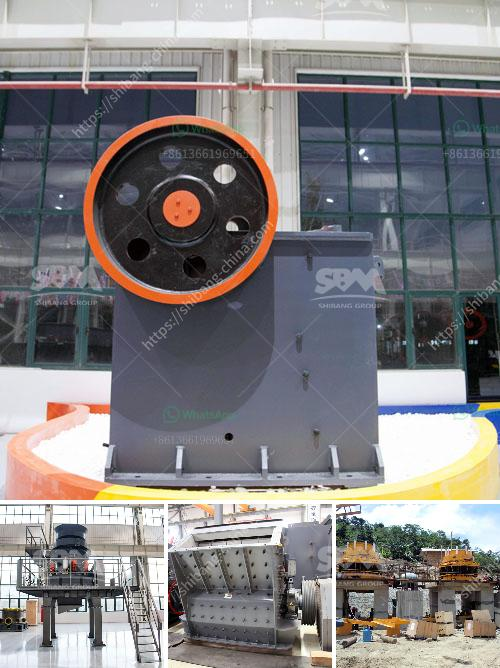

<h3>What is the effect of ball size in a ball mill?</h3>
The size of the grinding media plays a crucial role in the efficiency of the mill process. Ball mills are used in a wide range of industries and are essential for efficient grinding of large quantities of material into fine powder. The ball mill is one of the most widely used super fine grinding machine in the industry and it is the key grinding equipment after materials have been crushed.

In a ball mill, grinding occurs when a particle is crushed between two pieces of grinding media. Grinding efficiency therefore depends on the size of the grinding media. The finer the grinding media, the higher the grinding efficiency will be. The grinding media comes in different shapes and sizes, depending on the material being ground.

The impact of the grinding media on the material to be ground is directly proportional to the size of the grinding media. The larger the grinding media, the more impact it will have on the material, resulting in faster and finer grinding. This is because larger balls have more mass and therefore more energy to deliver to the particles, resulting in a greater grinding force. In contrast, smaller balls have less mass and therefore less energy, leading to slower and coarser grinding.

Another factor that influences grinding efficiency is the actual surface area of the grinding media. As the ball size increases, the surface area per unit weight also increases. This means that larger balls have more total contact area, resulting in greater surface area for grinding. This increased surface area allows for more efficient grinding, as there are more contact points between the grinding media and the material being ground.

Additionally, smaller balls tend to wear out faster than larger balls. This is because the smaller balls have a greater surface area per unit weight, resulting in greater wear and tear. Therefore, the lifespan of smaller balls is generally shorter than that of larger balls.

Overall, the effect of ball size on the efficiency of a ball mill can be summarized as follows: larger balls provide greater impact force and result in finer grinding, while smaller balls provide less impact force and result in coarser grinding. Additionally, larger balls have a greater total contact area, leading to more efficient grinding. However, smaller balls tend to wear out faster compared to larger balls.

In conclusion, the size of the grinding media significantly affects the grinding efficiency of a ball mill. The choice of ball size should be determined based on the desired final particle size and the material being ground. By selecting the appropriate ball size, optimal grinding conditions can be achieved, resulting in improved efficiency and productivity in the milling process.
<h3>Contact us</h3><ul><li><strong>Whatsapp:&nbsp;<a href="https://wa.me/8613661969651">+8613661969651</a></strong></li><li><a href="https://swt.shibang-china.com/?git&amp;zhl&amp;What is the effect of ball size in a ball mill"><strong>Online Service(chat now)</strong></a></li></ul><h3>Related</h3><ul><li><a href='What is the smallest size of output for a hammer crusher.md'>What is the smallest size of output for a hammer crusher?</a></li><li><a href='What is the best crusher for sandstone.md'>What is the best crusher for sandstone?</a></li><li><a href='What is a belt conveyor machine .md'>What is a belt conveyor machine ?</a></li><li><a href='What is the problem with ore mining .md'>What is the problem with ore mining ?</a></li><li><a href='What machinery is used to mine zinc .md'>What machinery is used to mine zinc ?</a></li></ul>