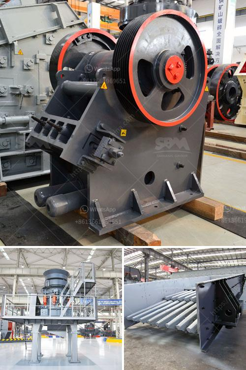

<h3>What is the feed of the jaw crusher ?</h3>
The jaw crusher is an essential equipment in mining and quarrying industries, as it crushes large stones into smaller particles to help efficiently and effectively extract valuable minerals. It is widely used in the construction and mining industries, and it plays a vital role in the primary crushing process. However, before understanding the feed of the jaw crusher, it is essential to grasp its overall functioning.

A jaw crusher consists of a fixed jaw and a movable jaw, which form a V-shaped chamber. The movable jaw moves back and forth to crush the stones against the fixed jaw. The crushed materials then travel down through the bottom of the chamber and come out as a smaller size. The feed of the jaw crusher refers to the material that enters the crushing chamber.

The feed size of the jaw crusher determines its processing capacity and the size of the product. By understanding the feed size, one is able to make the necessary adjustments or optimizations to the crusher to maximize its performance. The feed size can vary depending on the type of rock being crushed and the desired product size. It is often measured by the top opening of the crusher, commonly referred to as the "gape".

To determine the optimal feed size for a jaw crusher, several factors need to be considered. Firstly, the characteristics of the rock, such as hardness, abrasiveness, and moisture content, play a significant role. Harder and more abrasive rocks tend to require a larger feed size to prevent excessive wear on the crushing surfaces. Additionally, the moisture content of the feed material should be considered, as excessive moisture can cause clogging and reduce the efficiency of the crusher.

Secondly, the desired product size also plays a crucial role in determining the appropriate feed size. If a smaller product size is desired, a smaller feed size is usually required. Conversely, if a larger product size is desired, a larger feed size can be used.

Furthermore, the capacity of the jaw crusher should also be taken into account when determining the feed size. The capacity of a jaw crusher is influenced by factors such as the size and type of the crusher, the closed side setting (CSS), and the rate of feed. A higher capacity jaw crusher requires a larger feed size to achieve optimal performance.

In conclusion, the feed of the jaw crusher refers to the material that enters the crushing chamber. The feed size plays a significant role in determining the processing capacity and product size of the crusher. Factors such as rock characteristics, desired product size, and crusher capacity should be considered when determining the optimal feed size. By understanding and appropriately adjusting the feed size, one can achieve maximum efficiency and productivity from a jaw crusher.
<h3>Contact us</h3><ul><li><strong>Whatsapp:&nbsp;<a href="https://wa.me/8613661969651">+8613661969651</a></strong></li><li><a href="https://swt.shibang-china.com/?git&amp;zhl&amp;What is the feed of the jaw crusher "><strong>Online Service(chat now)</strong></a></li></ul><h3>Related</h3><ul><li><a href='How is fluorite mined and what equipment is needed.md'>How is fluorite mined, and what equipment is needed?</a></li><li><a href='What are the cement mill precrushing equipment .md'>What are the cement mill pre-crushing equipment ?</a></li><li><a href='What type of machine is used in the cement industry.md'>What type of machine is used in the cement industry?</a></li><li><a href='What type of crusher should I use to crush quartzite rock.md'>What type of crusher should I use to crush quartzite rock?</a></li><li><a href='What is the cost of roller mills.md'>What is the cost of roller mills?</a></li></ul>