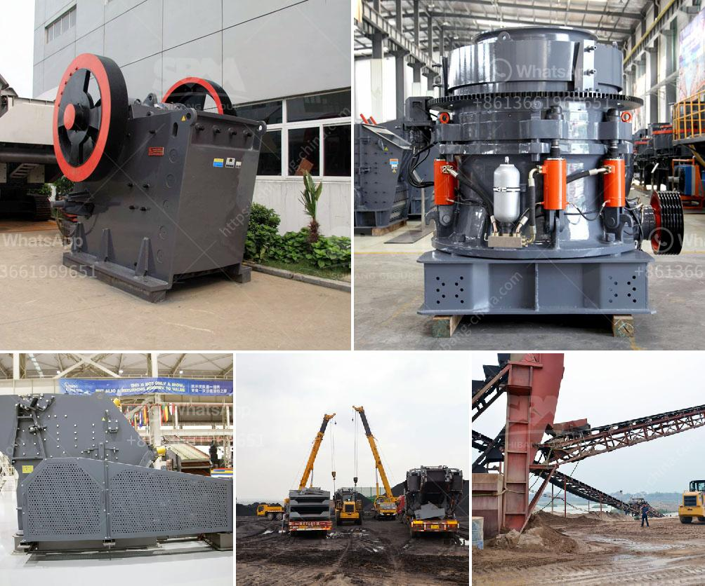

<h3>What is the final product of columbite?</h3>
Columbite is a black, metallic mineral that contains the elements niobium and tantalum. It is commonly found in complex granite pegmatites, which are igneous rocks formed underground with large crystal structures. The final product of columbite is primarily refined into two separate materials: niobium oxide and tantalum oxide. These oxides serve as important raw materials in various industries, including electronics, aerospace, and energy.

Niobium oxide, also known as niobium pentoxide (Nb2O5), is extracted from columbite through a series of processes. The initial step involves crushing the ore into smaller fragments, followed by grinding and magnetic separation to separate the columbite mineral from other impurities. The columbite concentrate is then further processed by roasting it at high temperatures in the presence of oxygen, which converts the niobium component into niobium pentoxide. Subsequent purification and refinement steps are carried out to obtain high-purity niobium oxide, which can be converted into different forms such as metal alloys, capacitors, superconducting materials, and even jewelry.

Niobium is a highly sought-after element due to its unique properties, including high melting point, corrosion resistance, and superconductivity at low temperatures. These characteristics make niobium desirable for various industrial applications. For instance, niobium alloys are used in the aerospace industry to manufacture components like turbine blades, jet engine parts, and rocket nozzles. Niobium capacitors are employed in electronics and communication devices due to their high capacitance, small size, and stability. Additionally, niobium oxide is utilized as a catalyst in the production of ethylene oxide, a key chemical used to make plastics and other products.

Similarly, tantalum oxide is obtained by refining the tantalum component within columbite. Tantalite, a related mineral to columbite, is often processed together with columbite to extract tantalum. The tantalum-rich ore undergoes similar processes as those used for niobium to separate and refine tantalum oxide. Tantalum is known for its high melting point, excellent corrosion resistance, and capacitive properties. These attributes have led to its use in various applications, particularly in the electronics industry.

One of the primary uses of tantalum oxide is in the production of tantalum capacitors. These capacitors, known for their reliability, are widely used in electronic devices such as smartphones, computers, and automotive electronics. Tantalum capacitors offer high energy storage, long operational lifetimes, and small size, making them indispensable in the miniaturization of electronic components.

Tantalum is also utilized in the aerospace industry, where it is employed in jet engines, gas turbines, and superalloys due to its ability to withstand high temperatures and harsh operating conditions. Additionally, tantalum is used in the production of specialty alloys for chemical process equipment and in the medical field for surgical implants like dental implants and bone screws. Its biocompatibility and resistance to corrosion make it an ideal material for long-lasting medical devices.

In conclusion, the final product of columbite is primarily refined into niobium oxide and tantalum oxide. These oxides are then utilized in a wide range of industries, including electronics, aerospace, and energy. The properties of niobium and tantalum make them desirable materials for various applications, such as alloys, capacitors, superconductors, and catalysts. As technology advances, the demand for niobium and tantalum continues to grow, making columbite an essential resource for modern industries.
<h3>Contact us</h3><ul><li><strong>Whatsapp:&nbsp;<a href="https://wa.me/8613661969651">+8613661969651</a></strong></li><li><a href="https://swt.shibang-china.com/?git&amp;zhl&amp;What is the final product of columbite"><strong>Online Service(chat now)</strong></a></li></ul><h3>Related</h3><ul><li><a href='what machine is used for crushing quarry stone in philippines？.md'>what machine is used for crushing quarry stone in philippines？</a></li><li><a href='What is the minimum possible crushing size of limestone after it has been crushed in a crusher.md'>What is the minimum possible crushing size of limestone after it has been crushed in a crusher?</a></li><li><a href='What is the ore crusher discharge port size.md'>What is the ore crusher discharge port size?</a></li><li><a href='What is an impact crusher and what is its working principle.md'>What is an impact crusher and what is its working principle?</a></li><li><a href='What is the best jaw crusher for coal processing.md'>What is the best jaw crusher for coal processing?</a></li></ul>