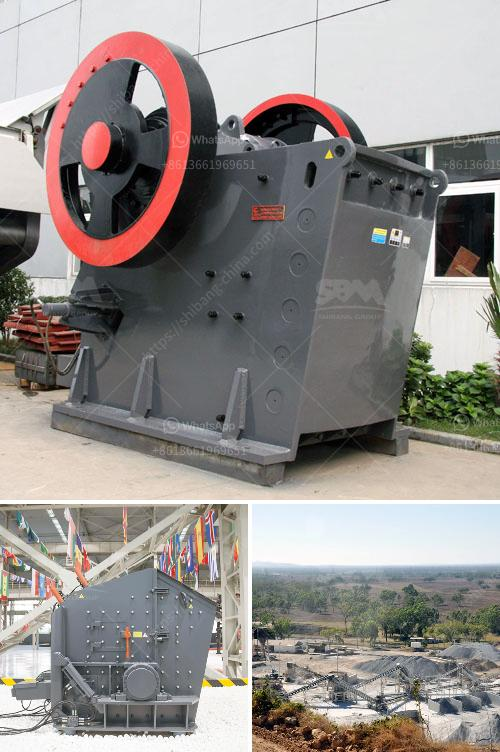

<h3>What is the flywheel size and weight in a jaw crusher?</h3>
A jaw crusher is a type of primary crusher used in mines and ore processing plants. Jaw crushers are designed to crush the toughest materials through the use of compressive force (pressure). The jaw crusher design includes a set of two vertical jaws—a fixed (stationary) jaw and a swing (reciprocating) jaw. The swing jaw moves back and forth by a cam or pitman mechanism, acting as a connecting rod to create an oscillating motion, crushing the materials against the fixed jaw.

One crucial component of a jaw crusher is the flywheel [1]. The flywheel is responsible for storing the energy of the moving jaw, and then used to generate the crushing force. When the jaw crusher starts, energy is transferred to the flywheel from the motor via V-belts. As the flywheel rotates, a large amount of energy is stored, which enhances the crushing capacity and efficiency of the crusher.

The size and weight of the flywheel are essential factors to consider when selecting a jaw crusher model. Generally, the size of the flywheel is determined by the physical size of the jaw crusher and its components. In most cases, the flywheel diameter is greater than the eccentric shaft diameter. This increases the moment of inertia, resulting in a higher crushing capacity.

The weight of the flywheel also influences the performance of the jaw crusher. A heavier flywheel allows the crusher to generate greater inertia, which improves crushing efficiency and reduces power consumption. Additionally, a heavier flywheel reduces the load on the motor and enhances the longevity of the crusher.

The specific size and weight of the flywheel depend on various factors such as the application, required capacity, and material characteristics. In some cases, manufacturers provide recommended flywheel sizes and weights for different jaw crusher models. However, these recommendations may vary depending on the specific requirements of the site or application.

It is important to consider the application and material characteristics when determining the size and weight of the flywheel. For example, in a quarry application where the primary objective is to produce aggregate, a large flywheel with a high moment of inertia may be preferred. On the other hand, in a recycling application where the focus is on processing smaller materials, a smaller flywheel with quicker rotational speed may be more suitable.

To conclude, the flywheel size and weight play a crucial role in the performance of a jaw crusher. They determine the crusher's capacity, efficiency, and power consumption. A larger and heavier flywheel enhances the inertia, allowing the crusher to generate higher crushing forces and improve its overall performance. When selecting a jaw crusher, it is essential to consider the specific requirements of the application and material characteristics to determine the appropriate flywheel size and weight.
<h3>Contact us</h3><ul><li><strong>Whatsapp:&nbsp;<a href="https://wa.me/8613661969651">+8613661969651</a></strong></li><li><a href="https://swt.shibang-china.com/?git&amp;zhl&amp;What is the flywheel size and weight in a jaw crusher"><strong>Online Service(chat now)</strong></a></li></ul><h3>Related</h3><ul><li><a href='What are the different parts of a crusher in a power plant.md'>What are the different parts of a crusher in a power plant?</a></li><li><a href='What is a composite cone crusher.md'>What is a composite cone crusher?</a></li><li><a href='What is the cost of gravel crushing .md'>What is the cost of gravel crushing ?</a></li><li><a href='what are the maintenance of primary ball mill？.md'>what are the maintenance of primary ball mill？</a></li><li><a href='What is crushed quartz stone.md'>What is crushed quartz stone?</a></li></ul>