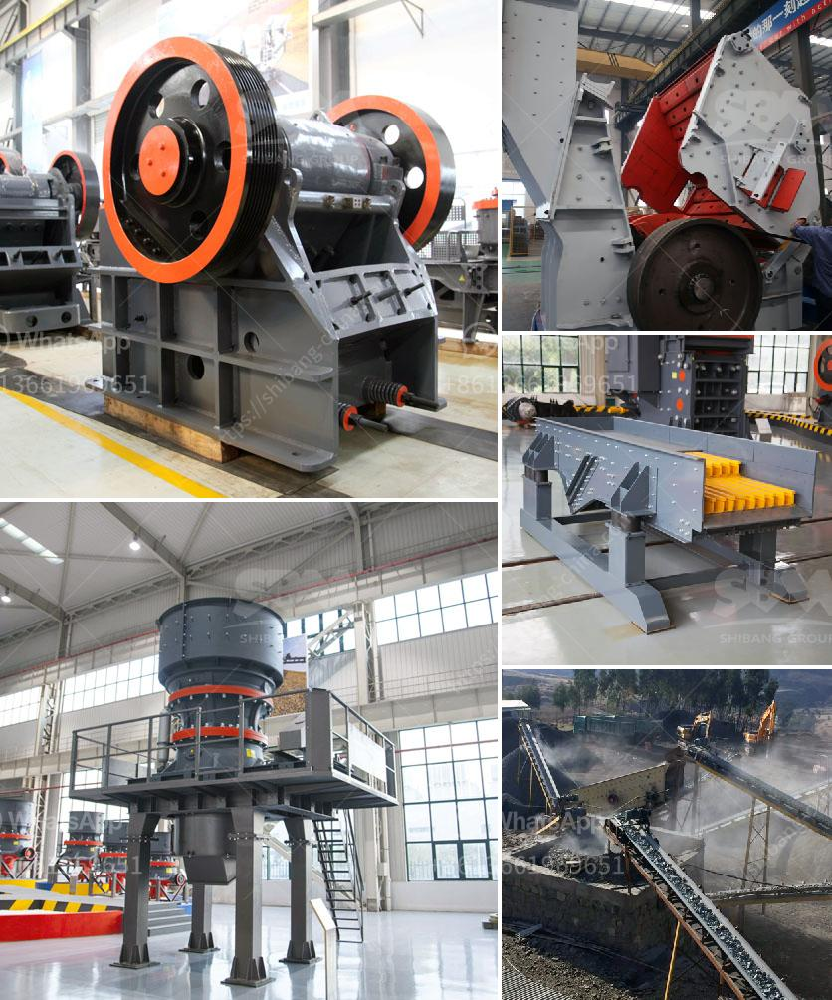

<h3>What is the functions of crusher ?</h3>
Crushers are heavy-duty machines that are designed to reduce the size of large materials like ores and rocks to smaller ones, such as gravel or rock dust. These machines are used in a variety of industries, including mining, construction, and recycling. Understanding the functions of a crusher will help us to choose the appropriate equipment for our specific needs.

The primary function of the crusher is to reduce the size of large materials into smaller ones. Currently, there are several types of crushers available on the market, such as jaw crushers, cone crushers, impact crushers, and roller crushers. Each of these crushers has unique characteristics that fulfill specific purposes.

Jaw crushers are primarily used for reducing the size of large materials into smaller ones, as the name suggests. The materials are placed into a fixed jaw plate and then movable jaw plate exerts force on them, crushing them against the fixed jaw plate. This process allows the material to be reduced in size to a manageable level. Jaw crushers are commonly used in mining and building material industries.

Cone crushers, on the other hand, are used in secondary and tertiary crushing processes. These crushers are mainly used to crush the materials by squeezing them between two crushing surfaces, known as mantles. The materials are fed into the crushing chamber through a feed chute, and once crushed, it is released through an opening at the bottom called the discharge opening.

Impact crushers are utilized in applications where the desired product size is not too small, and cubical-shaped aggregate is required. These machines use collision forces to crush the materials against an impact plate or hammer. The impact creates a high-speed rotation of the rotor, which then throws the materials towards the crushing chamber walls, where they are further broken down.

Roller crushers, also known as roll crushers or double roll crushers, are mainly used for medium and fine crushing of hard and medium-hard ores and rocks. These machines consist of two parallel cylindrical rollers that rotate in opposite directions. The materials are drawn into the gap between the rollers, where they are crushed and discharged through the gap.

In addition to reducing the size of materials, crushers also play a vital role in the recycling industry. They are used to break down waste materials, such as concrete, asphalt, and demolition debris, into reusable aggregates. This process helps in conserving natural resources and reducing waste disposal.

To conclude, crushers are essential machines in various industries, as they perform the important function of reducing the size of large materials into smaller ones. They are available in different types, each serving specific purposes, such as jaw crushers, cone crushers, impact crushers, and roller crushers. Understanding the functions and capabilities of these machines will enable us to choose the right crusher for our specific needs, ultimately improving efficiency and productivity in our operations.
<h3>Contact us</h3><ul><li><strong>Whatsapp:&nbsp;<a href="https://wa.me/8613661969651">+8613661969651</a></strong></li><li><a href="https://swt.shibang-china.com/?git&amp;zhl&amp;What is the functions of crusher "><strong>Online Service(chat now)</strong></a></li></ul><h3>Related</h3><ul><li><a href='How oftenwhat maintenance needs to be done on crushing plant.md'>How often/what maintenance needs to be done on crushing plant</a></li><li><a href='What is the price of a jaw coal crusher.md'>What is the price of a jaw coal crusher?</a></li><li><a href='What machines are required for a limestone powder factory.md'>What machines are required for a limestone powder factory?</a></li><li><a href='What type of crusher produces the least amount of fines.md'>What type of crusher produces the least amount of fines?</a></li><li><a href='What is the best type of crusher for hard rock.md'>What is the best type of crusher for hard rock?</a></li></ul>