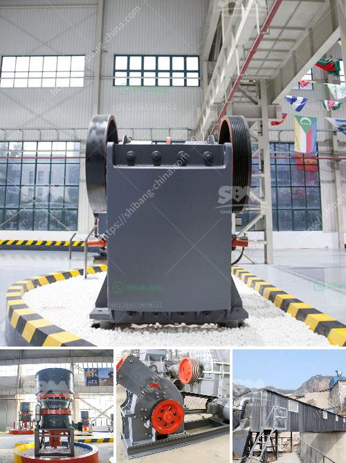

<h3>What is the input and output of a crusher machine?</h3>
A crusher machine is a tool that is designed to reduce the size of large rocks or gravel, for construction purposes. Crushers can also be utilized to transform the shape of waste matter for simplicity in disposal, or recycling. Crushers are commonly classified by the degree to which they fragment not starting material with primary and secondary crushers handling coarse materials and tertiary and quaternary crushers lessening finer gradations.

The input of a crusher machine is initially granulated ore or solid material, commonly used in large-scale mining industries, rock quarrying, and demolition sites to reduce the size of rock blocks and stones. The size of the input can vary greatly, depending on the specifications and requirements of the desired output. In some cases, the input can be as large as several meters in diameter, which would require a powerful machine to handle the workload.

To begin the crushing process, the input material is fed into the crusher machine through a chute or hopper, which is set up above the opening of the machine. The material drops into the crushing chamber, where it is accelerated and impacted by a rotor, hammer, or blow bars fixed on a spinning rotor. The force of impact breaks the material into smaller pieces, reducing its size.

Once the material has been crushed to the desired size, the output of the crusher machine is discharged through an opening at the bottom, commonly known as the discharge opening. The size of the discharge opening determines the final size of the crushed material. Crushers are usually equipped with adjustable settings to control the size of the output, allowing operators to produce different sizes of crushed material depending on their needs.

The output of a crusher machine can vary significantly, depending on factors such as the type of material being crushed, the required product size, and the settings of the machine. Crushers can produce a wide range of products, such as gravel, crushed rock, sand, or even finer materials like limestone dust or agricultural lime.

In addition to the size of the output, crushers can also produce different shapes of crushed material. Some machines are designed to produce cubical or spherical-shaped particles, while others may produce more elongated or uneven-shaped particles. The shape of the output can be controlled by adjusting the speed and configuration of the impactors or hammers within the crusher machine.

Crusher machines are widely used in various industries, including mining, construction, recycling, and demolition. They play a crucial role in the processing and production of raw materials for infrastructure projects, as well as for the production of finished products for commercial use. The input and output of a crusher machine are essential factors to consider when selecting the appropriate machine for a specific application.

In conclusion, a crusher machine takes in large, solid material or ore as the input and reduces it to smaller, desired sizes as the output. The input size can vary greatly, depending on the application and requirements, while the output determines the final product size and shape. Crusher machines are versatile tools that are widely used in various industries for their ability to process raw materials efficiently and effectively.
<h3>Contact us</h3><ul><li><strong>Whatsapp:&nbsp;<a href="https://wa.me/8613661969651">+8613661969651</a></strong></li><li><a href="https://swt.shibang-china.com/?git&amp;zhl&amp;What is the input and output of a crusher machine"><strong>Online Service(chat now)</strong></a></li></ul><h3>Related</h3><ul><li><a href='What are the models of Raymond mill.md'>What are the models of Raymond mill?</a></li><li><a href='What is the difference between mining and crushing.md'>What is the difference between mining and crushing?</a></li><li><a href='What are the cement mill precrushing equipment .md'>What are the cement mill pre-crushing equipment ?</a></li><li><a href='what does a raymond coal mill cost？.md'>what does a raymond coal mill cost？</a></li><li><a href='What good sand making equipment manufacturers are there.md'>What good sand making equipment manufacturers are there?</a></li></ul>