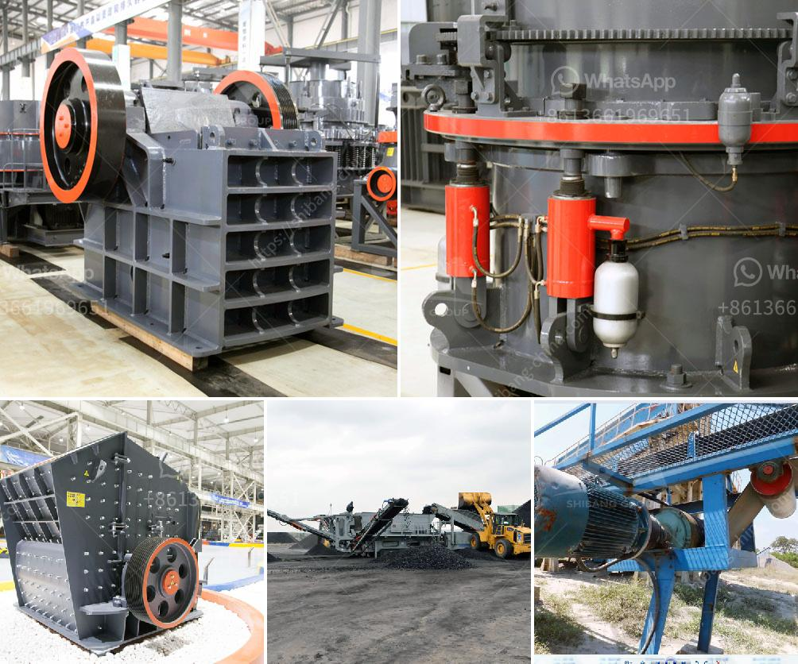

<h3>What is the iron ore thickening process?</h3>
Iron ore thickening process is a crucial step in iron ore mining operations. Upon excavation, crude ore undergoes a variety of processes to extract the iron content. The first step in this process is often crushing and grinding, followed by classification and separation. During the classification stage, ore particles of different sizes are separated based on their specific gravity. The finer particles, called slimes, are usually first treated through a process called thickening.

Thickening is a physical separation process that increases the concentration of the solids in a mixture through the removal of a portion of the liquid phase. In the case of iron ore slimes, the objective is to remove water and thereby reduce the moisture content of the final product. This is usually achieved by adding chemicals known as flocculants to enhance the settling of particles.

The thickening process works by creating a dense slurry that is then pumped to a settling tank. In this tank, the fine particles settle to the bottom, while the clarified water is removed from the top. The settled solids, also known as underflow, are then further processed or discarded, depending on their quality.

Flocculants play a vital role in the thickening process. They are polymers that facilitate the agglomeration of fine particles into larger flocs, which then settle more readily. Flocculants are typically added to the slurry before it enters the thickener. These chemicals bind the particles together, forming larger, heavier aggregates that settle faster.

There are several factors to consider when choosing the appropriate flocculant for iron ore thickening. The type and concentration of the ore, as well as the desired final moisture content, play a significant role in the selection process. It is essential to find a balance between achieving high underflow densities and maintaining acceptable overflow clarity.

The efficiency of the thickening process is often measured by the underflow density, which represents the concentration of solids in the final product. Higher underflow densities result in a lower moisture content, making the iron ore more suitable for transportation and storage. However, achieving high densities can be challenging, as factors such as particle size distribution, temperature, and pH levels can affect the overall performance.

In conclusion, iron ore thickening is a crucial step in the mining process. It aims to remove water from the slimes, improving the quality and reducing the moisture content of the final product. Through the addition of flocculants, fine particles are agglomerated and settle faster, allowing for efficient separation. Achieving high underflow densities requires careful consideration of various factors, ensuring optimal performance of the thickening process.
<h3>Contact us</h3><ul><li><strong>Whatsapp:&nbsp;<a href="https://wa.me/8613661969651">+8613661969651</a></strong></li><li><a href="https://swt.shibang-china.com/?git&amp;zhl&amp;What is the iron ore thickening process"><strong>Online Service(chat now)</strong></a></li></ul><h3>Related</h3><ul><li><a href='What type of jaws are in the crusher plant.md'>What type of jaws are in the crusher plant?</a></li><li><a href='What is a ball mill and how does it function.md'>What is a ball mill and how does it function?</a></li><li><a href='What is the difference between an impact cone and jaw crusher.md'>What is the difference between an impact, cone, and jaw crusher?</a></li><li><a href='What is aggregates in mining .md'>What is aggregates in mining ?</a></li><li><a href='What is an impact crusher and what is its working principle.md'>What is an impact crusher and what is its working principle?</a></li></ul>