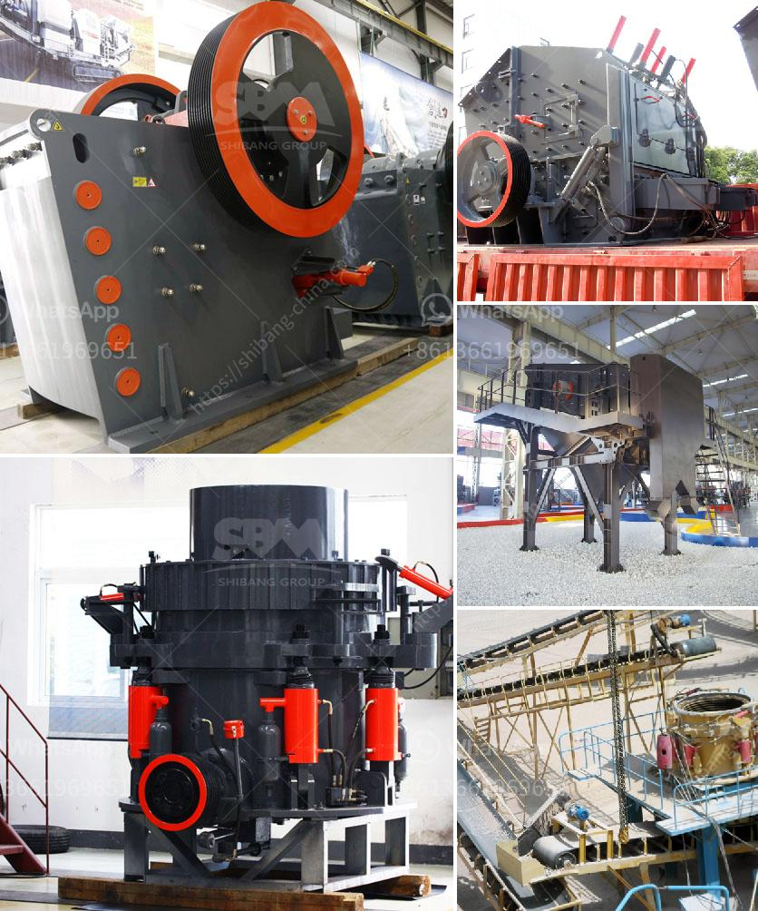

<h3>What is the largest industrial crusher?</h3>
When it comes to industrial crushers, size does matter. The size of the materials being crushed is an important factor to consider, as it determines the required output and efficiency of the crusher. Therefore, it should come as no surprise that there are crushers specifically designed to handle massive industrial loads.

The largest industrial crusher in the world is undoubtedly the jaw crusher. It is widely used in mining, quarrying, and construction sectors for breaking a variety of raw materials into smaller pieces. This colossal machine boasts a jaw opening of 59 inches by 78 inches, making it perfectly suited for handling large rocks and bulky materials.

One of the primary reasons why the jaw crusher is the largest industrial crusher is its ability to handle tough and abrasive materials. These materials, such as granite, ores, or concrete, can be challenging to crush due to their hardness and composition. However, the jaw crusher's design and mechanism allow it to exert immense pressure on the material, breaking it down into more manageable sizes.

Moreover, jaw crushers come equipped with heavy-duty features that enable them to handle industrial loads effortlessly. The robust design of the machine ensures its durability and longevity, even under the most demanding conditions. Additionally, the jaw crusher's hydraulic system provides a smooth and efficient operation, further enhancing its productivity.

In addition to the jaw crusher, other types of industrial crushers also play a significant role in various industries. For instance, the impact crusher is widely used in mining and construction sectors due to its ability to crush materials using impact force. Similarly, the cone crusher is commonly used in the mining industry to crush harder and more abrasive materials.

Despite the variety of options available, the jaw crusher remains the largest and most extensively used industrial crusher. Its versatility, strength, and reliability make it an invaluable asset in countless industries. Whether it is for mining, construction, or quarrying purposes, the jaw crusher is the go-to choice for those needing to crush large, unwieldy materials.

In conclusion, the largest industrial crusher is, without a doubt, the jaw crusher. Its ability to handle tough and abrasive materials sets it apart from other types of crushers. With its robust design, efficient operation, and versatility, the jaw crusher remains the top choice for crushing large and challenging materials.
<h3>Contact us</h3><ul><li><strong>Whatsapp:&nbsp;<a href="https://wa.me/8613661969651">+8613661969651</a></strong></li><li><a href="https://swt.shibang-china.com/?git&amp;zhl&amp;What is the largest industrial crusher"><strong>Online Service(chat now)</strong></a></li></ul><h3>Related</h3><ul><li><a href='What is the best design for stone screening equipment.md'>What is the best design for stone screening equipment</a></li><li><a href='What are the specifications of the limestone powder used in the paper mill.md'>What are the specifications of the limestone powder used in the paper mill?</a></li><li><a href='What are the steps in manufacturing Portland cement.md'>What are the steps in manufacturing Portland cement?</a></li><li><a href='What is a hammer mill work.md'>What is a hammer mill work?</a></li><li><a href='what are common raw materials for artificial sand.md'>what are common raw materials for artificial sand</a></li></ul>