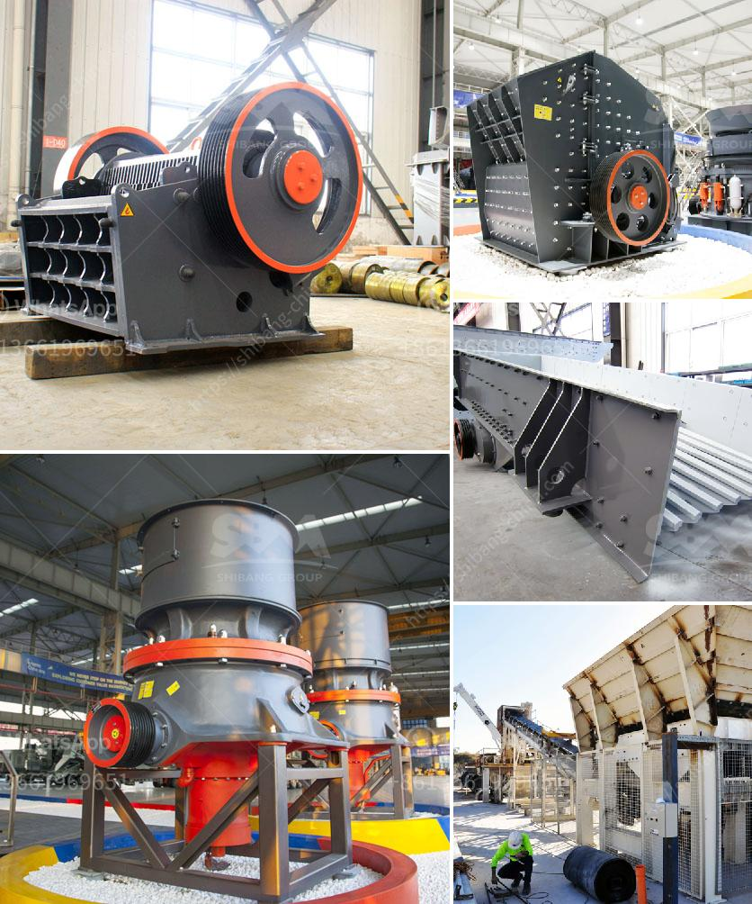

<h3>What is the maintenance of a jaw crusher?</h3>
A jaw crusher is one of the most commonly used crushing equipment in the mining industry. It is designed to crush hard materials, such as ore, concrete, and other materials, and is widely used in the construction and demolition industries.

To keep your jaw crusher in good condition, you need to follow a proper maintenance schedule. This will help prevent any unexpected problems, ensure a consistent output, and extend the lifespan of your equipment. In this article, we will discuss some essential maintenance tips for a jaw crusher.

Regular lubrication is crucial for the proper functioning of a jaw crusher. The bearings of the crusher are subjected to enormous forces and friction, which leads to wear and tear. To prevent excessive wear, regular lubrication is necessary. The lubricant should be chosen based on the operating conditions and temperature of the crusher. It is recommended to use high-quality, low-viscosity grease that provides adequate protection and lubrication.

Another important aspect of maintenance is checking and tightening all the bolts and nuts in the jaw crusher regularly. Over time, vibrations and constant use can cause the fasteners to become loose. Loose bolts can result in excessive wear and vibration, affecting the overall efficiency of the crusher. Therefore, it is crucial to check and tighten all the bolts to ensure smooth and stable operation.

The jaw crusher's movable jaw plate and fixed jaw plate undergo continuous wear and tear due to the friction between the materials being crushed. This wear and tear can result in the jaw plates becoming less effective in crushing the materials. To maintain the optimum crushing performance, it is essential to regularly inspect the jaw plates and replace them if necessary. Signs of excessive wear include worn tooth profiles, cracks, or loose mounting screws.

The conveyor belts that transport the crushed materials from the jaw crusher to the next stage of processing also require regular maintenance. Check the belts for any signs of wear, tear, or damage. If any damage is noticed, replace the belt immediately to prevent any disruption in the material flow.

Additionally, regularly inspecting and cleaning the crusher's internal components is crucial. Dust, dirt, and debris can accumulate inside the crusher, affecting its performance. Regularly remove any buildup and clean the crusher with compressed air or water. This will help maintain the efficiency and productivity of the equipment.

Finally, it is essential to have a comprehensive maintenance plan and schedule for your jaw crusher. Regularly performing routine maintenance tasks, such as lubricating, inspecting, and cleaning, will help identify and address any potential issues before they worsen.

In conclusion, the maintenance of a jaw crusher is crucial to its overall performance and lifespan. Regular lubrication, tightening of bolts, inspection of jaw plates, and cleaning of internal components are some essential maintenance tasks. By following a proper maintenance schedule, you can extend the lifespan of your jaw crusher, prevent unexpected problems, and ensure consistent and efficient operation.
<h3>Contact us</h3><ul><li><strong>Whatsapp:&nbsp;<a href="https://wa.me/8613661969651">+8613661969651</a></strong></li><li><a href="https://swt.shibang-china.com/?git&amp;zhl&amp;What is the maintenance of a jaw crusher"><strong>Online Service(chat now)</strong></a></li></ul><h3>Related</h3><ul><li><a href='What plate is used for the curtain in an impact crusher.md'>What plate is used for the curtain in an impact crusher?</a></li><li><a href='What are the advantages of a roll crusher compared to other crushers.md'>What are the advantages of a roll crusher compared to other crushers?</a></li><li><a href='What is the flywheel size and weight in a jaw crusher.md'>What is the flywheel size and weight in a jaw crusher?</a></li><li><a href='What will be the cost of a stone crusher .md'>What will be the cost of a stone crusher ?</a></li><li><a href='What are the parts of a Raymond Mill.md'>What are the parts of a Raymond Mill?</a></li></ul>