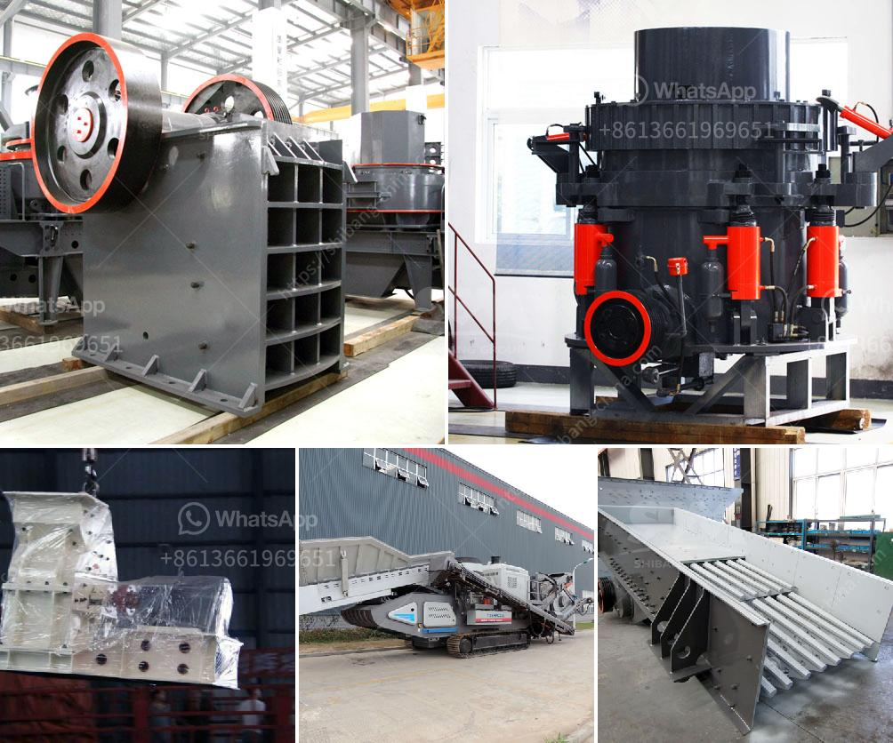

<h3>What is the major step in the process of open-pit and underground mining?</h3>
Mining has been an essential part of human civilization for thousands of years. It has played a significant role in shaping our economies, societies, and even our cultures. While there are various methods of extracting valuable minerals from beneath the Earth's surface, open-pit and underground mining are two of the most commonly used techniques. Understanding the major steps involved in these processes is crucial to grasp the complexity and significance of mining operations.

Open-pit mining, also known as surface mining, is a method used to extract minerals or rocks that are near the surface. The primary objective of this type of mining is to remove the overburden, the layers of soil or rock covering the desired deposit. Open-pit mining starts with the excavation of a large pit or "open pit" on the surface. This is typically done using heavy machinery such as draglines, excavators, or shovels. The overburden material is then removed and transported to a designated area. Once the overburden is removed, mining equipment can access the mineral deposit.

After the removal of the overburden, the next major step in open-pit mining is the extraction of minerals. This involves drilling and blasting the rock to fragment it into smaller, more manageable pieces. This is typically achieved using explosive charges strategically placed in drill holes. Once the rock is fragmented, it can be loaded onto trucks or conveyors for transport to the processing plant. In some cases, the minerals might be processed on-site, while in others, they are transported to a separate facility for further processing, refining, or beneficiation.

Underground mining, on the other hand, involves accessing mineral deposits that are deep below the Earth's surface. This method is typically employed when the mineral deposit cannot be economically extracted using open-pit mining due to various geological factors such as depth, grade, or shape. The major step in underground mining is the development of underground workings and infrastructure. This includes the construction of access shafts, ventilation systems, and underground tunnels to reach the mineral deposit.

Once the infrastructure is established, underground mining follows a similar pattern to open-pit mining. The rock is drilled and blasted to fragment it, and then it is transported to the surface. Unlike open-pit mining, where the overburden is removed, underground mining deals with the challenge of ground stability. Support systems such as pillars, rock bolts, or bolting plates are used to prevent collapses or cave-ins in the underground workings.

Both open-pit and underground mining involve several other steps in addition to those mentioned above. These include surveying, geotechnical studies, environmental assessments, and rehabilitation of the mining site once the operation is complete.

In conclusion, the major step in the process of open-pit mining is the removal of the overburden to access the mineral deposit, while underground mining involves the development of underground infrastructure to reach the deposit. These mining techniques have evolved over centuries and continue to be refined with advancements in technology and better understanding of geological processes. Mining plays a vital role in providing the raw materials needed for various industries, but it is crucial to carry out these operations responsibly, considering environmental and social factors, to ensure the sustainable utilization of our Earth's resources.
<h3>Contact us</h3><ul><li><strong>Whatsapp:&nbsp;<a href="https://wa.me/8613661969651">+8613661969651</a></strong></li><li><a href="https://swt.shibang-china.com/?git&amp;zhl&amp;What is the major step in the process of openpit and underground mining"><strong>Online Service(chat now)</strong></a></li></ul><h3>Related</h3><ul><li><a href='What machine crushes talcum powder for building stone？.md'>What machine crushes talcum powder for building stone？</a></li><li><a href='what is the cost of stone crusher？.md'>what is the cost of stone crusher？</a></li><li><a href='What is aggregates in mining .md'>What is aggregates in mining ?</a></li><li><a href='What is the production process of stone aggregates .md'>What is the production process of stone aggregates ?</a></li><li><a href='What is a belt conveyor machine .md'>What is a belt conveyor machine ?</a></li></ul>