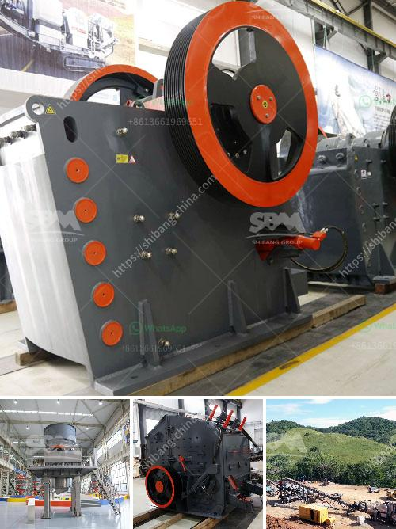

<h3>What is the minimum possible crushing size of limestone after it has been crushed in a crusher?</h3>
Limestone is a common rock formation found all across the globe. It is primarily composed of calcium carbonate, which has the chemical formula CaCO3. Limestone is widely used for various applications, ranging from construction and infrastructure development to agriculture and industrial processes. One crucial aspect of limestone utilization is the size of the crushed limestone, as it influences its effectiveness and suitability for different purposes.

When limestone is extracted from quarries, it often undergoes crushing to reduce the size of the extracted rock. Crushing limestone into smaller sizes is crucial for various industrial applications, as it provides several advantages. Firstly, crushing limestone enables easy handling and transportation. Smaller-sized limestone can fit into trucks and other vehicles, making it convenient to transport to different locations. Furthermore, it allows for efficient storage, minimizing the space required to stockpile large quantities of limestone.

The minimum possible crushing size of limestone is determined by the type of crusher used and its crushing capacity. At the same time, several factors, including the physical properties of the limestone and desired end-product specifications, play a significant role in determining the optimal crushing size.

The physical properties of limestone that affect its crushing size include hardness, strength, density, and moisture content. Hardness refers to the resistance of a material to permanent indentation or scratching, while strength refers to the ability of a material to withstand an applied force. The density of limestone determines its weight per unit volume, and the moisture content affects its brittleness and crushing behavior. All these physical properties impact the minimum size achievable during the crushing process.

Additionally, the desired end-product specifications influence the minimum crushing size required. Different industries and applications have specific requirements for crushed limestone, such as particle size distribution, gradation, and chemical composition. For instance, in construction applications, crushed limestone with a specific size distribution is often required to ensure optimal strength and stability in concrete mixtures.

The type of crusher used also plays a role in determining the minimum crushing size of limestone. There are various types of crushers available, including jaw crushers, impact crushers, cone crushers, and hammer crushers. Each type of crusher has different crushing capabilities and may produce different crushed limestone sizes. It is essential to choose the appropriate crusher based on the desired end-product and the physical properties of the limestone.

In conclusion, the minimum possible crushing size of limestone after it has been crushed in a crusher is determined by various factors. The physical properties of the limestone, such as hardness, strength, density, and moisture content, play a significant role in this determination. Additionally, the desired end-product specifications, including particle size distribution, gradation, and chemical composition, further influence the minimum size required. Lastly, the type of crusher used also affects the crushing size. Understanding these factors is crucial for efficient limestone utilization in various industries.
<h3>Contact us</h3><ul><li><strong>Whatsapp:&nbsp;<a href="https://wa.me/8613661969651">+8613661969651</a></strong></li><li><a href="https://swt.shibang-china.com/?git&amp;zhl&amp;What is the minimum possible crushing size of limestone after it has been crushed in a crusher"><strong>Online Service(chat now)</strong></a></li></ul><h3>Related</h3><ul><li><a href='What causes tension rods in jaw crushers to break.md'>What causes tension rods in jaw crushers to break?</a></li><li><a href='What is the cost of artificial sand projects.md'>What is the cost of artificial sand projects?</a></li><li><a href='What are the merits of vibratory screens.md'>What are the merits of vibratory screens?</a></li><li><a href='What machines are used in a crushing plant？.md'>What machines are used in a crushing plant？</a></li><li><a href='What is an overpressure fan in a cone crusher.md'>What is an overpressure fan in a cone crusher?</a></li></ul>