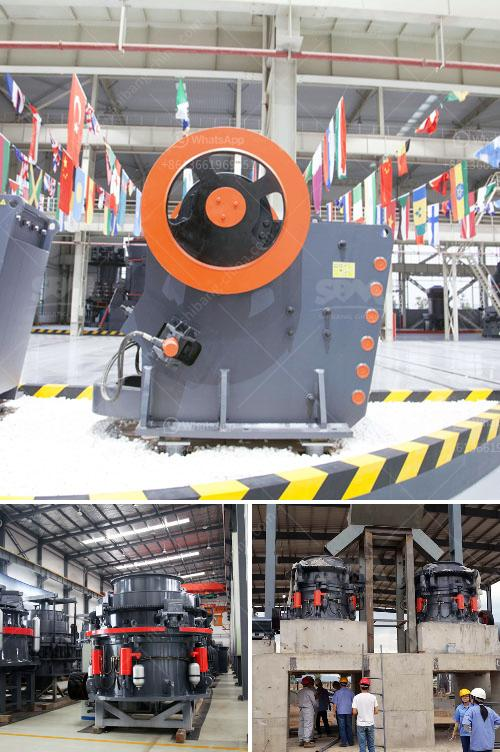

<h3>What is the mining process of barite？</h3>
Barite, also known as baryte, is a mineral composed of barium sulfate (BaSO4). It is widely used in various industries such as petroleum, paint, chemicals, and glass due to its high density and chemical inertness. The mining process of barite begins with the exploration and development of deposits, which are usually found in layers or veins within limestone or other sedimentary rocks.

The first step in the mining process is the identification of potential barite deposits, which requires extensive research and geological analysis. Geologists study the formation of rock layers and analyze past data to determine areas that are likely to contain barite. This involves examining various factors such as the presence of suitable host rocks, the composition of the surrounding environment, and historical mining activities.

Once potential deposits have been identified, exploration drilling is conducted to confirm the presence of barite and determine its quality and quantity. Core samples are obtained from the drilling and analyzed in the laboratory to assess the barite content, as well as impurities such as sulfur and iron. This information is crucial for planning the mining operations.

After confirming the presence of economically viable barite deposits, the next step is the development of the mine. This involves acquiring the necessary permits and licenses, as well as conducting environmental impact assessments to ensure compliance with regulations. Infrastructure such as access roads, power supply, and water sources are also established to support the mining operations.

The actual mining process of barite involves several stages, including extraction, crushing, milling, and purification. Typically, barite is extracted through both open-pit and underground mining methods. The barite ore is then excavated using heavy machinery and loaded into trucks for transportation to the processing plant.

In the crushing stage, the ore is broken into smaller pieces to facilitate further processing. Barite ores are usually crushed using jaw crushers or impact crushers, which reduce the ore size to a more manageable level. After crushing, the ore is sent to a mill for grinding to achieve the desired particle size.

The grinding process involves using large grinding mills, such as ball mills or vertical mills, to crush the ore into a finer powder. This powder is then sent to a beneficiation plant, where impurities are removed through a variety of methods, including gravity separation, flotation, and magnetic separation. The purified barite concentrate is then further processed to meet specific customer requirements.

In conclusion, the mining process of barite involves various stages, including exploration, development, extraction, crushing, milling, and purification. Through these processes, the valuable barite mineral is extracted and processed to meet the demands of various industries. Mining companies must ensure compliance with environmental regulations and engage in sustainable practices to minimize the impact on the surrounding environment.
<h3>Contact us</h3><ul><li><strong>Whatsapp:&nbsp;<a href="https://wa.me/8613661969651">+8613661969651</a></strong></li><li><a href="https://swt.shibang-china.com/?git&amp;zhl&amp;What is the mining process of barite？"><strong>Online Service(chat now)</strong></a></li></ul><h3>Related</h3><ul><li><a href='What type of quarry crusher is .md'>What type of quarry crusher is ?</a></li><li><a href='What is the cost of a jaw crusher.md'>What is the cost of a jaw crusher?</a></li><li><a href='What kind of equipment is used for fine crushed stone？.md'>What kind of equipment is used for fine crushed stone？</a></li><li><a href='What kind of crusher is used to create railway ballast.md'>What kind of crusher is used to create railway ballast?</a></li><li><a href='What is the project cost for ball grinding unit .md'>What is the project cost for ball grinding unit ?</a></li></ul>