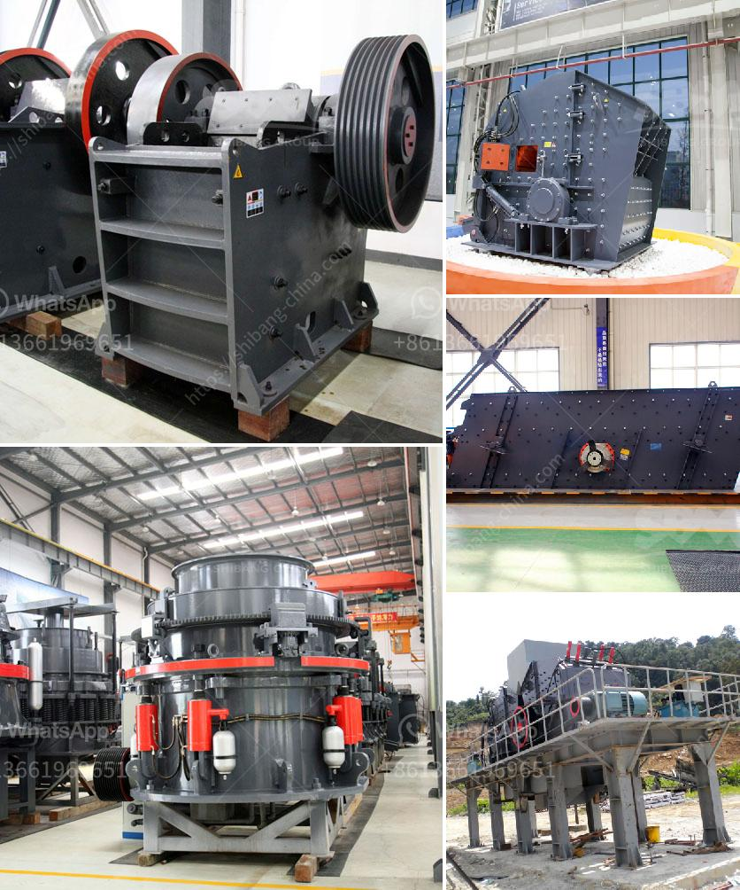

<h3>What is the mining process of limestone?</h3>
Limestone, composed mostly of calcium carbonate, is used primarily to produce cement and lime. In terms of its environmental impact, limestone mining can be considered as one of the most environmentally damaging activities. Limestone mining causes widespread disturbance in the environment.

To obtain limestone, huge blocks of it must be cut out of the quarry walls. This is usually done by a combination of blasting and mechanical sawing or cutting. Once the limestone is extracted, it is transported to a processing plant where it is crushed and divided into different sizes for further processing.

The first step in the mining process of limestone is blasting, which is carried out using explosives. However, the blasting process carries certain risks that can be minimized by following safety guidelines to protect workers and neighboring communities.

After blasting, the fragmented limestone material is loaded onto trucks or conveyors and transported to a primary crusher. Crushing can be done in several stages, with the primary crusher reducing the limestone to a size of about 10-20 centimeters in diameter. Secondary crushers then reduce the size of the stones to the desired size.

After crushing, the limestone is screened to remove any unwanted debris or fine particles. The screened limestone is then conveyed to storage piles or bins for further processing. In some cases, the crushed limestone is also mixed with other materials, such as coal or clay, in order to produce cement.

To produce lime, limestone is burned at high temperatures in a kiln. The process of limestone calcination results in the release of carbon dioxide gas, contributing to greenhouse gas emissions. Furthermore, lime production also generates large amounts of waste in the form of lime sludge.

Mining limestone has several negative environmental impacts. It can cause erosion, change the shape of river channels, and lead to habitat destruction for plants and animals. Additionally, the water quality of nearby rivers and streams can be negatively affected by the release of sediment and pollutants.

Furthermore, the extraction of limestone from quarries often leads to the destruction of natural habitat and loss of biodiversity. Many limestone quarries are located in areas of significant ecological importance, such as wetlands or forests, which are home to numerous plant and animal species.

To mitigate the environmental impact of limestone mining, various measures can be implemented. These include limiting the extent of mining operations, properly managing waste materials, utilizing advanced technologies to reduce pollutant emissions, and restoring the land after mining.

In conclusion, limestone mining involves a series of processes, including blasting, crushing, screening, and burning. It has significant environmental impacts, such as habitat destruction and water contamination. However, by implementing sustainable practices and mitigation measures, the negative effects of limestone mining can be minimized, allowing for the continued use of this valuable resource.
<h3>Contact us</h3><ul><li><strong>Whatsapp:&nbsp;<a href="https://wa.me/8613661969651">+8613661969651</a></strong></li><li><a href="https://swt.shibang-china.com/?git&amp;zhl&amp;What is the mining process of limestone"><strong>Online Service(chat now)</strong></a></li></ul><h3>Related</h3><ul><li><a href='What are the processing equipment for feldspar powder？.md'>What are the processing equipment for feldspar powder？</a></li><li><a href='What products are produced from a cone crusher.md'>What products are produced from a cone crusher?</a></li><li><a href='what brand of iron ore crusher more advanced.md'>what brand of iron ore crusher more advanced</a></li><li><a href='What is the minimum possible crushing size of limestone after it has been crushed in a crusher.md'>What is the minimum possible crushing size of limestone after it has been crushed in a crusher?</a></li><li><a href='What chrome ore used for .md'>What chrome ore used for ?</a></li></ul>