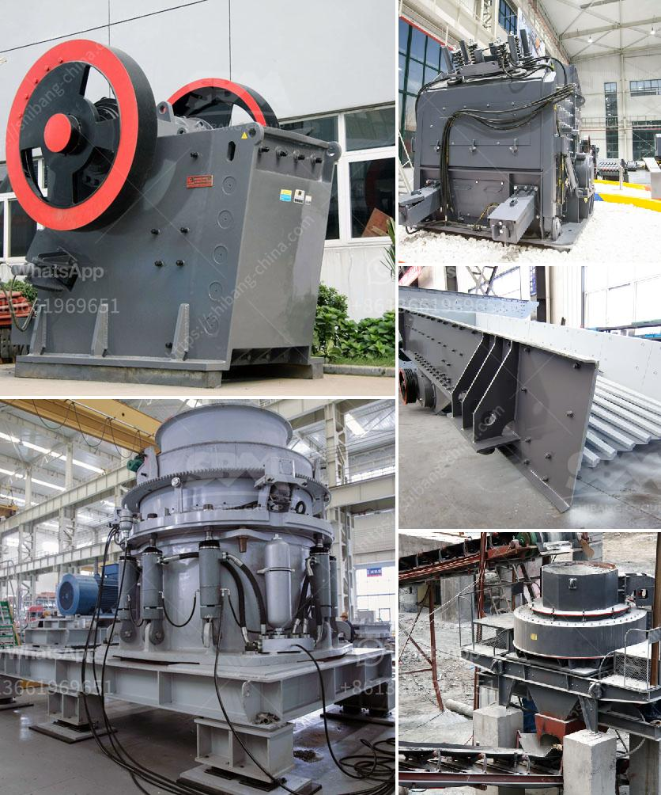

<h3>What is the need to replace the jaw crusher plate？</h3>
The jaw crusher plate is the most crucial component in the jaw crusher machine, which is responsible for crushing the materials. The material is crushed between the two jaws, so the wear of the liner plate is the most serious problem for the jaw crusher. And the types of wear and tear are mainly divided into the following cases.

Abrasive wear is caused by the relative sliding of the hard particles on the surface of the jaw crusher plate. It is mainly caused by the extrusion and rubbing of the ore during the crushing process. In addition, it is also affected by various factors such as the hardness and size of the material.

Chipping wear is caused by the impact of the ore on the jaw crusher plate during the work, which causes severe local deformation and cracks. Therefore, the material with good toughness is required to resist the impact.

Erosion wear is caused by the scouring action of the ore and the abrasive action of small particles on the surface of the jaw crusher plate. In addition, the jaw crusher plate is also corroded by chemical materials.

The above types of wear will lead to a decrease in the service life of the jaw crusher plate. Therefore, the need to replace the jaw plate increases. Among them, the jaw plate is the most easily worn component in the jaw crusher. Its working purpose is to transmit the power and squeeze the stone material.

Without the jaw plate, the machine cannot be made to work normally. Therefore, to protect the jaw plate, the operator needs to replace the jaw crusher plate regularly. Due to the relatively severe working conditions of the stone crushing equipment, the wear and tear of the jaw plate is greater.

In the process of crushing materials, the jaw plate constantly rubs against the materials, with strong friction and grinding pressure. Under such working conditions, the jaw plate is prone to wear and tear. Therefore, the operator needs to replace the jaw plate regularly.

During the operation of the jaw crusher, the jaw plate may be damaged due to various reasons. Excessive load or uneven feeding may cause the jaw plate to be overloaded or the non-crushed materials enter the crushing chamber, causing the jaw plate to break or deform.

As the jaw crusher plate is constantly in contact with stones and debris, it is easy to wear out over time. In addition, the jaw plate is also prone to corrosion due to the action of various chemical materials. When the jaw plate becomes aging or corroded, its impact resistance and structural stability will decrease, leading to the need for replacement.

In conclusion, the need to replace the jaw crusher plate arises due to the wear and tear caused by abrasive, chipping, and erosion. Regular replacement of the jaw plate is necessary to ensure the normal operation and prolong the service life of the jaw crusher machine.
<h3>Contact us</h3><ul><li><strong>Whatsapp:&nbsp;<a href="https://wa.me/8613661969651">+8613661969651</a></strong></li><li><a href="https://swt.shibang-china.com/?git&amp;zhl&amp;What is the need to replace the jaw crusher plate？"><strong>Online Service(chat now)</strong></a></li></ul><h3>Related</h3><ul><li><a href='What are the steps in manufacturing Portland cement.md'>What are the steps in manufacturing Portland cement?</a></li><li><a href='What is antimony ore used for.md'>What is antimony ore used for?</a></li><li><a href='What is the disk spacing in a jaw crusher known as.md'>What is the disk spacing in a jaw crusher known as?</a></li><li><a href='What are the coal sizing requirements for a power plant.md'>What are the coal sizing requirements for a power plant?</a></li><li><a href='What equipment is required for a large quarry.md'>What equipment is required for a large quarry?</a></li></ul>