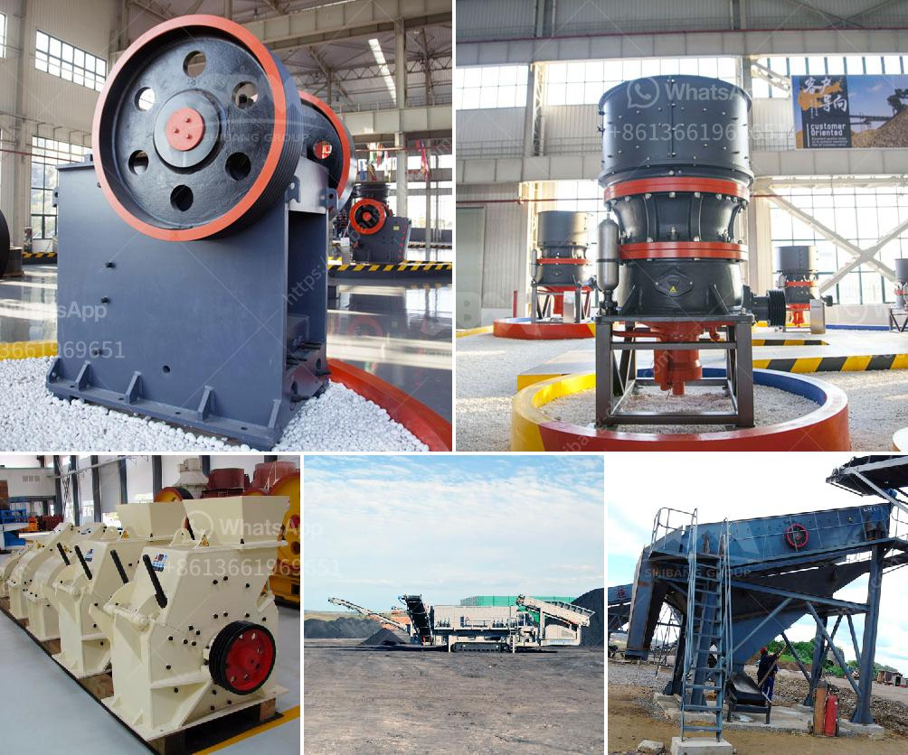

<h3>What is the operation of a vertical roller mill?</h3>
A vertical roller mill (VRM) is a type of industrial equipment used to crush or grind materials into small particles. These machines consist of a large, heavy-duty steel drum that relies on both hydraulic and pneumatic forces to pulverize rock or stone.

Vertical roller mills are widely used in the cement industry and power generation industry. In a typical VRM, raw materials are fed into the mill and ground between rollers and a rotating table. The material is then transported out of the mill and classified by a classifier, which separates the ground particles based on size.

The operation of a vertical roller mill involves multiple components working together. The main components include the grinding rollers, grinding table, hydraulic system, and pressure device. These components work together to generate the necessary forces required for grinding.

The grinding rollers are the key components in a vertical roller mill. These rollers help in crushing and grinding the material, which is fed into the mill. They exert pressure on the material, causing it to be ground between the rollers and the grinding table. The grinding table is a rotating component that holds the material in place and allows it to be ground against the rollers. It ensures the evenly distributed grinding of material across the table.

The hydraulic system in a vertical roller mill is responsible for maintaining the grinding pressure, ensuring a stable grinding operation. It consists of a pump, a motor, a pressure container, and piping. The pump, driven by a motor, creates the pressure required for grinding. The pressure container stores the hydraulic fluid, which is transmitted to the grinding rollers to exert the necessary force.

A pressure device, such as a spring or hydraulic cylinder, assists in maintaining a constant grinding pressure. It ensures the proper compacting of the material between the rollers and the table. This pressure device helps in achieving the desired fineness of the ground material.

During the operation of a vertical roller mill, the material is fed into the mill by a chute or conveyor. The material is ground between the rollers and the table, and the resulting powder is transported out of the mill by an air flow. The coarse particles are separated by a classifier, and the finer particles are collected in a bag filter system for further processing or storage.

The operation of a vertical roller mill is crucial for achieving high-quality cement or powders. It requires skilled operators who can monitor the machine and make necessary adjustments to optimize the grinding process. Regular maintenance and inspection of the mill components are also essential to ensure its smooth operation and prolonged lifespan.

In conclusion, the operation of a vertical roller mill involves multiple components working together to crush, grind, and classify materials. The grinding rollers, grinding table, hydraulic system, and pressure device play crucial roles in achieving the desired fineness of the ground material. Skilled operators and regular maintenance are vital for the efficient and reliable operation of a vertical roller mill.
<h3>Contact us</h3><ul><li><strong>Whatsapp:&nbsp;<a href="https://wa.me/8613661969651">+8613661969651</a></strong></li><li><a href="https://swt.shibang-china.com/?git&amp;zhl&amp;What is the operation of a vertical roller mill"><strong>Online Service(chat now)</strong></a></li></ul><h3>Related</h3><ul><li><a href='What machines are used in mines.md'>What machines are used in mines?</a></li><li><a href='What is the way to block the material of sand crusher .md'>What is the way to block the material of sand crusher ?</a></li><li><a href='What should be the RPM of a ball mill with a 45inch diameter.md'>What should be the RPM of a ball mill with a 45-inch diameter?</a></li><li><a href='What is Raymond mill and ball mill process .md'>What is Raymond mill and ball mill process ?</a></li><li><a href='What determines the capacity of a stone crusher.md'>What determines the capacity of a stone crusher?</a></li></ul>