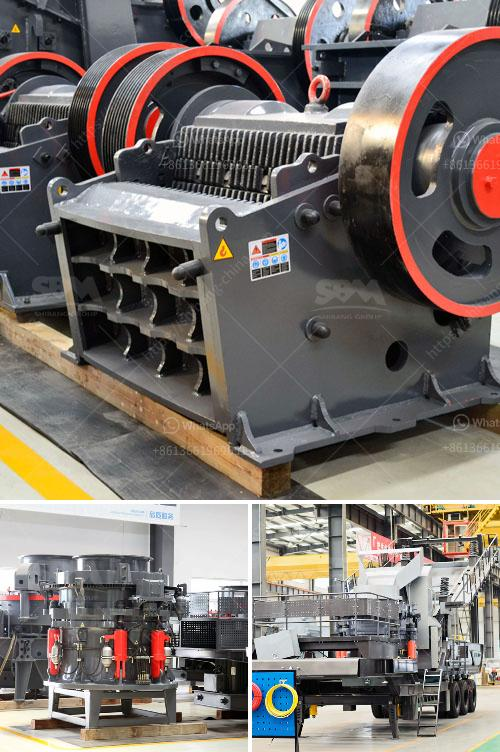

<h3>What is the ore crusher discharge port size?</h3>
The ore crusher is an important mechanical equipment in the ore crushing process. Ore materials are fed into the crusher through the feeding device, and then crushed into smaller particles by the crushing chamber. The discharge port is an essential part of the crusher, as it determines the size of the final product. So, what is the ore crusher discharge port size?

The discharge port size of the ore crusher refers to the size of the crushed material after the ore is crushed by the crusher. In general, the larger the size of the discharge port, the coarser the crushed product will be. Conversely, a smaller discharge port size will result in a finer crushed product.

The discharge port size of the ore crusher can be adjusted by adjusting the distance between the stationary plate and the movable plate of the crusher. By changing the spacing, the size of the crushed material can be controlled, and different discharge port sizes can be achieved to meet the requirements of different production needs.

The discharge port size of the ore crusher is mainly determined by the gap between the two crushing plates. Generally, the larger the gap, the larger the discharge port size, and vice versa. However, it is worth noting that the discharge port size is not the only factor that affects the final product size. The size and shape of the crushing cavity, the rotational speed of the crusher, and the feeding size of the ore material also play important roles.

In addition, the discharge port size of the ore crusher is also related to the type of crusher. Different types of crushers have different ways of adjusting the discharge port size. For example, the jaw crusher uses an adjustable wedge to control the discharge port size, while the cone crusher uses a hydraulic cylinder to adjust the discharge port size.

The discharge port size of the ore crusher is of great significance to the production and operation of the crushing system. An appropriate discharge port size can ensure the normal operation of the crusher and improve the efficiency of the crushing process. It can also be adjusted according to the specific requirements of the final product size, ensuring the production of qualified products.

In conclusion, the discharge port size of the ore crusher is the size of the crushed material after the ore is crushed by the crusher. It can be adjusted by changing the distance between the crushing plates. The discharge port size affects the final product size and can be controlled to meet different production needs. It is an important parameter in the operation of the ore crusher and plays a crucial role in the crushing process.
<h3>Contact us</h3><ul><li><strong>Whatsapp:&nbsp;<a href="https://wa.me/8613661969651">+8613661969651</a></strong></li><li><a href="https://swt.shibang-china.com/?git&amp;zhl&amp;What is the ore crusher discharge port size"><strong>Online Service(chat now)</strong></a></li></ul><h3>Related</h3><ul><li><a href='What is a Raymond mill.md'>What is a Raymond mill?</a></li><li><a href='What is a beneficiation plant primary mill.md'>What is a beneficiation plant primary mill?</a></li><li><a href='What are the steps in manufacturing Portland cement.md'>What are the steps in manufacturing Portland cement?</a></li><li><a href='What are the factors that promote the development of mining.md'>What are the factors that promote the development of mining?</a></li><li><a href='What is vsi in mobile stone jaw crusher.md'>What is vsi in mobile stone jaw crusher</a></li></ul>