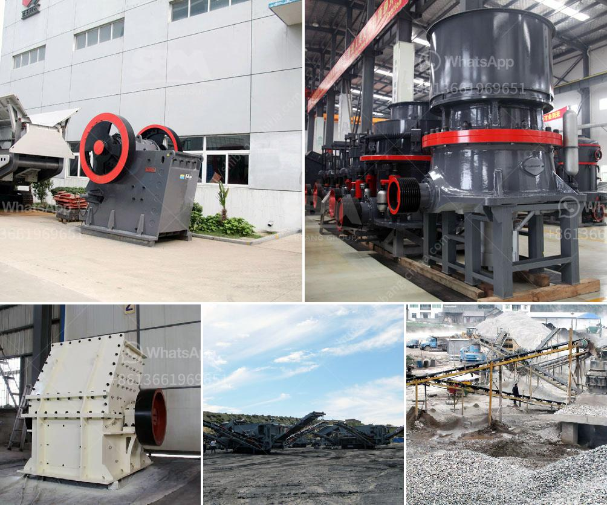

<h3>What is the price of a cone crusher in Venezuela?</h3>
Venezuela is a country rich in mineral resources and has been experiencing a significant increase in the extraction and production of minerals in recent years. However, due to economic challenges and political instability, the country's mining industry has faced several obstacles. One key component of the mining industry is the cone crusher, a machine used to break large rocks into smaller rocks, gravel, or rock dust. With the increasing demand for minerals, the cone crusher market in Venezuela is growing rapidly. But what is the price of a cone crusher in Venezuela?

The price of a cone crusher in Venezuela is affected by multiple factors, including the capacity, model, and brand of the equipment. More specifically, the price is determined by the following aspects:

1. Capacity: Cone crushers come in different sizes with varying capacities. Higher capacity cone crushers are generally more expensive due to their ability to process larger amounts of material at a faster rate. The price will increase as the capacity of the machine increases.

2. Model: Different cone crusher models have different features and specifications, which can influence the price. Models with advanced technology and enhanced efficiency might come at a higher price point compared to basic models.

3. Brand: The brand of the cone crusher also plays a role in determining its price. Well-known brands with a reputation for quality and durability tend to have higher prices. However, these brands often provide better after-sales service and spare parts availability, making them a preferred choice for many.

Additionally, there are external factors that can affect the price of a cone crusher in Venezuela. The exchange rate, inflation rate, and import tariffs are significant influences on the overall cost of imported equipment. Fluctuations in these factors can cause variations in the price of a cone crusher.

It is important to note that the price of a cone crusher can vary significantly between different suppliers and regions within Venezuela. Local economic conditions, competition in the market, and transportation costs can all contribute to price discrepancies.

To determine the exact price of a cone crusher in Venezuela, it is recommended to reach out to multiple suppliers and compare their offers. It is crucial to consider not only the initial purchase price but also the long-term costs associated with maintenance, spare parts, and potential downtime.

In conclusion, the price of a cone crusher in Venezuela is influenced by factors such as capacity, model, brand, exchange rate, and competition in the market. To obtain an accurate price, it is advisable to consult multiple suppliers and consider the long-term costs associated with the equipment. Investing in a high-quality cone crusher is essential for the efficient and sustainable extraction of minerals in Venezuela's growing mining industry.
<h3>Contact us</h3><ul><li><strong>Whatsapp:&nbsp;<a href="https://wa.me/8613661969651">+8613661969651</a></strong></li><li><a href="https://swt.shibang-china.com/?git&amp;zhl&amp;What is the price of a cone crusher in Venezuela"><strong>Online Service(chat now)</strong></a></li></ul><h3>Related</h3><ul><li><a href='what is a primary and secondary crusher？.md'>what is a primary and secondary crusher？</a></li><li><a href='What is a single toggle jaw crusher.md'>What is a single toggle jaw crusher?</a></li><li><a href='What type of crusher is needed to crush sillimanite？.md'>What type of crusher is needed to crush sillimanite？</a></li><li><a href='What is construction waste and what can we do to reuse it.md'>What is construction waste, and what can we do to reuse it?</a></li><li><a href='7 different vibrating screens how do you choose.md'>7 different vibrating screens, how do you choose?</a></li></ul>