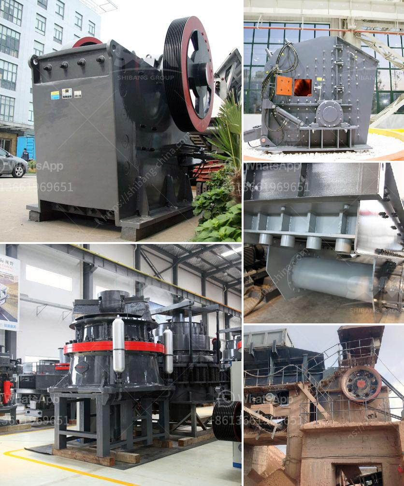

<h3>What is the price of a jaw coal crusher?</h3>
A jaw coal crusher, also known as coal breaker, is a specialized crusher equipment designed to reduce the size and large chunks of raw coal into smaller pieces for further processing. Jaw coal crushers are widely used in the mining, construction, and power generation industries as a primary crushing stage for coal.

When it comes to the price of a jaw coal crusher, there are several factors that influence its cost. Here, we will discuss some of these factors to provide an overview of the price range for such equipment.

The price of a jaw coal crusher varies depending on its type and model. Manufacturers offer a wide range of jaw crushers, each with different specifications and features. Generally, the more advanced the model and its capabilities, the higher the price. Additionally, some manufacturers may charge a premium for specific features like adjustable discharge settings, hydraulic toggle systems, or wear-resistant components.

The production capacity of a jaw coal crusher is another crucial factor that affects its price. Crushers with higher throughput capabilities naturally come at a higher cost. Larger crushers can handle more significant amounts of coal in a single pass, making them suitable for high-volume operations. However, they may not be necessary for smaller-scale projects or where the demand for processed coal is relatively low.

Well-established brands with a positive reputation in the industry tend to have higher prices for their equipment. This is because their products are known for their quality, reliability, and after-sales support. Choosing a reputable brand may result in a higher initial investment but can offer better long-term value as they often come with warranties and excellent customer service.

Market demand and competition can also influence the price of a jaw coal crusher. When demand is high or there is limited competition, manufacturers may price their crushers higher. On the other hand, intense competition can drive prices down as manufacturers aim to attract customers by offering competitive pricing. It is important to research the market and compare prices from different suppliers to ensure you are getting the best value for your investment.

Besides the base price of the jaw coal crusher, there may be additional costs to consider, such as shipping, installation, and maintenance. These costs can vary depending on various factors like geographical location, the complexity of installation, and the availability of trained technicians in the area. It is advisable to factor in these additional costs when budgeting for a jaw coal crusher.

In conclusion, the price of a jaw coal crusher can vary widely depending on several factors. These include the type and model of the crusher, production capacity, brand reputation, market demand, and competition. Additionally, there may be additional costs for shipping, installation, and maintenance. It is important to carefully consider these factors and gather quotes from multiple suppliers to make an informed decision and ensure you get the best value for your investment.
<h3>Contact us</h3><ul><li><strong>Whatsapp:&nbsp;<a href="https://wa.me/8613661969651">+8613661969651</a></strong></li><li><a href="https://swt.shibang-china.com/?git&amp;zhl&amp;What is the price of a jaw coal crusher"><strong>Online Service(chat now)</strong></a></li></ul><h3>Related</h3><ul><li><a href='What is a construction waste crusher ？.md'>What is a construction waste crusher ？</a></li><li><a href='What is a ball mill and how does it function.md'>What is a ball mill and how does it function?</a></li><li><a href='What is froth flotation used for in mines.md'>What is froth flotation used for in mines?</a></li><li><a href='What is the density of crushed stone aggregate 10mm 20mm and 40mm.md'>What is the density of crushed stone aggregate 10mm, 20mm, and 40mm?</a></li><li><a href='What is the price of coal crusher in Indonesia.md'>What is the price of coal crusher in Indonesia?</a></li></ul>