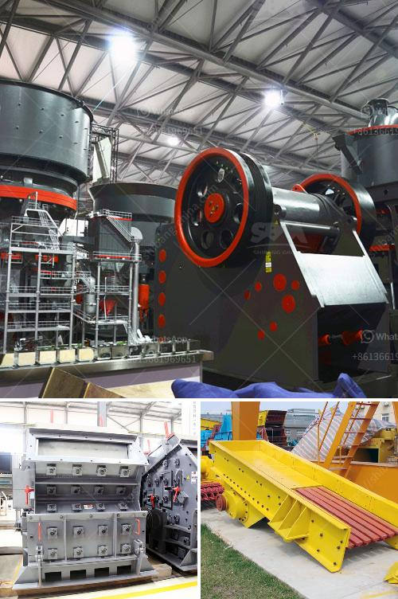

<h3>What is the price of a mobile crushing plant in Canada?</h3>
Mobile crushing plant is a new type of crushing equipment, which plays an important role in the whole production process. The equipment integrates crushing and screening, thus it can perform multi-stage crushing processes on various large-sized stones. Mobile crushing plant in Canada is used widely in mining industry, iron ore processing industry, aggregate crushing plant, clay mines, rock crushing plant, etc.

To invest in a mobile crushing plant, is a wise choice. It is very convenient to maintain and move, regardless of the weather conditions. Continuous operation increases production efficiency, and saves transportation costs. So, what is the price of a mobile crushing plant in Canada? Let’s take a look at the following analysis.

The first factor is the specification of the mobile crushing plant. The mobile crushing plant is divided into different crushing equipment, which can be divided into mobile jaw crusher, mobile cone crusher, mobile impact crusher, mobile sand making machine, mobile pulverizing machine, etc. The selected equipment depends on the specific crushing requirements. Different specifications correspond to different prices.

The second factor is the specific model of the equipment. Different models have different production capacities and processing capabilities. For example, a mobile jaw crusher with a production capacity of 50-800 tons per hour can crush granite, limestone, marble, basalt, etc. The prices range from 10,000 to 150,000 dollars.

The third factor is the company reputation. When purchasing a mobile crushing plant, it is essential to choose a reliable manufacturer. A reputable manufacturer generally has advanced technology, high-quality equipment, and excellent after-sales service. The prices offered by reputable manufacturers are usually higher than those of small manufacturers, but the quality and after-sales service can be guaranteed.

The fourth factor is the market supply and demand situation. As the saying goes, supply and demand determine the price. If the mobile crushing plant is in high demand and the supply is limited, the price will be higher. Conversely, if the supply exceeds the demand, the price will decrease. It is essential to pay attention to the market situation when purchasing a mobile crushing plant.

The last factor is the region where the mobile crushing plant is purchased. The prices of mobile crushing plants in different regions are often different due to factors such as transportation costs, production costs, and government policies. Therefore, it is necessary to consider all aspects comprehensively before making a purchase decision.

In summary, the price of a mobile crushing plant in Canada is affected by various factors. The specification, model, reputation of the manufacturer, market supply and demand situation, and the region where the plant is purchased all contribute to the final price. Therefore, it is crucial to conduct a comprehensive investigation and analysis before making a purchase decision, in order to choose a cost-effective mobile crushing plant.
<h3>Contact us</h3><ul><li><strong>Whatsapp:&nbsp;<a href="https://wa.me/8613661969651">+8613661969651</a></strong></li><li><a href="https://swt.shibang-china.com/?git&amp;zhl&amp;What is the price of a mobile crushing plant in Canada"><strong>Online Service(chat now)</strong></a></li></ul><h3>Related</h3><ul><li><a href='What are equipments used in a cement plant .md'>What are equipments used in a cement plant ?</a></li><li><a href='What is the bearing specification for an impact crusher.md'>What is the bearing specification for an impact crusher?</a></li><li><a href='What type of crusher is good for bentonite and dolomite.md'>What type of crusher is good for bentonite and dolomite?</a></li><li><a href='What is the capacity of the mobile crushers.md'>What is the capacity of the mobile crushers?</a></li><li><a href='What type of motor is used in cement mills.md'>What type of motor is used in cement mills?</a></li></ul>