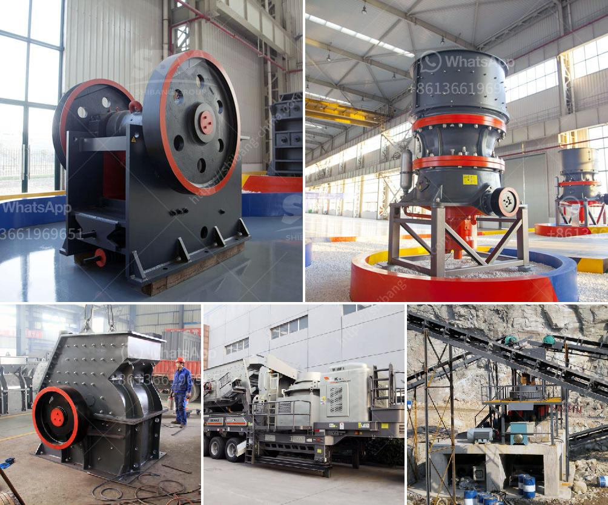

<h3>What is the price of barite crusher？</h3>
Barite, also known as baryte, is a mineral widely used in various industries such as oil and gas, drilling mud, paints, medical and pharmaceutical applications, and more. With such a wide range of uses, the demand for barite has been steadily increasing, leading to the need for efficient and reliable barite crushers.

The price of a barite crusher can vary greatly depending on the specific model and features chosen. With so many options available, it is important to understand the different factors that can affect the pricing.

One of the key factors influencing the price is the production capacity of the crusher. Crushers with higher production capacities tend to have higher prices due to the increased cost of materials and manufacturing processes. Additionally, crushers with higher capacities can handle larger quantities of barite, making them more suitable for large-scale industrial operations.

Another factor that affects the price is the quality and durability of the crusher. Barite is a relatively soft mineral, but it can still cause significant wear and tear on equipment. Therefore, higher-quality crushers with better materials and construction tend to have higher prices. Investing in a durable and reliable crusher can save money in the long run by reducing maintenance and replacement costs.

The type of crusher also plays a role in determining the price. There are several types of crushers available for barite crushing, including jaw crushers, cone crushers, impact crushers, and hammer crushers. Each type has its own advantages and disadvantages, and the price can vary accordingly. For example, jaw crushers are generally more expensive than impact crushers but may offer better performance in certain applications.

In addition to these factors, the brand and reputation of the crusher manufacturer can also affect the price. Well-known and established brands often have higher prices due to their reputation for quality and reliability. However, it is important to note that lesser-known brands might offer competitive prices without compromising on performance.

It is also worth considering the after-sales service and technical support provided by the manufacturer. A crusher is a complex piece of equipment that may require maintenance, repairs, and spare parts over time. Manufacturers that offer comprehensive after-sales support can provide peace of mind and potentially save money in the long run.

When considering the price of a barite crusher, it is essential to compare multiple options to find the best value for money. It is recommended to seek quotes from different manufacturers and evaluate the features, specifications, and after-sales service offered. Additionally, researching customer reviews and testimonials can provide insights into the performance and durability of different models.

In conclusion, the price of a barite crusher can vary depending on factors such as production capacity, quality, durability, type, brand, and after-sales support. It is important to carefully evaluate these factors and compare multiple options to make an informed decision. Investing in a reliable and efficient crusher can contribute to improved productivity and cost-effectiveness in various industrial applications.
<h3>Contact us</h3><ul><li><strong>Whatsapp:&nbsp;<a href="https://wa.me/8613661969651">+8613661969651</a></strong></li><li><a href="https://swt.shibang-china.com/?git&amp;zhl&amp;What is the price of barite crusher？"><strong>Online Service(chat now)</strong></a></li></ul><h3>Related</h3><ul><li><a href='What is the selling price of the hammer crusher.md'>What is the selling price of the hammer crusher?</a></li><li><a href='What are the requirements for a sand crushing plant.md'>What are the requirements for a sand crushing plant?</a></li><li><a href='What should be the RPM of a ball mill with a 45inch diameter.md'>What should be the RPM of a ball mill with a 45-inch diameter?</a></li><li><a href='What is chrome ore used for.md'>What is chrome ore used for?</a></li><li><a href='What machine crushes talcum powder for building stone？.md'>What machine crushes talcum powder for building stone？</a></li></ul>