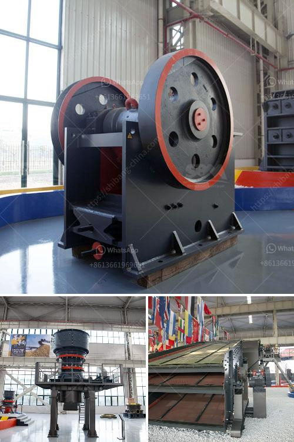

<h3>What is the price of coal crusher in Indonesia?</h3>
Coal crusher is also known as coal crushing machine which is used for the coal particle size is 100mm to 20mm after the coal is crushed or grinded by the coal crusher. It is widely used in the coal industry, such as coal mining and thermal power plant. The coal is often crushed into uniform particle size by jaw crusher and impact crusher or cone crusher.

The price of coal crusher is not fixed and the production capacity range is large, which can better meet the needs of different users. As a professional manufacturer of coal crusher, Hongxing insists on providing users with high-quality coal crushers with higher quality, high performance, excellent service, and reasonable price.

With the increasingly high demand for coal in Indonesia, mining operators in Indonesia have various requirements on coal crushing equipment. The coal crushing equipment market has been widely developed in the coal mining industry and is also popular in the mining industry. It has a variety of performances and characteristics such as large crushing ratio, high efficiency, low energy consumption, and uniform product size.

Coal crusher plays a very important role in the coal mining process. In Indonesia, coal crushing plant consists of jaw crusher, cone crusher, impact crusher, vibrating feeder, vibrating screen and belt conveyor.

XSM can supply you coal primary crusher and secondary coal crusher for sale. XSM can customize vibrating feeder, vibrating screen and type of motor as your requirements. There are three types of crushers available for crushing coal namely (i) hammer mill, (ii) ring granulator and (iii) smooth roll crusher. The price of coal crusher is not fixed and can be further adjusted according to the different specifications and sizes of crusher equipment.

The continuous improvement of coal crushing technology has strengthened the performance and quality of coal crushers. Where to buy coal crusher? As the coal mining industry in Indonesia is booming, coal crushers are greatly needed. Therefore, Indonesia's coal crusher machine is closely related to the economic interests of coal enterprises. The price of coal crusher is higher than that of common crusher equipment and occupies an important position in the entire production and operation process. Why is the price of coal crusher higher? What is the price of coal crusher?

Different types and models of coal crusher have different prices. For the same type of equipment, the price is related to its specifications, production capacity, processing materials, etc. For the specific price of coal crusher, it can be consulted with manufacturers and suppliers directly. Here, we recommend Luoyang Dahua, China's leading crusher manufacturer. The company provides customers with more detailed product information, and the product quotes, sales consultation, and after-sales service are also very advantageous.

In summary, the price and quality of coal crusher are influenced by factors such as equipment quality, technology, region, market demand, etc. The price of coal crusher is unstable, and the users don't have much budget. Therefore, when choosing coal crusher, manufacturers should consider the comprehensive strength and quality of equipment. Only with guaranteed quality, the equipment price is reasonable and service is more perfect.
<h3>Contact us</h3><ul><li><strong>Whatsapp:&nbsp;<a href="https://wa.me/8613661969651">+8613661969651</a></strong></li><li><a href="https://swt.shibang-china.com/?git&amp;zhl&amp;What is the price of coal crusher in Indonesia"><strong>Online Service(chat now)</strong></a></li></ul><h3>Related</h3><ul><li><a href='What does aggregate crusher mean.md'>What does "aggregate crusher" mean?</a></li><li><a href='What does a 100 ton per hour jaw crusher cost.md'>What does a 100 ton per hour jaw crusher cost?</a></li><li><a href='What material is generally broken by a cone crusher.md'>What material is generally broken by a cone crusher?</a></li><li><a href='What is a cement plants tertiary crusher.md'>What is a cement plant's tertiary crusher?</a></li><li><a href='What type of crusher is needed to crush sillimanite？.md'>What type of crusher is needed to crush sillimanite？</a></li></ul>