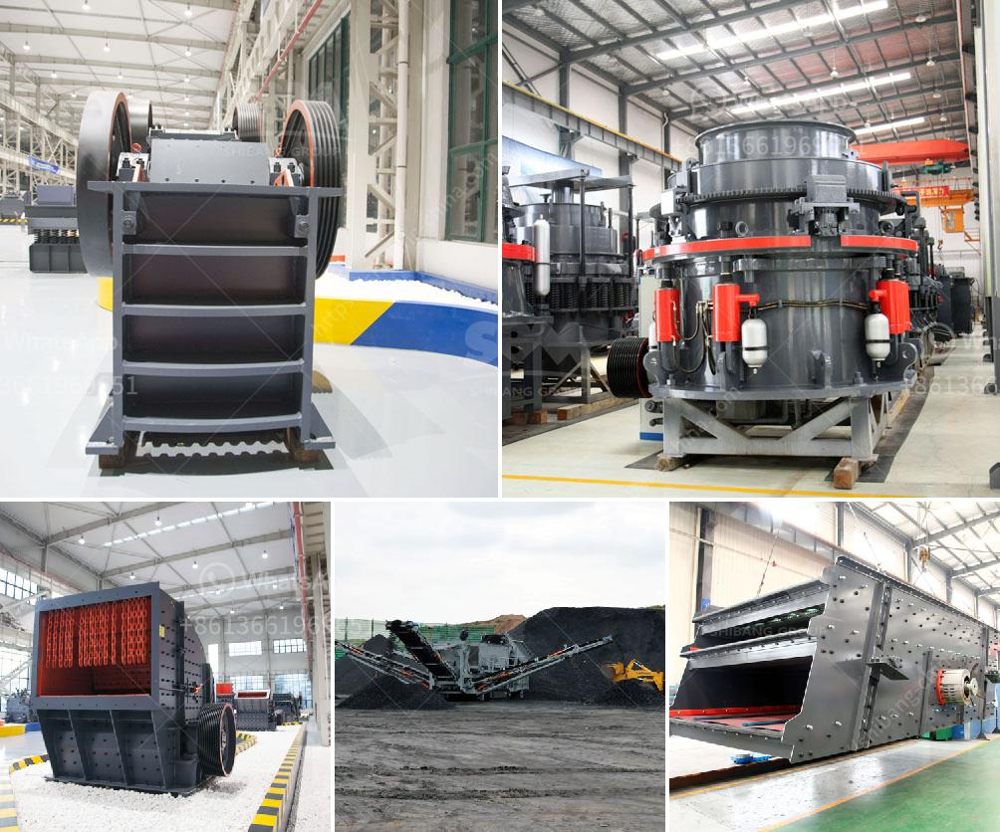

<h3>What is the price of mobile crusher?</h3>
What is the price of a mobile crusher? This is a question that many potential buyers may ask themselves when considering purchasing a mobile crushing plant. With numerous models and varieties available on the market, it can be challenging to estimate the cost for your specific needs. However, by understanding the factors that influence pricing, customers can gain insight into what they can expect to pay.

First and foremost, the price of a mobile crusher is influenced by the technical specifications and features. These can vary significantly from one model to another, depending on the capacity, power, and efficiency of the machine. A mobile crusher with a high output capacity may command a higher price due to its enhanced performance capabilities. Additionally, features such as advanced automation, remote control operation, and interlock systems may also contribute to a higher price tag.

Another significant factor that affects the price is the brand and reputation of the manufacturer. Well-known and established brands often charge a premium for their products due to their reputation for quality and reliability. While these brands may cost more upfront, customers can have confidence in the machine's performance and longevity.

Furthermore, the type of mobile crusher required can also impact the price. Different types of crushers are designed for different applications and materials. For example, a jaw crusher is ideal for primary crushing purposes, whereas a cone crusher is suitable for secondary or tertiary crushing. The complexity and functionality of the equipment required for specific tasks can affect the overall cost.

Transportation and logistical aspects also play a role in pricing a mobile crusher. Factors such as shipping distance and the need for special transportation permits can influence the final cost. Additionally, the weight and dimensions of the machine can impact transportation costs.

Lastly, market conditions and competition can affect pricing. In a competitive market, manufacturers may strive to offer competitive prices, resulting in more affordable options for customers. It is essential to research and compare prices from different manufacturers to ensure a fair deal.

In conclusion, determining the price of a mobile crusher involves considering various factors. Technical specifications, features, brand reputation, type of crusher, transportation costs, and market conditions all contribute to the final price. Potential buyers should thoroughly research and compare different options to ensure they find the right mobile crusher that fits their needs and budget.
<h3>Contact us</h3><ul><li><strong>Whatsapp:&nbsp;<a href="https://wa.me/8613661969651">+8613661969651</a></strong></li><li><a href="https://swt.shibang-china.com/?git&amp;zhl&amp;What is the price of mobile crusher"><strong>Online Service(chat now)</strong></a></li></ul><h3>Related</h3><ul><li><a href='What equipment can be used to crush 6 mm aggregate into dust.md'>What equipment can be used to crush 6 mm aggregate into dust?</a></li><li><a href='What is the cost of gravel crushing .md'>What is the cost of gravel crushing ?</a></li><li><a href='What should be the RPM of a ball mill with a 45inch diameter.md'>What should be the RPM of a ball mill with a 45-inch diameter?</a></li><li><a href='What is crushed quartz stone.md'>What is crushed quartz stone?</a></li><li><a href='what is a mobile impactor crusher？.md'>what is a mobile impactor crusher？</a></li></ul>