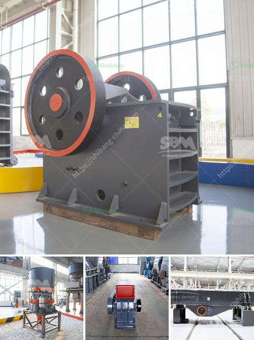

<h3>What is the principle of a hammer crusher?</h3>
A hammer crusher is a machine that is used to crush or shred materials into smaller pieces. The basic design of this type of machine involves a rotating shaft or drum on which hammers are mounted. The hammers are free to swing on the ends of the cross, or fixed to the central rotor. The rotor rotates at high speeds within the crushing chamber and hammers are thrown towards the crushing materials to break them into smaller pieces.

The principle of a hammer crusher is straightforward. Essentially, the crusher consists of a large rotating hammer cluster, which is contained within a casing. These hammers are attached to a shaft that rotates at high speed within the crushing chamber. The material is fed into the crusher from the top and falls directly onto the hammers. As the hammers rotate, they act like a series of impactors, breaking down the material in a cascading motion.

The size of the crushed material depends on the speed and number of hammers and the size of the opening at the bottom of the crusher. The speed of the rotor can vary from hundreds to thousands of revolutions per minute, allowing for a high throughput of material. The hammers can be replaced or adjusted to achieve the desired size of the crushed material.

The main advantage of a hammer crusher is its simplicity and versatility. It can be used for a wide range of materials, including coal, limestone, gypsum, and more. Additionally, the hammer crusher can be used in recycling operations as it can break down materials into smaller pieces that can be processed further. This makes it ideal for the processing of construction debris and other waste materials.

In addition to its simplicity, the hammer crusher is also known for its energy efficiency. The hammers do not consume much power as they rotate, and the impact of the hammers on the material provides the crushing action. This reduces the overall energy consumption of the machine and makes it a cost-effective solution for crushing applications.

One potential drawback of a hammer crusher is its susceptibility to wear and tear. The hammers can become worn over time, especially when crushing hard or abrasive materials. To counter this, the hammers are often made from high wear-resistant materials, such as manganese steel or cast alloys, to increase their durability. Regular maintenance, including hammer replacement, is essential to ensure the efficient operation of the crusher.

In conclusion, the principle of a hammer crusher involves a rotating shaft or drum on which hammers are mounted. The hammers are free to swing on the ends of the cross, or fixed to the central rotor. The material is fed into the crusher from the top and falls onto the rotating hammers, which break it down into smaller pieces. The simplicity and versatility of the hammer crusher make it an efficient and cost-effective solution for crushing a wide range of materials. However, regular maintenance is necessary to ensure its optimal performance.
<h3>Contact us</h3><ul><li><strong>Whatsapp:&nbsp;<a href="https://wa.me/8613661969651">+8613661969651</a></strong></li><li><a href="https://swt.shibang-china.com/?git&amp;zhl&amp;What is the principle of a hammer crusher"><strong>Online Service(chat now)</strong></a></li></ul><h3>Related</h3><ul><li><a href='what are the raw material for cement production .md'>what are the raw material for cement production ?</a></li><li><a href='What machines are required for a limestone powder factory.md'>What machines are required for a limestone powder factory?</a></li><li><a href='What are the specifications of the copper crusher.md'>What are the specifications of the copper crusher?</a></li><li><a href='What is the definition of crushing in mining.md'>What is the definition of crushing in mining?</a></li><li><a href='What determines the capacity of a stone crusher.md'>What determines the capacity of a stone crusher?</a></li></ul>