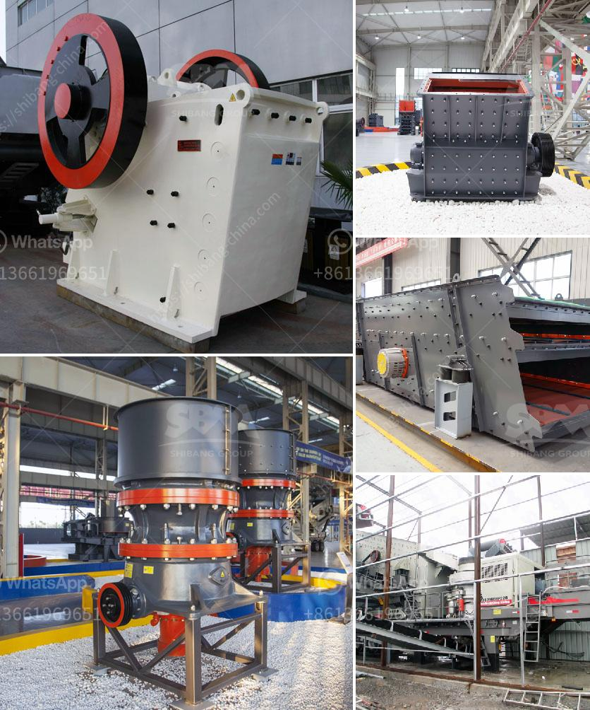

<h3>What is the problem with ore mining ?</h3>
Ore mining has long been an essential part of global industry, serving as the primary source for numerous valuable metals and minerals used in various applications. However, despite its economic benefits, ore mining comes with a range of ecological and social problems that pose significant challenges to sustainable development. From environmental degradation to human rights abuses, these issues demand the urgent attention of governments, industries, and individuals alike.

One of the most significant problems associated with ore mining is environmental degradation. The extraction and processing of ores often lead to deforestation, soil erosion, and contamination of air, water, and land. Open-pit mining, for example, can result in large-scale destruction of natural habitats, displacing wildlife and disrupting entire ecosystems. Pollution from mining operations can also have devastating effects on nearby communities, as toxic chemicals, heavy metals, and tailings can seep into water sources, putting both human health and the environment at risk.

Air pollution is another pressing concern linked to ore mining. The release of vast amounts of dust, especially during ore transportation and mineral processing, contributes to respiratory problems and lung diseases among workers and nearby communities. Additionally, the combustion of fossil fuels in mining operations releases greenhouse gases, exacerbating climate change and its associated environmental consequences.

Moreover, ore mining often involves significant energy consumption, contributing to the depletion of natural resources and the release of additional greenhouse gas emissions into the atmosphere. The extraction and processing of ores require immense quantities of water, adding strain to already water-stressed regions. This leads to conflicts over water resources, affecting not only local communities but also exacerbating tensions between industry and agriculture.

In addition to environmental concerns, the social impacts of ore mining cannot be overlooked. The extraction industry is frequently associated with human rights violations, including forced labor, child labor, and the displacement of indigenous communities from their ancestral lands. In many cases, mining companies operate in regions where governance is weak, which enables the exploitation of both people and resources without proper regulations and oversight.

Furthermore, the economic benefits of ore mining often fail to trickle down to local communities in the form of sustainable development. The reliance on mining can result in boom and bust cycles, leaving behind long-term economic instability and dependence on a single resource. Additionally, mining operations often prioritize the interests of multinational corporations over the well-being and quality of life of local communities, leading to social inequality and marginalization.

To address the problems associated with ore mining, governments and industries should prioritize sustainable practices and responsible resource management. This requires implementing stronger environmental regulations, investing in clean technologies, and promoting transparency and accountability in the extractive industries. Furthermore, community engagement and consultation must become an integral part of decision-making processes, ensuring that affected communities have a voice in shaping mining activities that directly impact their lives and environments.

In conclusion, ore mining presents a range of environmental and social problems that cannot be neglected. The industry's negative impacts on ecosystems, air and water quality, and human rights demand urgent attention and action. By shifting towards sustainable practices and engaging in responsible resource management, we can ensure that the benefits of ore mining are balanced with the preservation of our environment and the well-being of affected communities.
<h3>Contact us</h3><ul><li><strong>Whatsapp:&nbsp;<a href="https://wa.me/8613661969651">+8613661969651</a></strong></li><li><a href="https://swt.shibang-china.com/?git&amp;zhl&amp;What is the problem with ore mining "><strong>Online Service(chat now)</strong></a></li></ul><h3>Related</h3><ul><li><a href='What is the disk spacing in a jaw crusher known as.md'>What is the disk spacing in a jaw crusher known as?</a></li><li><a href='What is the best use of quarry limestone.md'>What is the best use of quarry limestone?</a></li><li><a href='What guards should be installed on a jaw crusher.md'>What guards should be installed on a jaw crusher?</a></li><li><a href='What is the difference between a wet and dry coal crusher and a hammer crusher.md'>What is the difference between a wet and dry coal crusher and a hammer crusher?</a></li><li><a href='What is the bearing specification for an impact crusher.md'>What is the bearing specification for an impact crusher?</a></li></ul>