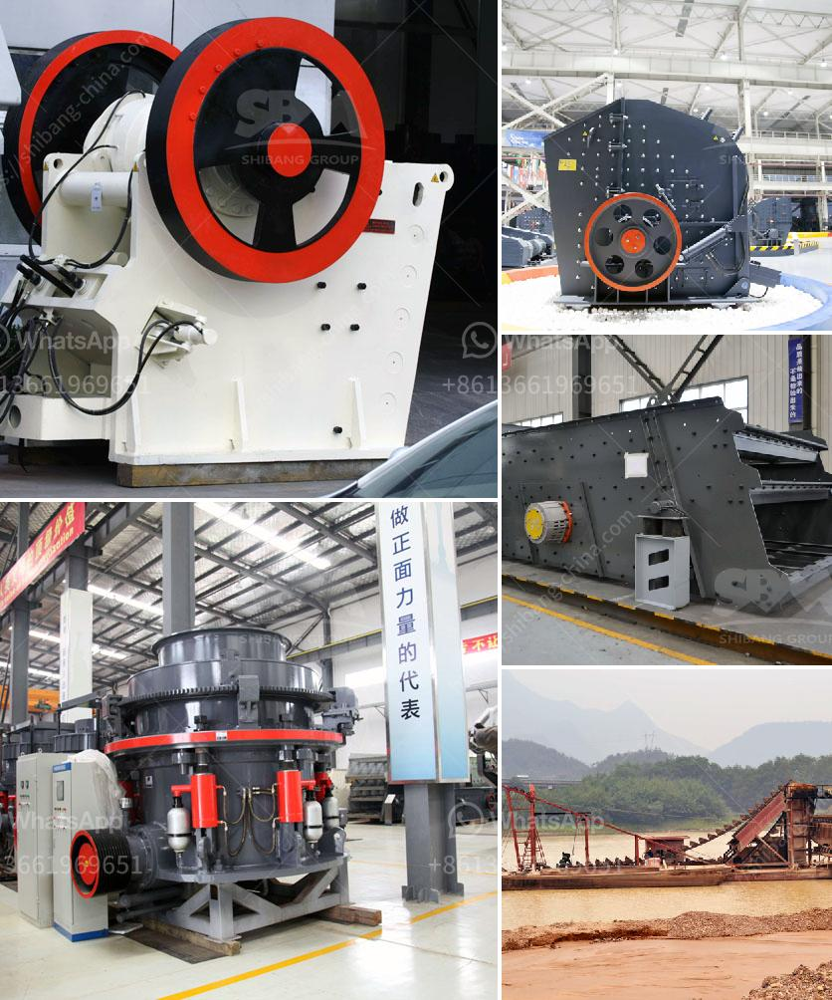

<h3>What is the procedure for obtaining a stone quarry license?</h3>
Stone quarrying is an ancient practice that has been carried out for centuries. As civilizations grew, the demand for construction materials like stone increased. Today, stone quarrying and the use of stone for various purposes continue to be a crucial industry worldwide. However, before anyone can start a stone quarrying operation, they must first obtain a stone quarry license. This article aims to outline the procedure involved in obtaining this essential license.

The procedure for obtaining a stone quarry license may vary depending on the jurisdiction, as regulations and requirements can differ from one region to another. However, some general steps are commonly followed:

Before starting the process, thorough research is necessary to understand the legal and regulatory framework governing stone quarrying operations in the target area. Identify the relevant government agencies responsible for issuing licenses and permits. Gather information about the specific requirements that must be met and any restrictions or guidelines associated with stone quarrying activities.

A comprehensive business plan should be developed, outlining the nature of the quarrying operation, the intended market, and the projected financials. It is crucial to include details about the site, including its geological characteristics, available resources, and environmental impact assessment. This plan is essential as it will be required when applying for a stone quarry license.

After the necessary research and business plan formulation, the next step involves applying for a stone quarry license. The application is typically submitted to the relevant government agency responsible for issuing licenses, such as the Department of Mines or Ministry of Natural Resources. The application process usually involves completing an application form, submitting the business plan, and paying the required application fee. It may also require meeting certain criteria such as proof of financial stability, technical expertise, and compliance with environmental regulations.

Upon receiving the application, the government agency will conduct a site inspection to verify the information provided. This may involve assessing the geological aspects of the site, evaluating environmental concerns, and ensuring compliance with health and safety regulations. The specific requirements of the site inspection will depend on local regulations and may require the applicant's presence.

After the site inspection, the government agency will evaluate the application and consider various factors such as environmental impact, community concerns, and the applicant's financial and technical capabilities. This evaluation process may take some time, depending on the workload and administrative procedures. Once the application is approved, the stone quarry license will be issued.

After obtaining the stone quarry license, the licensee must comply with all the regulations and conditions specified. Regular inspections and monitoring by the government agency may be conducted to ensure ongoing compliance. The license will typically have a validity period, and it must be renewed periodically to continue operating the quarry legally.

In summary, getting a stone quarry license requires careful planning, thorough research, and compliance with relevant regulations. The process involves formulating a business plan, submitting an application, undergoing site inspections, and obtaining approval from the government agency responsible. Compliance with license conditions and periodic renewal are necessary for the continued operation of the quarry.
<h3>Contact us</h3><ul><li><strong>Whatsapp:&nbsp;<a href="https://wa.me/8613661969651">+8613661969651</a></strong></li><li><a href="https://swt.shibang-china.com/?git&amp;zhl&amp;What is the procedure for obtaining a stone quarry license"><strong>Online Service(chat now)</strong></a></li></ul><h3>Related</h3><ul><li><a href='What should be the RPM of a ball mill with a 45inch diameter.md'>What should be the RPM of a ball mill with a 45-inch diameter?</a></li><li><a href='What guards should be installed on a jaw crusher.md'>What guards should be installed on a jaw crusher?</a></li><li><a href='What is the waste of ore crushing plant .md'>What is the waste of ore crushing plant ?</a></li><li><a href='What machines are used in mines.md'>What machines are used in mines?</a></li><li><a href='What type of flywheel is used in the double toggle jaw crusher.md'>What type of flywheel is used in the double toggle jaw crusher</a></li></ul>