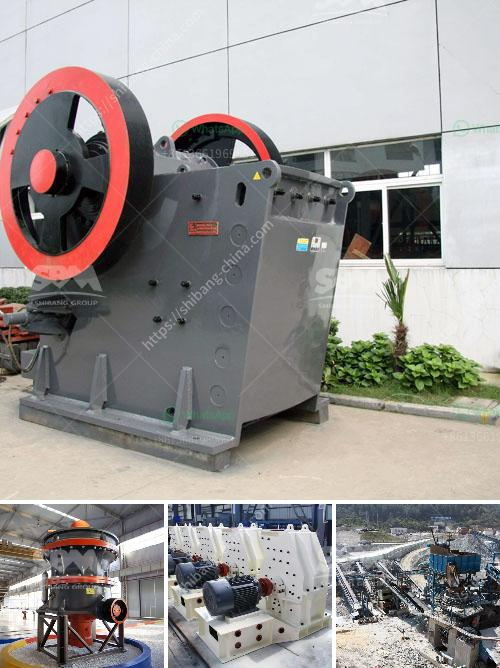

<h3>What is the process for mining manganese ore?</h3>
Manganese is a silver-gray metal with a pinkish hue. It is a vital mineral that plays a key role in various industrial applications, including the production of steel, batteries, and even pharmaceuticals. Manganese ore is typically mined in huge open-pits, much like iron ore, and the process for extracting this mineral is relatively simple and efficient.

In this article, we will explore the process for mining manganese ore, starting from its transportation to the processing facilities and beyond.

1. Transportation: The first step in mining manganese ore is its transportation from the mining site to a suitable processing facility. To accomplish this, large trucks or conveyors are used to transport the ore to a central processing plant or stockpile.

2. Crushing and Screening: Once the ore arrives at the processing facility, it undergoes crushing and screening. This process involves breaking the ore into small pieces and separating it into various grades based on its size. The ore is typically crushed using jaw crushers or cone crushers and then screened to remove any oversized materials.

3. Washing and Beneficiation: After the initial crushing and screening, the ore may undergo further processing to remove impurities and increase its manganese content. This process, known as beneficiation, typically involves washing the ore in water or a solution to remove any clay or organic matter. Magnetic separation or flotation methods are also commonly employed to separate the ore from unwanted minerals or gangue.

4. Drying: Once the ore has been washed and separated, it is dried to reduce its moisture content. Drying is crucial in preparing the ore for subsequent processing steps. Depending on the specific requirements, the ore may be air-dried or heated in an industrial dryer to remove the remaining moisture.

5. Roasting and Smelting: In some cases, manganese ore may undergo additional processing steps to extract the manganese metal. Roasting is one such process, where the ore is heated in a furnace to drive off unwanted impurities and convert manganese minerals into a more easily recoverable form. Smelting may follow, which involves melting the roasted ore with suitable reducing agents to obtain the final product, such as ferromanganese or silicomanganese alloys.

6. Refining and Packaging: Once the manganese metal or alloy has been obtained, further refining steps may be taken to improve its purity and quality. The final product is then packaged and prepared for sale or further industrial use.

In conclusion, the process for mining manganese ore involves several stages, including transportation, crushing and screening, washing and beneficiation, drying, roasting and smelting, and refining. Each of these steps is essential in extracting the valuable manganese metal or alloy from the ore efficiently and effectively. Manganese mining is a vital industry that contributes to various sectors, and understanding the mining process helps ensure the responsible extraction and utilization of this valuable resource.
<h3>Contact us</h3><ul><li><strong>Whatsapp:&nbsp;<a href="https://wa.me/8613661969651">+8613661969651</a></strong></li><li><a href="https://swt.shibang-china.com/?git&amp;zhl&amp;What is the process for mining manganese ore"><strong>Online Service(chat now)</strong></a></li></ul><h3>Related</h3><ul><li><a href='What does aggregate crusher mean.md'>What does "aggregate crusher" mean?</a></li><li><a href='What good sand making equipment manufacturers are there.md'>What good sand making equipment manufacturers are there?</a></li><li><a href='What are the specifications of the crusher for crushing concrete.md'>What are the specifications of the crusher for crushing concrete?</a></li><li><a href='What is the principle of a hammer crusher.md'>What is the principle of a hammer crusher?</a></li><li><a href='What is gyratory crushers .md'>What is gyratory crushers ?</a></li></ul>