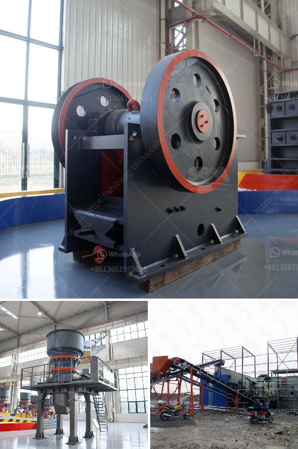

<h3>What is the process of crushers in a cement plant?</h3>
The cement plant processes stone, cement, coal, slag, gypsum, and limestone. Among all these machines, the crushers are the most crucial ones. Every cement plant keeps a stockpile of limestone and other raw materials. The crushing process is essential for these raw materials to be processed into cement. Most crushers perform this process by either compressing or impacting the materials.

In the primary crusher, the raw material is crushed to a size of about 250mm by a large jaw crusher. The crushed material is transported to the secondary crusher by a belt conveyor system. Here, the material is further reduced to a size of about 50mm using a cone crusher. The crushed material is then stacked and stored in a pre-homogenization pile.

In the pre-homogenization pile, the materials are blended and mixed to ensure uniformity and consistency in the composition of the raw materials. The process of pre-homogenization is crucial as it helps reduce variations in the chemical composition, which can affect the quality of the final cement.

From the pre-homogenization pile, the materials are moved to the raw mill for further grinding. In the raw mill, the materials are ground to a fine powder, which is known as raw meal. This raw meal is then transported to the mixing silo.

In the next stage, the raw meal is stored in the mixing silo, which acts as a buffer between the grinding process and the kiln process. It allows for a continuous supply of the raw meal to the kiln, ensuring a steady production of cement.

The first stage of the cement kiln system is the preheater. In the preheater, the raw meal is heated by the hot gases from the kiln. This helps to reduce the moisture content in the raw meal and preheats it to a temperature of about 800 degrees Celsius. This preheated raw meal is then fed into the kiln for further processing.

In the kiln, the raw meal is heated to a temperature of around 1450 degrees Celsius, resulting in the formation of clinker. The clinker is then cooled and stored in the clinker stockpile.

Finally, the clinker is ground with gypsum and other additives to produce cement. This grinding process is typically done in a ball mill, which is a cylindrical shell filled with steel balls.

In summary, the process of crushers in a cement plant involves the primary crushing of raw materials, followed by secondary crushing and stacking in a pre-homogenization pile. The raw materials are then ground in a raw mill and stored in a mixing silo before being fed into the kiln for further processing. The final stage involves grinding the clinker with gypsum to produce cement. These crushers play a key role in the cement manufacturing process and are essential for the production of high-quality cement.
<h3>Contact us</h3><ul><li><strong>Whatsapp:&nbsp;<a href="https://wa.me/8613661969651">+8613661969651</a></strong></li><li><a href="https://swt.shibang-china.com/?git&amp;zhl&amp;What is the process of crushers in a cement plant"><strong>Online Service(chat now)</strong></a></li></ul><h3>Related</h3><ul><li><a href='What should you pay attention to in iron ore mining.md'>What should you pay attention to in iron ore mining?</a></li><li><a href='What is the way to block the material of sand crusher .md'>What is the way to block the material of sand crusher ?</a></li><li><a href='What is the principle of a hammer crusher.md'>What is the principle of a hammer crusher?</a></li><li><a href='What type of motor is used in cement mills.md'>What type of motor is used in cement mills?</a></li><li><a href='What is the applicability of a jaw crusher.md'>What is the applicability of a jaw crusher?</a></li></ul>