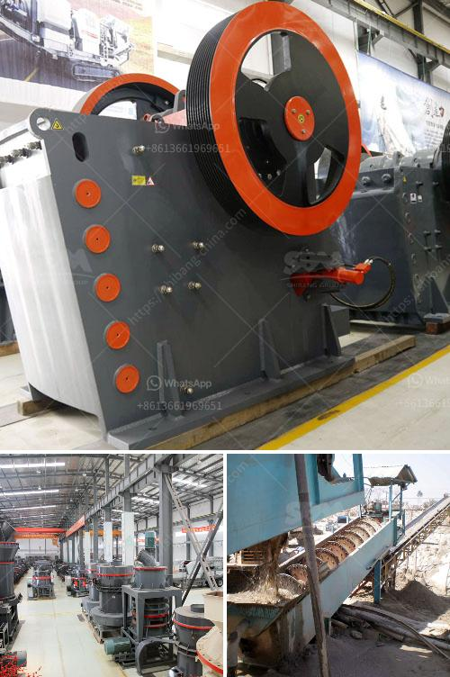

<h3>What is the process of crushing copper ore?</h3>
Copper ore is a valuable mineral resource that is commonly used in various industrial applications. It is extracted from the earth through the process of mining and undergoes a series of stages to be converted into a usable product. One crucial step in this process is crushing copper ore.

The process of crushing copper ore involves three stages – primary crushing, secondary crushing, and tertiary crushing. Each of these steps involves a different type of crusher and produces different particle sizes.

The primary crushing stage is where the large pieces of copper ore are initially broken down into smaller manageable sizes. This is typically done with the help of a jaw crusher or gyratory crusher. The ore is fed into the crusher and as it passes through, the jaws or cones squeeze and crush it, reducing it to a size that can be handled more easily. The primary crushers can produce large chunks or pieces of ore measuring several inches in diameter.

Once the copper ore has been reduced to a manageable size in the primary crushing stage, it is then further crushed in the secondary crushing stage. This is usually carried out using cone crushers or impact crushers. The secondary crushers take the smaller pieces from the primary crushers and further reduce their size. This stage of crushing aims to achieve a uniform particle size distribution and produce smaller-sized particles suitable for the subsequent grinding process.

After the secondary crushing stage, the crushed copper ore enters the tertiary crushing stage. This is the final stage of the crushing process in which the ore is further reduced in size to a fine powder. Tertiary crushers, such as vertical shaft impactors or cone crushers, are commonly used for this purpose. The aim is to achieve a very fine particle size distribution to facilitate efficient grinding of the copper ore.

Once the crushing process is complete, the copper ore is ready to be ground into a fine powder. This grinding process is typically carried out in a ball mill, where the ore is mixed with water and various chemicals, such as lime and grinding media (e.g., steel balls). The mixture is then agitated, and the ore particles are reduced in size through impact and abrasion. The fine copper ore powder obtained from this process is then ready for further refining and processing.

In summary, the process of crushing copper ore involves three stages – primary crushing, secondary crushing, and tertiary crushing. Each stage uses different types of crushers to achieve the desired particle size. Once the ore is crushed, it undergoes additional processing, such as grinding, to obtain a fine copper ore powder, which is further refined for various industrial applications. The process of crushing copper ore plays a crucial role in extracting this valuable mineral resource and preparing it for further use.
<h3>Contact us</h3><ul><li><strong>Whatsapp:&nbsp;<a href="https://wa.me/8613661969651">+8613661969651</a></strong></li><li><a href="https://swt.shibang-china.com/?git&amp;zhl&amp;What is the process of crushing copper ore"><strong>Online Service(chat now)</strong></a></li></ul><h3>Related</h3><ul><li><a href='What type of crusher is good for bentonite and dolomite.md'>What type of crusher is good for bentonite and dolomite?</a></li><li><a href='What does it cost to mill gold ore.md'>What does it cost to mill gold ore?</a></li><li><a href='What is the process of mining galena.md'>What is the process of mining galena?</a></li><li><a href='What is the process for mining manganese ore.md'>What is the process for mining manganese ore?</a></li><li><a href='What is a belt conveyor machine .md'>What is a belt conveyor machine ?</a></li></ul>