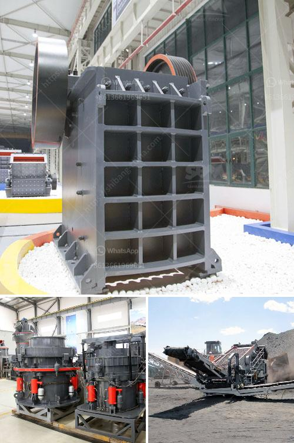

<h3>What is the process of mining galena?</h3>
Galena, also known as lead sulfide, is a mineral commonly found in massive ore deposits that contain other valuable minerals. It is often mined for its lead content and is widely used in various industrial applications. The process of mining galena involves a series of steps that start with locating the ore deposits and end with the extraction of pure lead metal. In this article, we will explore the process of mining galena and its significance.

The first step in mining galena is prospecting to identify potential ore deposits. This involves examining geological maps, analyzing rock samples, and conducting geophysical surveys to locate areas with high concentrations of galena. Once a potential deposit is identified, further exploration is needed to determine the extent and quality of the ore. This includes drilling and sampling to gather more data on the size, grade, and accessibility of the deposit.

Once the ore deposit is confirmed, the mining process begins. The first stage is blasting, wherein explosives are carefully placed in boreholes drilled into the rock. The explosives are then ignited, breaking the rock mass into smaller fragments. This process is necessary to create manageable-sized pieces for extraction and reduce the environmental impact of mining. Safety precautions are taken to ensure the controlled detonation of explosives and minimize any potential risks.

After blasting, the fragmented rock, containing galena and other minerals, is loaded onto trucks or conveyors for transportation to the primary crusher. The primary crusher reduces the size of the rock fragments, allowing for more efficient handling and processing. The crushed rock is then transported to a secondary crusher, where it is further crushed into smaller pieces.

Next, the galena-bearing rock undergoes grinding and milling. This process involves passing the crushed rock through various types of mills, such as ball mills or rod mills, to achieve the desired particle size. The finely ground galena particles are then subjected to flotation.

Flotation is a process used to separate minerals from their ore by utilizing differences in surface properties. In the case of galena, the mineral is selectively enriched using chemicals known as collectors, which attach to the surface of the galena particles. These collector-coated particles are then attached to air bubbles in a flotation cell, and as the bubbles rise to the surface, they carry the galena particles with them, separating them from other minerals.

Once the galena concentrate is obtained through flotation, it undergoes further processing in a refining furnace. The concentrate is smelted at high temperatures to remove impurities and separate the lead metal from other minerals present in the ore. The resulting molten lead is then poured into molds to cool and solidify, forming lead ingots that can be used for various applications.

In conclusion, the process of mining galena involves prospecting, blasting, crushing, grinding, flotation, and refining. It is a complex process that requires careful planning, meticulous execution, and adherence to safety and environmental regulations. Galena mining plays a crucial role in providing lead, a versatile and valuable metal used in many industries. However, it is important to undertake responsible mining practices to mitigate any potential environmental impacts associated with this process.
<h3>Contact us</h3><ul><li><strong>Whatsapp:&nbsp;<a href="https://wa.me/8613661969651">+8613661969651</a></strong></li><li><a href="https://swt.shibang-china.com/?git&amp;zhl&amp;What is the process of mining galena"><strong>Online Service(chat now)</strong></a></li></ul><h3>Related</h3><ul><li><a href='What happens to the crusher when the manganese liner starts to wear out.md'>What happens to the crusher when the manganese liner starts to wear out?</a></li><li><a href='What machines are used in mines.md'>What machines are used in mines?</a></li><li><a href='What is the mining process of barite？.md'>What is the mining process of barite？</a></li><li><a href='What material is generally broken by a cone crusher.md'>What material is generally broken by a cone crusher?</a></li><li><a href='What are cone crusher used to crush .md'>What are cone crusher used to crush ?</a></li></ul>