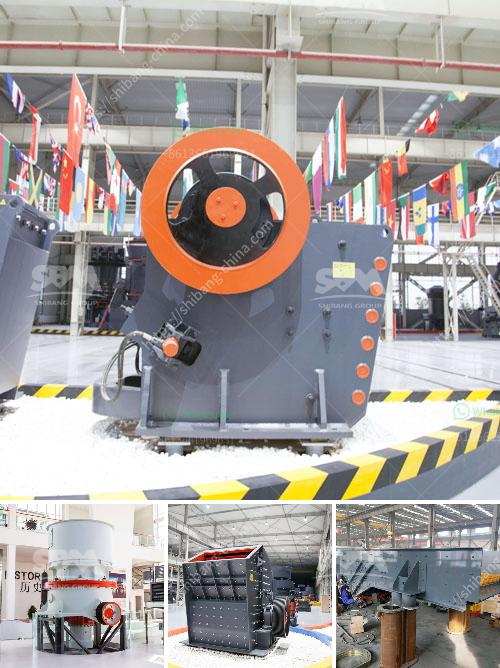

<h3>What is the process of mining marble?</h3>
Marble mining is a complex and fascinating process that involves a vast array of tools, machinery, and skill. It is the extraction and excavation of natural marble blocks or slabs from the mountains and hillsides where marble deposits are found.

The first step in marble mining is locating the marble deposits. This is typically done through research, surveys, and geological mapping to identify the areas rich in marble. Once a potential deposit is found, the extraction process can begin.

The extraction of marble starts with the clearing of vegetation and the removal of topsoil or overburden. This is typically done using heavy machinery such as bulldozers, excavators, and dump trucks. Once the site is cleared, the mining process continues with the drilling and blasting of the marble deposit.

Drilling is done to create holes or channels in the marble formation. These holes are then loaded with explosives that are carefully measured and controlled. The controlled explosions break up the marble into manageable blocks, making it easier to extract and transport.

After the blasting, the broken marble blocks are carefully inspected and sorted based on their quality, color, and texture. This process is known as quarrying, and it requires the expertise of skilled workers who can differentiate high-quality marble from lower-quality ones.

Once the blocks are selected, the extraction process begins. Large cranes or excavators are used to lift and move the marble blocks onto trucks or railcars for transportation to processing facilities. It is crucial to handle the blocks with care to prevent any damage or breakage.

At the processing facilities, the marble blocks are further refined and prepared for commercial use. The blocks are cut into slabs of various thicknesses using diamond wire saws or large gangsaws. Precision equipment ensures that the slabs have uniform thickness and a smooth finish.

After being cut into slabs, the marble undergoes a polishing process to enhance its natural beauty and shine. This is achieved by using abrasive pads and polishing machines that carefully grind and buff the surface of the marble slabs. The polishing process can be adjusted based on the desired sheen and finish of the marble.

Once the marble slabs are polished, they are ready to be transported to various industries and markets. Marble is a highly sought-after material used in construction projects, sculptures, furniture, countertops, and more. Its elegant appearance, durability, and versatility make it a desirable choice for many applications.

In conclusion, the process of mining marble involves several stages, including locating and preparing the site, drilling and blasting the marble deposit, quarrying the blocks, and finally cutting, polishing, and transporting the marble slabs. This process requires the expertise of skilled workers, as well as the use of specialized machinery and equipment. The result is a beautiful and valuable natural resource that continues to be in high demand worldwide.
<h3>Contact us</h3><ul><li><strong>Whatsapp:&nbsp;<a href="https://wa.me/8613661969651">+8613661969651</a></strong></li><li><a href="https://swt.shibang-china.com/?git&amp;zhl&amp;What is the process of mining marble"><strong>Online Service(chat now)</strong></a></li></ul><h3>Related</h3><ul><li><a href='What materials can the vertical roller mill grind.md'>What materials can the vertical roller mill grind?</a></li><li><a href='What is the common ore crusher for aluminum.md'>What is the common ore crusher for aluminum?</a></li><li><a href='What equipment is used in the quarry.md'>What equipment is used in the quarry</a></li><li><a href='What is the principle of a hammer crusher.md'>What is the principle of a hammer crusher?</a></li><li><a href='What equipment is required for a large quarry.md'>What equipment is required for a large quarry?</a></li></ul>