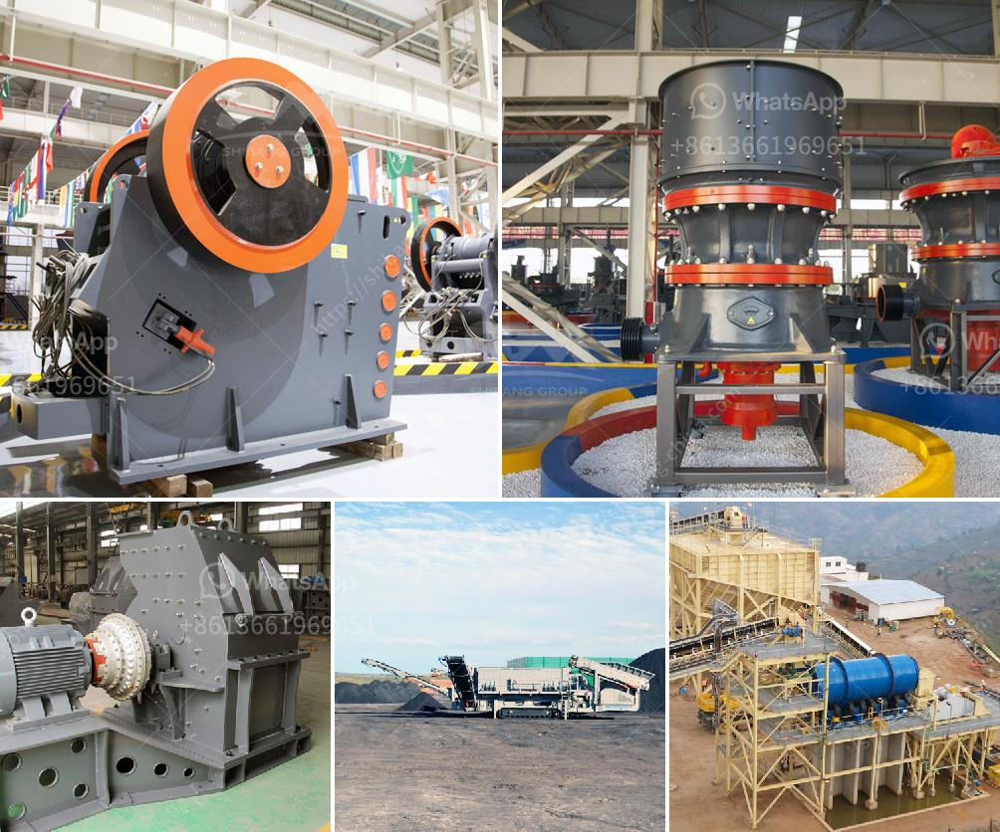

<h3>What is the process of mining orthoclase feldspar?</h3>
Orthoclase feldspar is a mineral commonly found in granite, a type of igneous rock. The worldwide demand for orthoclase feldspar is high, primarily driven by its use in the production of glass, ceramics, and paints. The process of mining orthoclase feldspar involves blasting, crushing, and grinding the rock into a fine powder.

To extract orthoclase feldspar from the rock, blasting is required. This process involves drilling holes into the granite bedrock, filling them with explosives, and detonating them to create cracks in the rock. The resulting fragments are then carefully collected and transported to the crushing and grinding machinery.

Once the fragments have been collected, they undergo the crushing process. Large jaw crushers or gyratory crushers are used to reduce the size of the fragments into manageable pieces. The fragmented orthoclase feldspar is then loaded onto conveyor belts and transported to grinding mills.

In the grinding mills, the particles are further reduced in size, typically to a few millimeters or smaller. This is achieved by using rotating drums or ball mills, which contain steel balls or other grinding media. The feldspar particles are fed into the mill, where they are repeatedly struck and crushed by the grinding media, resulting in a fine powder.

After the grinding process, the orthoclase feldspar powder is processed and refined to remove impurities and improve its quality. Various techniques, such as gravity separation, magnetic separation, and flotation, may be employed to accomplish this. These techniques involve separating the feldspar powder from other minerals and impurities based on their different physical and chemical properties.

Gravity separation utilizes the difference in particle size and density to separate the orthoclase feldspar from the impurities. Magnetic separation relies on the magnetic properties of certain minerals, such as iron-bearing minerals, to separate them from the feldspar. Flotation is a process that utilizes the differences in the surface properties of minerals to separate them. Air bubbles are introduced into the mixture, and the feldspar particles attach to these bubbles and rise to the surface, where they can be skimmed off.

Once the orthoclase feldspar is separated and purified, it is ready to be used in various industries. Glass manufacturers commonly use it to impart durability and hardness to glass products. In the ceramics industry, it is used as a flux, which helps lower the melting temperature of clay-based materials, making them easier to shape and fire. Orthoclase feldspar is also used as a filler in paints to enhance their durability and resistance to fading.

In conclusion, the process of mining orthoclase feldspar involves blasting, crushing, and grinding the rock into a fine powder. This powder is then refined and separated to remove impurities before it is used in various industries such as glass, ceramics, and paints. The demand for orthoclase feldspar continues to grow, making its mining and processing a vital part of many economies.
<h3>Contact us</h3><ul><li><strong>Whatsapp:&nbsp;<a href="https://wa.me/8613661969651">+8613661969651</a></strong></li><li><a href="https://swt.shibang-china.com/?git&amp;zhl&amp;What is the process of mining orthoclase feldspar"><strong>Online Service(chat now)</strong></a></li></ul><h3>Related</h3><ul><li><a href='What is the production process of stone aggregates .md'>What is the production process of stone aggregates ?</a></li><li><a href='What is the density of crushed stone aggregate 10mm 20mm and 40mm.md'>What is the density of crushed stone aggregate 10mm, 20mm, and 40mm?</a></li><li><a href='What is receiving feeder in a crusher.md'>What is receiving feeder in a crusher?</a></li><li><a href='What is the best type of crusher for hard rock.md'>What is the best type of crusher for hard rock?</a></li><li><a href='What type of crusher is used for iron ore？.md'>What type of crusher is used for iron ore？</a></li></ul>