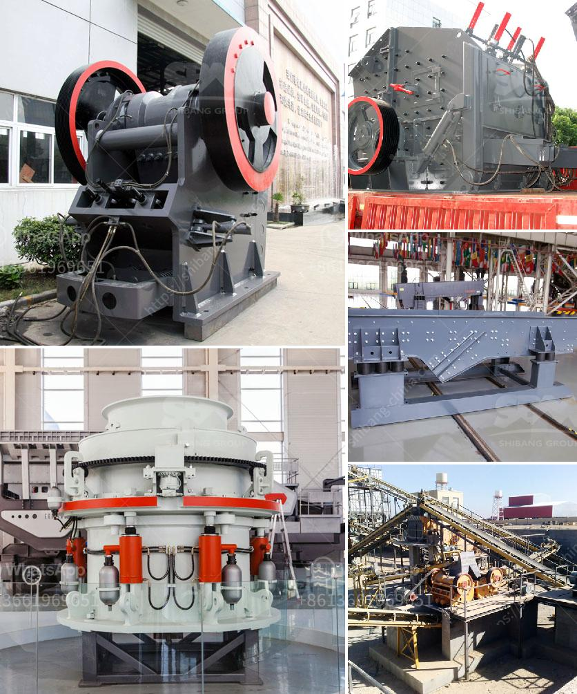

<h3>What is the process that coal goes through to become a finished product?</h3>
Coal is a fossil fuel that has played a significant role in shaping our industrial world. It is composed mainly of carbon along with small amounts of hydrogen, sulfur, oxygen, and nitrogen. In order to utilize this energy-rich resource, coal goes through a series of processes to transform it into a finished product. This article will delve into the detailed process that coal undergoes to become a valuable finished product.

The process of coal formation begins millions of years ago, with the accumulation of dead plant material in swamps or marshy environments. Over time, layers of sediment build up and apply pressure to the organic matter, initiating the process of coalification. The various stages of coal, ranging from lignite to sub-bituminous, bituminous, and ultimately anthracite, depend on the degree of heat and pressure the vegetation has been exposed to over millions of years.

Once the coal has been extracted from the ground through mining, it generally undergoes a cleaning process called coal preparation or coal washing. This process involves removing unwanted materials like rock, minerals, and other impurities. The coal is crushed into smaller pieces and then sorted into various sizes using screens and magnetic separators. Dense medium separation is often employed to separate coal from rock and mineral matter, utilizing the principle of gravity to separate the materials.

The next step is to transport the coal to the power plant or other manufacturing facilities. Coal transportation is typically done through trains, barges, or trucks, depending on the location and infrastructure availability. Transportation methods can vary depending on the distance and terrain, ensuring that coal reaches its destination efficiently.

At the power plant, the coal undergoes combustion in a boiler to produce steam. This steam is used to power turbines that generate electricity. The combustion of coal typically involves the burning of pulverized coal that is blown into the boiler. The heat generated from the burning coal boils water, creating high-pressure steam. This steam is then directed towards the blades of the turbine, causing them to rotate and generate electricity through a generator.

Another essential process that occurs during coal utilization is gasification. Coal gasification is the conversion of coal into synthetic gas, primarily composed of carbon monoxide, hydrogen, and carbon dioxide. Gasification has gained importance in recent years as it can produce cleaner energy and various chemicals. With the help of advanced technologies, coal gasification enables carbon capture and storage (CCS), which significantly reduces greenhouse gas emissions.

Lastly, the residue or waste generated from the coal combustion process is known as fly ash. Fly ash is typically collected by using electrostatic precipitators or baghouses. It is then stored in special landfills or utilized in the construction industry as a component in cement, concrete, or other building materials. These applications help reduce environmental impacts and ensure sustainable use of coal by-products.

In conclusion, coal undergoes a series of processes to transform it from a raw material into a valuable finished product. From its formation millions of years ago to mining, coal preparation, transportation, combustion, gasification, and by-product utilization, each step plays a crucial role in harnessing the energy potential of coal. As the world transitions towards cleaner energy sources, the development of advanced coal technologies and efficient carbon capture and storage methods will continue to shape the future of coal utilization.
<h3>Contact us</h3><ul><li><strong>Whatsapp:&nbsp;<a href="https://wa.me/8613661969651">+8613661969651</a></strong></li><li><a href="https://swt.shibang-china.com/?git&amp;zhl&amp;What is the process that coal goes through to become a finished product"><strong>Online Service(chat now)</strong></a></li></ul><h3>Related</h3><ul><li><a href='What is the principle of a hammer crusher.md'>What is the principle of a hammer crusher?</a></li><li><a href='What are the coal sizing requirements for a power plant.md'>What are the coal sizing requirements for a power plant?</a></li><li><a href='What happened in the vibrating screen.md'>What happened in the vibrating screen?</a></li><li><a href='What is the best jaw crusher for coal processing.md'>What is the best jaw crusher for coal processing?</a></li><li><a href='what does a raymond coal mill cost？.md'>what does a raymond coal mill cost？</a></li></ul>