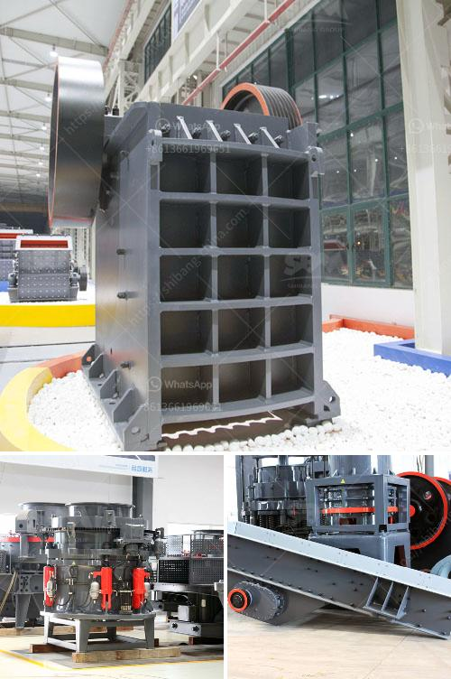

<h3>What is the production process of stone aggregates ?</h3>
Stone aggregates are one of the crucial components used in construction projects such as roadways, buildings, bridges, and dams. These aggregates, commonly known as crushed stone, are extracted from quarries and undergo a production process to transform them into various sizes and shapes that meet specific project requirements. Understanding the production process of stone aggregates is essential to ensure high-quality materials are used in construction.

The first step in the production process of stone aggregates is quarrying. Quarrying is the process of extracting rock or minerals from the earth’s surface or beneath the ground. Large machines, such as excavators and bulldozers, are used to extract the stone from the quarry. The extracted stone is then transported to a primary crusher, which breaks it down into smaller fragments.

Once the stone is broken down into smaller pieces, it goes through a series of crushing and screening stages. The primary crusher is usually a jaw or gyratory crusher that reduces the size of the stone fragments through compression. The crushed stone then passes through vibrating screens to separate it into different sizes. The screens select the appropriate size of stone aggregates required for specific applications.

After the crushing and screening process, the stone aggregates undergo washing to remove impurities and ensure high-quality materials. Washing is done by using water jets and pressure to remove dirt, clays, and other contaminants from the surface of the stone particles. This process increases the durability and strength of the aggregates, making them suitable for construction purposes.

Once the stone aggregates are washed, they are sorted into different sizes and shapes. This process is known as grading. Grading is essential to ensure that the aggregates meet the required specifications for different construction applications. Some projects may require specific sizes of stone aggregates, while others may need a mix of different sizes to achieve the desired strength and stability.

Finally, the graded stone aggregates are transported to construction sites for various applications. These aggregates are commonly used as a base material for roads, pavements, and foundations. They can also be used as cementitious materials in the production of concrete or asphalt. Contractors may use different techniques to lay and compact the stone aggregates, depending on the specific project requirements.

In conclusion, the production process of stone aggregates involves several steps, including quarrying, crushing, screening, washing, grading, and transportation. Each step plays a crucial role in producing high-quality aggregates that meet the specific requirements of construction projects. Understanding the production process is vital for contractors, engineers, and architects to ensure that the stone aggregates used in construction are durable, strong, and suitable for their intended purposes.
<h3>Contact us</h3><ul><li><strong>Whatsapp:&nbsp;<a href="https://wa.me/8613661969651">+8613661969651</a></strong></li><li><a href="https://swt.shibang-china.com/?git&amp;zhl&amp;What is the production process of stone aggregates "><strong>Online Service(chat now)</strong></a></li></ul><h3>Related</h3><ul><li><a href='What are the factors that promote the development of mining.md'>What are the factors that promote the development of mining?</a></li><li><a href='What are the advantages of a jaw crusher over the gyratory crusher .md'>What are the advantages of a jaw crusher over the gyratory crusher ?</a></li><li><a href='What type of quarry crusher is .md'>What type of quarry crusher is ?</a></li><li><a href='what is a bench berm in mining.md'>what is a bench berm in mining?</a></li><li><a href='what is the cost of stone crusher？.md'>what is the cost of stone crusher？</a></li></ul>