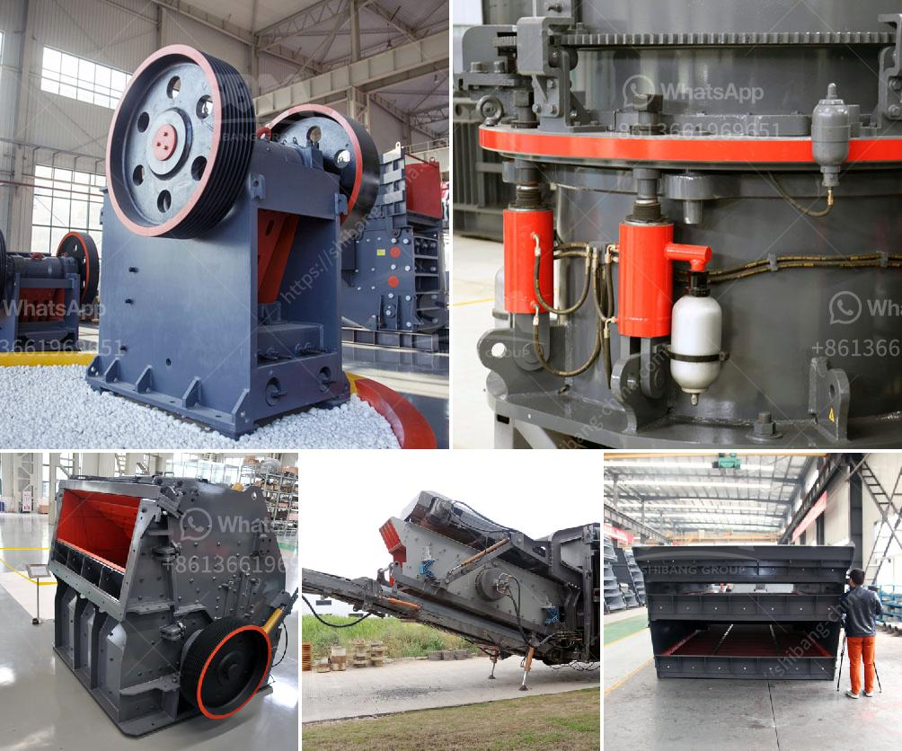

<h3>What is the project cost for ball grinding unit ?</h3>
The ball grinding unit is a crucial piece of equipment for grinding various materials in industries such as cement, ceramics, silicates, fertilizers, and mining. It is designed to efficiently grind and blend materials of different nature to a required particle size.

When planning to set up a ball grinding unit, one of the most important considerations is the project cost. The project cost encompasses several factors and can vary depending on the specific requirements, scale, and location of the unit. Let us delve deeper into understanding the project cost for a ball grinding unit.

The primary component of the project cost is the cost of the ball grinding unit equipment itself. This includes the cost of the main grinding mill, auxiliary equipment such as air classifiers, dust collectors, and storage facilities like silos or warehouses. The cost of the equipment can vary significantly depending on the capacity and technology used. Higher capacity units or those equipped with advanced features may have a higher price tag.

Establishing a ball grinding unit requires adequate infrastructure such as a building or a shed to house the equipment. The size and quality of the infrastructure will determine the cost. Additionally, it is crucial to consider factors such as access to utilities (water, electricity, etc.), transportation facilities, and environmental compliance measures that may add to the infrastructure cost.

Once the equipment and infrastructure are in place, there is a cost involved in installing and commissioning the ball grinding unit. This includes expenses related to site preparation, equipment installation, electrical connections, and mechanical assembly. The complexity of the unit and any customization required may impact the installation cost.

Running a ball grinding unit requires ongoing expenses, which contribute to the project cost. The primary operating costs include energy consumption (electricity or fuel), maintenance and repair costs, consumables for the grinding process (grinding media, liners, etc.), and labor costs for operating and maintaining the unit. These costs will vary depending on factors such as the scale of production, material properties, and process efficiency.

Complying with environmental, health, and safety regulations is crucial for operating a ball grinding unit. These regulations may require investments in pollution control equipment, waste management systems, safety measures, and obtaining necessary permits and certifications. Consequently, the project cost includes expenses associated with compliance with regulatory standards.

There may be additional costs associated with the project, such as consultancy fees, transportation of equipment, taxes, insurance, and contingencies. These costs are typically accounted for to ensure the smooth execution of the project.

In conclusion, the project cost for a ball grinding unit encompasses various factors. The cost of equipment, infrastructure, installation, and commissioning, ongoing operating expenses, regulatory compliance, and miscellaneous expenses collectively determine the total project cost. It is essential to conduct a thorough evaluation, considering these factors, to estimate the project cost accurately. Additionally, seeking expert advice from professionals in the field can help in making informed decisions and avoiding any potential cost overruns.
<h3>Contact us</h3><ul><li><strong>Whatsapp:&nbsp;<a href="https://wa.me/8613661969651">+8613661969651</a></strong></li><li><a href="https://swt.shibang-china.com/?git&amp;zhl&amp;What is the project cost for ball grinding unit "><strong>Online Service(chat now)</strong></a></li></ul><h3>Related</h3><ul><li><a href='What is the difference between jaw crusher and cone crusher？.md'>What is the difference between jaw crusher and cone crusher？</a></li><li><a href='What is a single toggle jaw crusher.md'>What is a single toggle jaw crusher?</a></li><li><a href='What is the final product of columbite.md'>What is the final product of columbite?</a></li><li><a href='What are the features of a jaw crusher.md'>What are the features of a jaw crusher?</a></li><li><a href='How is fluorite mined and what equipment is needed.md'>How is fluorite mined, and what equipment is needed?</a></li></ul>