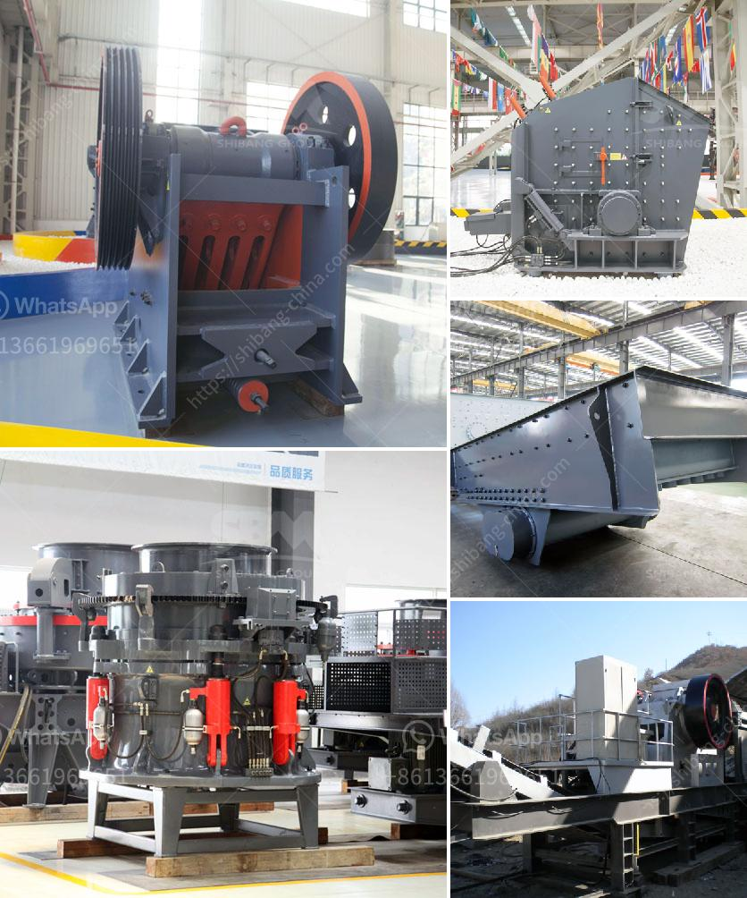

<h3>What is the purpose of gypsum added at the mill when the clinker is ground ?</h3>
Gypsum is a commonly used additive in cement production. It plays a crucial role in ensuring that the final product, i.e., cement, possesses the desired properties. When the clinker is ground at the mill, gypsum is added to control the setting time of the cement, and to enhance specific properties such as strength and durability.

Clinker, a key ingredient in cement production, is a fine-grained solid material that is produced when raw materials like limestone, clay, and iron ore are heated in a kiln at a high temperature. The clinker forms as small nodules or pellets and is then ground into a fine powder to produce cement.

During the grinding process at the mill, gypsum is added to the clinker in small quantities. The specific amount of gypsum added depends on various factors such as the desired setting time of the cement and the composition of the clinker. Generally, the gypsum content ranges from 2% to 5% of the total cementitious material.

One of the primary reasons gypsum is added to the mill is to control the setting time of the cement. Setting time refers to the time it takes for the cement paste to harden and gain strength after mixing with water. Rapid setting can be problematic, especially in large construction projects, as it leaves less time for the cement to be properly placed and compacted. By adding gypsum, the setting time of the cement can be controlled, allowing for a more practical and efficient construction process.

Another crucial aspect of gypsum addition is its role in controlling the initial rate of reaction of cement. The presence of gypsum slows down the hydration of the clinker minerals, especially tricalcium aluminate (C3A). C3A is responsible for early strength development but can also cause rapid setting. The addition of gypsum retards the hydration of C3A, making it possible for the cement to obtain the desired strength and workability over a longer period.

In addition to providing control over the setting time and early strength development, gypsum also improves the overall performance of cement. One of the significant properties enhanced by gypsum is the workability of the cement paste. Workability refers to the ease with which the freshly mixed cement can be placed, compacted, and finished. The presence of gypsum reduces the water demand of the cement paste, allowing for better workability and improved consistency.

Furthermore, gypsum enhances the resistance of cement to sulfate attack, which can occur when the cement comes into contact with sulfates present in groundwater or soils. Sulfate attack can cause the deterioration and cracking of concrete structures. Gypsum reacts with the sulfates, forming ettringite, which has a crystalline structure that helps to prevent the expansion and subsequent damage caused by sulfate ions.

In conclusion, the addition of gypsum at the mill when clinker is ground serves various essential purposes in cement production. It controls the setting time, improves workability, promotes sulfate resistance, and ensures the desired strength and durability of the final product. Gypsum plays a critical role in optimizing the performance of cement, making it an indispensable additive in the industry.
<h3>Contact us</h3><ul><li><strong>Whatsapp:&nbsp;<a href="https://wa.me/8613661969651">+8613661969651</a></strong></li><li><a href="https://swt.shibang-china.com/?git&amp;zhl&amp;What is the purpose of gypsum added at the mill when the clinker is ground "><strong>Online Service(chat now)</strong></a></li></ul><h3>Related</h3><ul><li><a href='What is a composite cone crusher.md'>What is a composite cone crusher?</a></li><li><a href='What is the role of a mill in a coalfired power plant.md'>What is the role of a mill in a coal-fired power plant?</a></li><li><a href='What are the main current crusher and which is good.md'>What are the main current crusher and which is good?</a></li><li><a href='What is the price of a cone crusher in Venezuela.md'>What is the price of a cone crusher in Venezuela?</a></li><li><a href='What is the ore crusher discharge port size.md'>What is the ore crusher discharge port size?</a></li></ul>