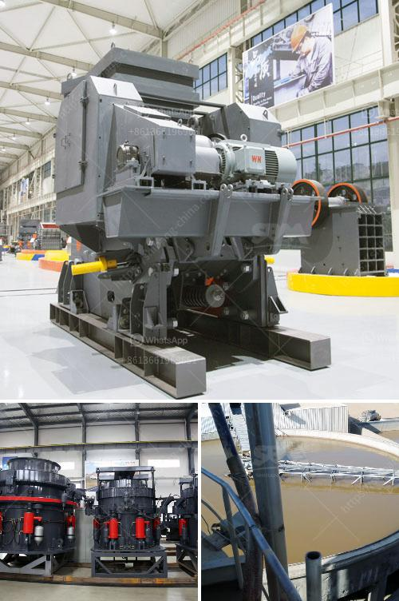

<h3>What is the purpose of secondary crushing in the production of lime?</h3>
In the production of lime, secondary crushing plays a crucial role in achieving the desired quality and particle size of the final product. Lime, also known as quicklime or calcium oxide (CaO), is a versatile chemical compound widely used in various industries such as agriculture, construction, and manufacturing. Understanding the purpose of secondary crushing in lime production is essential to comprehend the entire lime production process and its importance in different applications.

Primary crushing refers to the initial stage where raw limestone, which is the primary source of lime, undergoes mechanical reduction in size. Once the limestone is extracted from mines or quarries, it is crushed into smaller fragments by primary crushers, often jaw crushers or gyratory crushers. However, primary crushing alone may not achieve the desired particle size or quality of lime required by the end-users. This is where secondary crushing comes into play.

The purpose of secondary crushing in lime production is to further refine the raw material, ensuring the production of high-quality lime with the desired particle size distribution. The raw limestone may contain impurities, irregular shapes, or large particles, which can affect the efficiency and effectiveness of the lime production process. Secondary crushing addresses these concerns by reducing the size of the limestone fragments and improving their uniformity.

Secondary crushers, such as impact crushers, cone crushers, or roll crushers, are commonly used in the secondary crushing stage. These machines are designed to break down the limestone into smaller fragments by applying mechanical force through compression, impact, or shearing. The choice of secondary crusher depends on various factors, such as the required size of the final product, the hardness of the limestone, and the production capacity.

By reducing the size of the limestone fragments, secondary crushing helps in achieving a more consistent and homogenous feed size for the subsequent stages of the lime production process. This is crucial because the quality and consistency of the feed material directly impact the performance of other equipment involved in lime production, such as kilns, calciners, and hydrators. Consistency in feed size promotes stable and efficient operations, leading to improved productivity and cost-effectiveness.

Furthermore, secondary crushing also aids in increasing the surface area of the limestone fragments. A larger surface area allows for better and faster chemical reactions during the calcination process, where limestone is heated to high temperatures to produce lime. Enhanced chemical reactions result in higher quality lime with improved reactivity and lower impurity levels.

In conclusion, secondary crushing is an essential step in the production of lime. By reducing the size and improving the uniformity of the limestone fragments, secondary crushers contribute to the overall quality and efficiency of the lime production process. With a more consistent and homogenous feed size, the subsequent stages of lime production can operate smoothly, leading to increased productivity and better quality lime for various industrial applications. Understanding the purpose and importance of secondary crushing in lime production is crucial for ensuring optimal performance and outcomes.
<h3>Contact us</h3><ul><li><strong>Whatsapp:&nbsp;<a href="https://wa.me/8613661969651">+8613661969651</a></strong></li><li><a href="https://swt.shibang-china.com/?git&amp;zhl&amp;What is the purpose of secondary crushing in the production of lime"><strong>Online Service(chat now)</strong></a></li></ul><h3>Related</h3><ul><li><a href='What is the process of mining orthoclase feldspar.md'>What is the process of mining orthoclase feldspar?</a></li><li><a href='What are the processing equipment for feldspar powder？.md'>What are the processing equipment for feldspar powder？</a></li><li><a href='What is 42 and 65 in 42×65 gyratory crusher.md'>What is 42 and 65 in 42×65 gyratory crusher?</a></li><li><a href='What is the iron ore thickening process.md'>What is the iron ore thickening process?</a></li><li><a href='What is vsi in mobile stone jaw crusher.md'>What is vsi in mobile stone jaw crusher</a></li></ul>