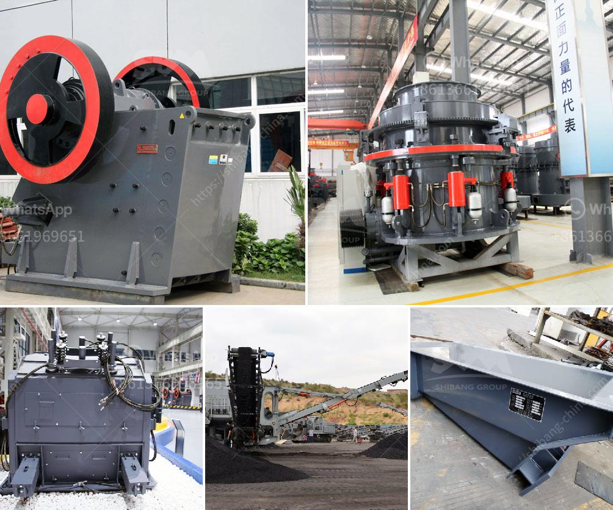

<h3>What is the purpose of using hydraulic cylinders in cone crushers?</h3>
Cone crushers are a type of compression crusher used by aggregate, coal, concrete, crushing, fracking sand, and mining industries. This type of crusher is used for crushing hard and abrasive materials. Hydraulic cylinders are used in cone crushers to allow for crushing of raw materials as well as to control the discharge opening to regulate the size and quality of the product.

The importance of the right hydraulic cylinder in cone crusher applications cannot be underestimated. The crusher uses a hydraulic system to adjust the crusher's setting and regulate the size of the product. The hydraulic cylinder in a cone crusher is mainly used for shaft adjustment and clearance adjustment.

When constructing the cone crusher, the manufacturer typically installs hydraulic cylinders inside the lower shell. The purpose of these cylinders is to hold the shaft in place when adjusting the crusher's closed side setting or maintaining the clearance between the lining surfaces in the crushing chamber.

Adjusting the crusher's setting is crucial for optimizing the crusher's performance and ensuring consistent product quality. The hydraulic cylinders allow for quick and easy adjustment of the crusher's setting. This allows the operator to control the size of the product and achieve the desired outcome.

Another essential function of the hydraulic cylinders in cone crushers is to hold the shaft in position during maintenance. This is particularly important when replacing or repairing the mantle and concave liners, which are subjected to wear and tear due to the regular crushing process. The hydraulic cylinders ensure that the shaft remains securely in place, preventing any potential damage to the crusher's components.

The hydraulic cylinders also play a significant role in protecting the crusher against non-crushable materials. In some instances, larger or harder materials may accidentally enter the crushing chamber. If left unattended, these materials can cause severe damage to the crusher's internals. However, the hydraulic cylinders can detect the increased pressure caused by non-crushable materials and quickly respond by releasing the pressure and allowing the material to pass through without causing any harm to the crusher.

Furthermore, the hydraulic cylinders provide overload protection to the cone crusher. If the crusher is subjected to an excessive load or if foreign objects are present, the hydraulic cylinders will automatically relieve the pressure, preventing any potential damage to the crusher parts.

In conclusion, the purpose of using hydraulic cylinders in cone crushers is to facilitate the adjustment of the crusher's setting, control the discharge opening, hold the shaft in place during maintenance, protect the crusher against non-crushable materials, and provide overload protection. These functions are crucial for optimizing the performance, enhancing safety, and prolonging the lifespan of cone crushers. The hydraulic cylinders play a vital role in ensuring the efficiency and reliability of cone crushers, making them a crucial component in the crushing process.
<h3>Contact us</h3><ul><li><strong>Whatsapp:&nbsp;<a href="https://wa.me/8613661969651">+8613661969651</a></strong></li><li><a href="https://swt.shibang-china.com/?git&amp;zhl&amp;What is the purpose of using hydraulic cylinders in cone crushers"><strong>Online Service(chat now)</strong></a></li></ul><h3>Related</h3><ul><li><a href='What is the price of a mobile crushing plant in Canada.md'>What is the price of a mobile crushing plant in Canada?</a></li><li><a href='What is the procedure for obtaining a stone quarry license.md'>What is the procedure for obtaining a stone quarry license?</a></li><li><a href='What machines are required for a limestone powder factory.md'>What machines are required for a limestone powder factory?</a></li><li><a href='What critical in stone crusher project .md'>What critical in stone crusher project ?</a></li><li><a href='What equipment is used for silver mining.md'>What equipment is used for silver mining?</a></li></ul>