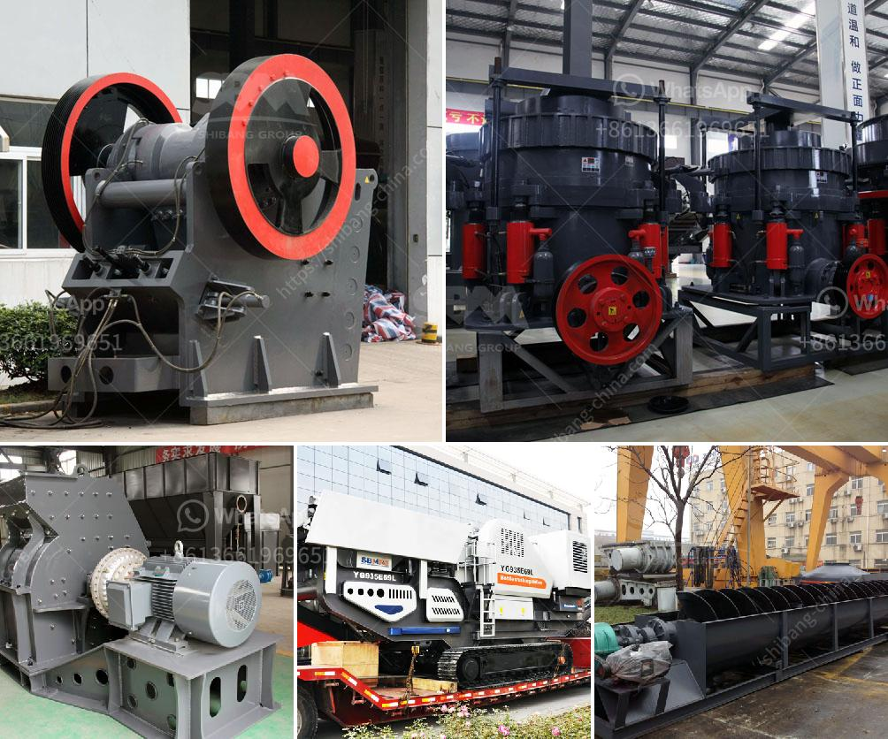

<h3>What is the role of a coal mill in the clinker manufacturing process?</h3>
The clinker manufacturing process is a complex one that involves a number of steps. In essence, it involves the raw materials being ground into a fine powder, mixed with water, and then heated to a very high temperature in a kiln. This creates a chemical reaction that produces clinker, the main ingredient in cement.

One crucial step in this process is the raw material grinding. As the name suggests, this is where the raw materials - such as limestone, clay, and iron ore - are ground down to fine particles using a coal mill. The coal mill takes the raw materials that have been mixed and grinded, and it dries them as well, using hot air that is blown into the mill from the bottom. This process helps to reduce the moisture content and ignite the coal, allowing it to burn more efficiently, producing heat that is necessary to transform the raw materials into clinker.

The coal mill plays a significant role in this process, ensuring that the materials are grinded and dried properly. During the grinding process, the coal mill uses the pressure and shear generated between the rollers and the rotating table to crush and grind the raw materials. The crushed raw materials are then extracted by means of a rotating bladed wheel that picks up the material and transfers it to a classifier. The classifier separates the particles based on size and returns the oversized particles back to the mill for further grinding, while the properly sized particles are conveyed to a storage hopper for further processing.

The coal mill also serves as a heat source for drying the raw materials which reduces the moisture content of the materials. Moisture in the raw materials can affect the quality and efficiency of the clinker manufacturing process. By drying the raw materials, the coal mill enables an efficient extraction of the moisture, allowing for better combustion, which in turn leads to a higher heat output. This ensures that the clinker produced is of high quality and consistency.

Furthermore, the coal mill provides the necessary heat to facilitate the chemical reactions required to transform the raw materials into clinker. The coal mill supplies the high temperatures needed for the burning process, which can reach up to 1500 degrees Celsius. This high temperature is necessary to initiate the reaction between the raw materials, resulting in the formation of clinker. Without the heat provided by the coal mill, the clinker manufacturing process would not be possible.

In conclusion, the coal mill plays a crucial role in the clinker manufacturing process by grinding and drying the raw materials, supplying the heat required for the chemical reactions to take place, and providing the necessary heat to burn the raw materials and transform them into clinker. It is an essential piece of machinery in the cement manufacturing process, ensuring that the final product has the desired quality and consistency.
<h3>Contact us</h3><ul><li><strong>Whatsapp:&nbsp;<a href="https://wa.me/8613661969651">+8613661969651</a></strong></li><li><a href="https://swt.shibang-china.com/?git&amp;zhl&amp;What is the role of a coal mill in the clinker manufacturing process"><strong>Online Service(chat now)</strong></a></li></ul><h3>Related</h3><ul><li><a href='What are the advantages of a roll crusher compared to other crushers.md'>What are the advantages of a roll crusher compared to other crushers?</a></li><li><a href='What are the different parts of a crusher in a power plant.md'>What are the different parts of a crusher in a power plant?</a></li><li><a href='What is a construction waste crusher ？.md'>What is a construction waste crusher ？</a></li><li><a href='What tests are used to select a suitable gold ore processing plant.md'>What tests are used to select a suitable gold ore processing plant?</a></li><li><a href='What type of flywheel is used in the double toggle jaw crusher.md'>What type of flywheel is used in the double toggle jaw crusher</a></li></ul>