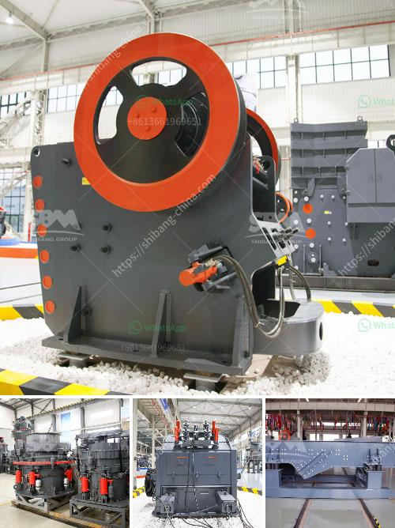

<h3>What is the role of a mill in a coal-fired power plant?</h3>
Coal-fired power plants are responsible for generating a significant portion of the world's electricity and are utilized by various industries – including steel production, cement manufacturing, and even in our homes for heating and cooking. Although the use of coal as an energy source has declined in recent years due to concerns over climate change and greenhouse gas emissions, it remains an integral part of many countries' energy portfolios. One crucial component of a coal-fired power plant is the mill, which pulverizes the coal before it is burned.

So, what exactly is the role of a mill in a coal-fired power plant? Let's delve deeper into its functions and significance.

A mill is a mechanical device used to grind, crush, or pulverize solid materials into smaller pieces or powders. In the case of coal mills, they are specifically designed to prepare coal particles of appropriate fineness for combustion in a furnace. This preparation process helps increase the efficiency of the boiler system, ensuring maximum energy output with minimal waste.

Coal mills typically consist of rotating cylinders, partly filled with large steel balls or cylindrical-shaped grinding media. As the cylinder rotates, the grinding media crushes and grinds the coal into a fine powder, enabling efficient combustion.

One primary purpose of the coal mill is to supply the furnace with a "fuel" of consistent fineness. A certain level of fineness directly impacts the combustion efficiency and heat output of the coal. Inadequate pulverization can result in incomplete combustion, leading to higher emissions, reduced power output, increased fuel consumption, and more frequent maintenance requirements.

Additionally, the mill plays a vital role in ensuring the coal's uniformity and consistency. Coal is a heterogeneous substance, meaning it contains varying amounts of moisture, volatile matter, and fixed carbon. These characteristics can greatly influence the combustion performance and emission levels. Through pulverization, the mill helps create a homogenous coal mixture that allows for better combustion control, reducing both environmental impact and operational costs.

Furthermore, mills are responsible for controlling the coal particle size distribution. The size of the coal particles affects the combustion process, heat release rates, and slagging tendencies. By regulating the particle size, mills help optimize the combustion process, reducing the formation of pollutants such as nitrogen oxide (NOx), sulfur dioxide (SO2), and particulate matter.

In summary, the role of a mill in a coal-fired power plant is to grind and pulverize the coal to a desired fineness and consistency. This process helps increase the overall efficiency of the combustion process and allows for more precise control of combustion parameters. By achieving optimal pulverization, mills contribute to lower emissions, lower operating costs, and improved environmental performance.

While coal-fired power plants face increasing pressure to reduce their carbon footprint, the role of mills remains crucial. As technology advancements continue and renewable energy sources become more prevalent, mills will likely play a vital role in facilitating the transition to cleaner energy by ensuring efficient coal combustion until cleaner alternatives take over.
<h3>Contact us</h3><ul><li><strong>Whatsapp:&nbsp;<a href="https://wa.me/8613661969651">+8613661969651</a></strong></li><li><a href="https://swt.shibang-china.com/?git&amp;zhl&amp;What is the role of a mill in a coalfired power plant"><strong>Online Service(chat now)</strong></a></li></ul><h3>Related</h3><ul><li><a href='What kind of mining crusher has a good high yield.md'>What kind of mining crusher has a good high yield?</a></li><li><a href='What is a beneficiation plant primary mill.md'>What is a beneficiation plant primary mill?</a></li><li><a href='What type of crusher is good for bentonite and dolomite.md'>What type of crusher is good for bentonite and dolomite?</a></li><li><a href='What does a ball mill do in mining.md'>What does a ball mill do in mining?</a></li><li><a href='What type of crusher used for copper ore crushing.md'>What type of crusher used for copper ore crushing?</a></li></ul>