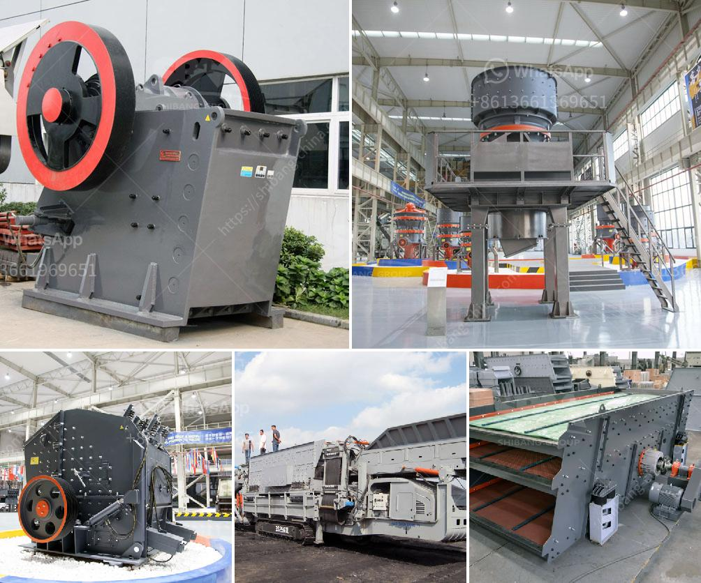

<h3>What is the role of impact crusher ?</h3>
In the aggregate production line, whether the crusher machine is suitable or not that determines the output of the whole line. JXSC can help you choose an optimal stone crusher.

1. Crushing demand You don't blindly consult the price of equipment, because there are many types of stone crushers. For example, hammer crusher, jaw crusher, impact crusher. Right way. First of all, you need to know the crusher materials, the maximum feeding size, finished particle size, handling capacity, crushing environment. With detailed information, JXSC will provide the stone crusher suitable for your production needs.

2. The equipment It is important to select a suitable crusher and wear-resistant lining plate and grate screen to ensure their output and reduce wear and tear. For choosing crusher, you should consider the nature of the materials, site conditions, capital budget and other factors to determine which crusher is suitable for your project.

3. Specifications of the finished product After crushing the stone material, it is about 95% to 300mm. If you want the finished product size, you have to consider using an impact rock crusher. The impact crusher can handle materials with side length less than 100-500 mm. It has the advantages of high crushing ratio and cubic granule after crushing, with a maximum pressure of 350 MPa. It is widely used in building materials, ore crushing, railway, highway, energy, transportation, energy, cement, mining, chemical industry and other industries for medium and fine crushing materials.

The discharging granularity can be adjusted, and the crushing specifications are diversified. According to different technological requirements, the impact crusher can be configured in various crushing chambers. The impact crusher is widely used in construction material, chemical, coal mine, coke and other industries. The impact crusher is the efficient and strong coarse, broken equipment developed by our company. Impact Crusher is mainly used to crush many kinds of large, medium, small materials. Of course, the impact crusher can perform coarse, medium and fine crushing operations on materials, so it is particularly used to process stones.

4. High-quality finished products The impact crusher can produce stones with high quality and good shape, which benefits people's lives and industries. Depending on the type of impact crusher, the finished product has a certain impact and good grain shape, which is suitable for the production of construction materials, highways, etc.

5. The overall structure design of the impact crusher is simple, the material is thrown into the rotor, and the impact board outside the rotor and the rebounding board inside the rotor can crush the material again. Once the impact crusher is in operation, the rotor rotates at high speed, the material enters the crusher cavity and is crushed by the impact of the plate hammer. The finished material is discharged from the lower discharge opening.

In conclusion, the impact crusher is popular with both domestic and foreign customers. It has become an essential equipment in the complete production line, which can meet the crushing demand of different materials. Its important role in stone crushing plant's process line is undeniable. It plays a very important role in the preparation of raw materials for subsequent production.
<h3>Contact us</h3><ul><li><strong>Whatsapp:&nbsp;<a href="https://wa.me/8613661969651">+8613661969651</a></strong></li><li><a href="https://swt.shibang-china.com/?git&amp;zhl&amp;What is the role of impact crusher "><strong>Online Service(chat now)</strong></a></li></ul><h3>Related</h3><ul><li><a href='What is the waste of ore crushing plant .md'>What is the waste of ore crushing plant ?</a></li><li><a href='What materials can the vertical roller mill grind.md'>What materials can the vertical roller mill grind?</a></li><li><a href='What machines are required for a limestone powder factory.md'>What machines are required for a limestone powder factory?</a></li><li><a href='What are the factors that promote the development of mining.md'>What are the factors that promote the development of mining?</a></li><li><a href='What procedures need to be done for a quarry.md'>What procedures need to be done for a quarry?</a></li></ul>