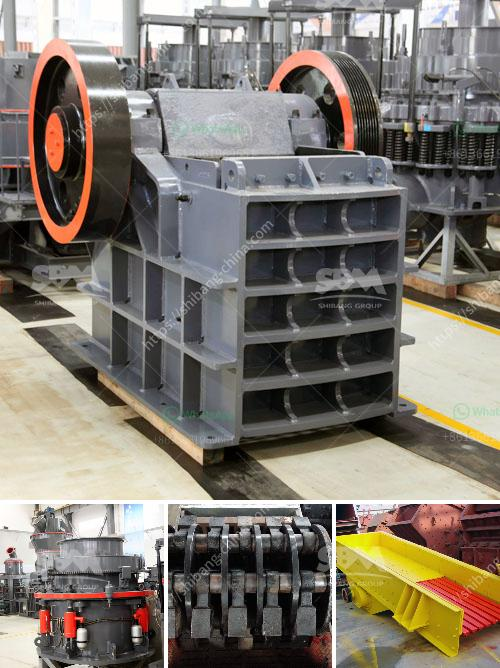

<h3>What is the selling price of the hammer crusher?</h3>
When it comes to crushing materials, a hammer crusher is an efficient and cost-effective choice for many industries. The hammer crusher, also known as the hammer mill, is a reliable device that can be utilized for different purposes. Its versatility and reliable performance make it an indispensable crushing machine in various industries.

The selling price of the hammer crusher depends on several factors such as the manufacturer, model, quality of the crusher, and the contract period. The manufacturer is a key aspect to consider as some manufacturers have established a reputable brand name, while others are relatively new in the market. A well-known and established manufacturer might have a higher selling price compared to a newly established manufacturer. However, the reputation and quality associated with an established manufacturer might justify the higher cost.

The model of the hammer crusher will also impact its selling price. Hammer crushers come in different sizes and models, each with its unique features and capabilities. A larger and more advanced model will generally have a higher selling price compared to a smaller and simpler model. However, the choice of the model should be based on the specific requirements of the user and the type of materials to be crushed.

The quality of the hammer crusher is another crucial factor that affects its selling price. High-quality crushers are built to last longer and require less maintenance, resulting in lower operating costs in the long run. Although high-quality models may have a higher initial investment, their durability and performance make them a more cost-effective choice over time. It is essential to carefully evaluate the quality of materials used in the construction of the crusher, including the strength of the hammer and the durability of the housing.

Contract period or warranty period is an additional consideration that influences the selling price of a hammer crusher. A longer warranty period, typically provided by reputable manufacturers, might lead to a higher selling price. However, a more extended contract period provides peace of mind to the buyer as any potential repairs or replacements within the warranty period will be covered by the manufacturer. It is crucial to carefully review the terms and conditions of the warranty before making the purchase decision.

In summary, the selling price of a hammer crusher depends on various significant factors including the manufacturer, model, quality, and contract period. It is essential for consumers and businesses to consider these factors before making a purchase decision. Although higher prices might be associated with renowned manufacturers, advanced models, and longer contract periods, it is important to evaluate the overall value and long-term benefits of the chosen hammer crusher. Ultimately, investing in a high-quality and reliable hammer crusher is crucial for efficient and cost-effective crushing operations in various industries.
<h3>Contact us</h3><ul><li><strong>Whatsapp:&nbsp;<a href="https://wa.me/8613661969651">+8613661969651</a></strong></li><li><a href="https://swt.shibang-china.com/?git&amp;zhl&amp;What is the selling price of the hammer crusher"><strong>Online Service(chat now)</strong></a></li></ul><h3>Related</h3><ul><li><a href='What is the ore crusher discharge port size.md'>What is the ore crusher discharge port size?</a></li><li><a href='What are the cement mill precrushing equipment .md'>What are the cement mill pre-crushing equipment ?</a></li><li><a href='What is the cost of artificial sand projects.md'>What is the cost of artificial sand projects?</a></li><li><a href='What is the process of mining marble.md'>What is the process of mining marble?</a></li><li><a href='What is rotary screen cement plant .md'>What is rotary screen cement plant ?</a></li></ul>