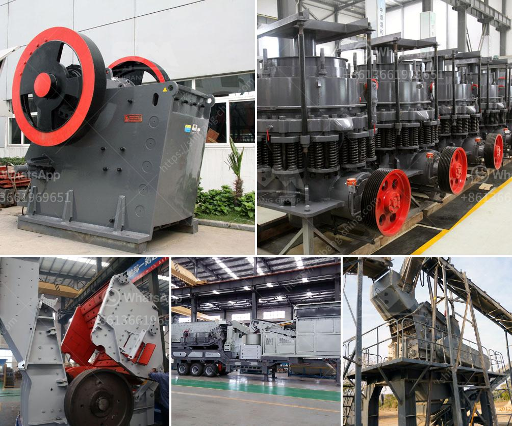

<h3>What is the smallest size of output for a hammer crusher?</h3>
The smallest size of output for a hammer crusher is determined by two factors: the design and configuration of the crusher, and the physical properties of the raw material being crushed. The hammer crushers are available in various sizes and specifications according to the customer's requirements.

The hammer crusher is a machine that crushes materials in the form of impact. It uses high-speed hammer blows to shatter and disintegrate the material. Hammer crushers are designed to crush brittle materials such as coal, limestone, clay, gypsum, gravel, or other similar materials.

The size of the final product or the desired size of the output material depends on the crusher's design and the nature of the raw material. Hammer crushers have different types of crushing chambers that are determined by the rotor dimensions and the hammer circle.

The size of the output material is determined by the adjustable gap between the rotor and the impact plates or anvils in the crushing chamber. When the raw material enters the crusher, it is impacted by the rotating hammers attached to the rotor. The material is then forced against the impact plates or anvils, causing it to break into smaller pieces.

The smallest size of the output for a hammer crusher can vary depending on the gap between the rotor and the impact plates or anvils. Smaller gaps will result in finer output material, while larger gaps will produce coarser material. This gap can be adjusted manually or hydraulically, depending on the crusher's design.

In addition to the crusher's design, the physical properties of the raw material being crushed also play a crucial role in determining the smallest size of the output. Hard materials, such as granite or quartz, will require more force to break and may result in a coarser output. Softer materials, such as limestone or clay, are easier to crush and may produce a finer output.

It is important to consider the application and end-use of the crushed material when determining the desired output size. For example, if the material is intended to be used as construction aggregate, a finer output size may be required. On the other hand, if the material is intended to be used as fill material or for road base, a coarser output size may be acceptable.

In summary, the smallest size of the output for a hammer crusher depends on the crusher's design, the physical properties of the raw material, and the desired application of the crushed material. By adjusting the gap between the rotor and the impact plates or anvils, and considering the hardness of the material being crushed, the crusher can produce the desired output size for various applications.
<h3>Contact us</h3><ul><li><strong>Whatsapp:&nbsp;<a href="https://wa.me/8613661969651">+8613661969651</a></strong></li><li><a href="https://swt.shibang-china.com/?git&amp;zhl&amp;What is the smallest size of output for a hammer crusher"><strong>Online Service(chat now)</strong></a></li></ul><h3>Related</h3><ul><li><a href='What can I use to crush rocks or granite.md'>What can I use to crush rocks or granite?</a></li><li><a href='what is the process to buy stone crusher in Nigeria.md'>what is the process to buy stone crusher in Nigeria</a></li><li><a href='What is the best use of quarry limestone.md'>What is the best use of quarry limestone?</a></li><li><a href='What is the functions of crusher .md'>What is the functions of crusher ?</a></li><li><a href='what is a bench berm in mining.md'>what is a bench berm in mining?</a></li></ul>