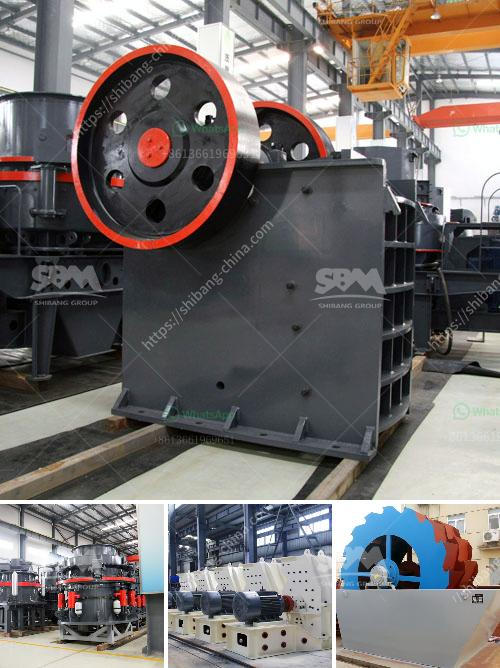

<h3>What is the standard particle size of ball mill grinding ?</h3>
Ball mills are commonly used in the manufacture of cement and finer grinding stages of mineral processing. They are typically cylindrical chambers filled with grinding media such as ceramic balls, flint pebbles, or stainless steel balls. The consumption of balls in the grinding process accounts for a significant portion of the production cost of a ball mill, making it essential to optimize ball size distribution to achieve higher efficiency and reduced operational costs.

The particle size distribution of the grinding media directly impacts the efficiency and capacity of a ball mill. The standard particle size of the grinding media used in ball mills ranges from approximately 1 mm to 10 mm. Although the ability of a ball mill to grind efficiently depends on the ball size, many factors such as the top size of the feed, rate of feed, solids concentration in the slurry, and the amount of grinding media used influence the final particle size of the product.

In general, the finer the final product required, the smaller the grinding media should be. This is because smaller media particles provide a larger surface area for grinding, allowing for more effective comminution of the particles. However, it is important to strike a balance between achieving the desired particle size and maintaining the grinding efficiency.

The choice of ball size also depends on the type of material being ground. For example, a harder and more abrasive material may require larger and more robust grinding media to withstand the forces imposed during the grinding process. Conversely, a softer material may require smaller and less abrasive media to avoid overgrinding and excessive wear on the equipment.

Another consideration when selecting the standard particle size of ball mill grinding is the desired product size distribution. Different industries and applications require specific particle size distributions to meet their requirements. In some cases, a narrow size distribution may be desired to ensure uniformity, while in others, a broader size distribution may be acceptable.

To achieve the desired particle size in a ball mill, various techniques can be employed. These include adjusting the ball-to-charge ratio, changing the rotational speed of the mill, using different types of grinding media, or using a combination of these strategies. Experimentation and optimization are often necessary to determine the most effective combination of parameters for each specific application.

In conclusion, the standard particle size of ball mill grinding varies depending on the material and application. Factors such as ball size, feed size, solids concentration, and grinding media properties all influence the final particle size distribution. Achieving the desired particle size requires careful consideration and optimization to balance grinding efficiency and product quality. With proper control and optimization, ball mills can effectively produce the desired particle size distributions for various industrial applications.
<h3>Contact us</h3><ul><li><strong>Whatsapp:&nbsp;<a href="https://wa.me/8613661969651">+8613661969651</a></strong></li><li><a href="https://swt.shibang-china.com/?git&amp;zhl&amp;What is the standard particle size of ball mill grinding "><strong>Online Service(chat now)</strong></a></li></ul><h3>Related</h3><ul><li><a href='What is the best type of crusher for hard rock.md'>What is the best type of crusher for hard rock?</a></li><li><a href='What should I know about a crusher plant.md'>What should I know about a crusher plant?</a></li><li><a href='What is an opencircuit ball mill.md'>What is an open-circuit ball mill?</a></li><li><a href='What kind of machine is needed to grind ore into fine powder？.md'>What kind of machine is needed to grind ore into fine powder？</a></li><li><a href='What type of machine is used in the cement industry.md'>What type of machine is used in the cement industry?</a></li></ul>