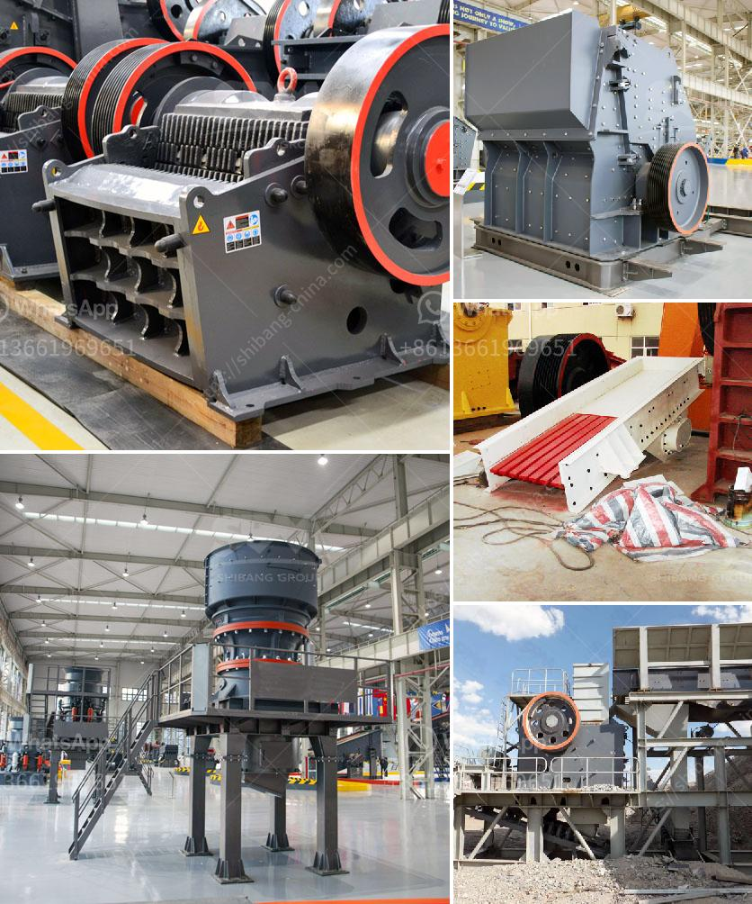

<h3>What is the total cost of a 100 TPH crusher plant?</h3>
When evaluating the cost of crusher plant, you have to consider many factors. This article will serve as a guide to help you understand the total cost of a crusher plant.

The main factors that will affect the cost of a crusher plant are the quality, size, and specification of the equipment, the raw material used, the labor required to operate the plant, as well as other overhead expenses. Let's break down these factors one by one.

Firstly, the quality and specification of the equipment will directly impact the cost. A 100 TPH crusher plant requires both primary and secondary crushers to achieve the desired crushing potential. The size and specifications of each crusher are different. Thus, the investment cost calculations for primary crushers are compared differently than secondary crushers.

Secondly, the raw materials used in the plant will also affect the total cost. The hardness, abrasiveness, and moisture content of the ore will determine the type of crushers required and the crushing stages needed. Certain materials may require pre-screening to maximize the plant’s efficiency. The cost of these raw materials will be considered in the overall plant cost.

Another factor is the labor required to operate the plant. The cost of labor varies from region to region and depends on the complexity of the crusher plant. Labor includes not only the primary crusher operator but also other supporting personnel like electricians, mechanics, and maintenance workers.

Apart from these direct costs, there are other overhead expenses that need to be accounted for. These include the cost of electricity and fuel consumed by the plant, transportation and logistics costs for raw materials and finished products, and general maintenance costs. Additionally, you may need to factor in administrative expenses, such as permits and licenses, as well as insurance costs.

To accurately calculate the total cost of a crusher plant, it is important to consider all these factors and carefully evaluate each one. Consulting with crusher plant manufacturers and experts is a wise choice to help you determine the best configuration and estimate the cost of the plant.

As a general rule, a 100 TPH crusher plant will require an investment budget of about 1 million dollars. However, with fluctuations in the market and the nature of the business, it is best to approach manufacturers for an accurate quote. They will take into account your specific requirements and provide you with a more accurate estimation.

In conclusion, the total cost of a 100 TPH crusher plant will vary depending on the quality, size, and specification of the equipment, the raw material used, labor costs, overhead expenses, and other factors. By carefully evaluating these factors, you can find the best value for your investment and ensure the success of your crusher plant.
<h3>Contact us</h3><ul><li><strong>Whatsapp:&nbsp;<a href="https://wa.me/8613661969651">+8613661969651</a></strong></li><li><a href="https://swt.shibang-china.com/?git&amp;zhl&amp;What is the total cost of a 100 TPH crusher plant"><strong>Online Service(chat now)</strong></a></li></ul><h3>Related</h3><ul><li><a href='What can dolomite be used for and how to processing it.md'>What can dolomite be used for and how to processing it?</a></li><li><a href='What does aggregate crusher mean.md'>What does "aggregate crusher" mean?</a></li><li><a href='What is the yield in mineral processing.md'>What is the yield in mineral processing?</a></li><li><a href='What type of motor is used in cement mills.md'>What type of motor is used in cement mills?</a></li><li><a href='What is antimony ore used for.md'>What is antimony ore used for?</a></li></ul>