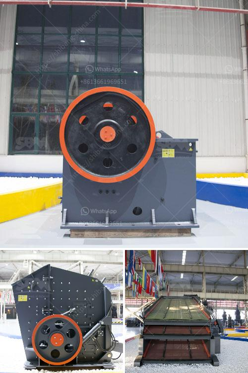

<h3>What is the use of a jaw crusher?</h3>
A jaw crusher is one of the most commonly used crushers in the mining and construction industry due to its ability to crush a variety of materials with high strength and hardness. The jaw crusher is primarily used for crushing different types of materials such as granite, limestone, marble, pebble, and quartz, among others.

One of the key features of a jaw crusher is its ability to crush materials without generating excessive dust and noise. This is especially beneficial in urban areas where noise and dust pollution is a major concern. Additionally, a jaw crusher produces uniform size particles that can be further processed in other equipment, ensuring the overall efficiency of the project.

The primary function of a jaw crusher is to reduce large-sized ore or rocks into smaller pieces. The machine is capable of providing several outputs depending on the desired specifications of the final product. One can choose from various sizes of jaw crushers according to their specific needs.

In mining operations, a jaw crusher is used to reduce large rocks into smaller pieces. This process is accomplished through the use of two jaw plates, one stationary and one movable. The material is fed into the jaws and crushed by the squeezing action between them. The discharge opening of the jaw crusher controls the size of the particles being crushed, ensuring that only the desired material passes through.

Jaw crushers are also widely used in the construction industry for recycling concrete and other construction waste. This process involves crushing the material and reducing it to a small size that can be reused or disposed of properly. This not only reduces the environmental impact but also saves on the cost of materials for construction projects.

Furthermore, the jaw crusher is often used in aggregate production to produce smaller sized stones for ready mix concrete or asphalt mix. By crushing larger rocks, these can be transformed into a more manageable size, which can then be used for various purposes in construction projects.

The versatility of a jaw crusher arises from its ability to handle different types of materials with different characteristics. The strong and durable construction of the machine allows it to withstand heavy use and provide reliable performance even in the toughest conditions.

In conclusion, a jaw crusher plays a vital role in various industries such as mining, construction, and recycling. It is used to crush materials of high strength and hardness, reducing them to smaller particles for further processing. The jaw crusher provides a cost-effective and efficient solution for a wide range of applications, ensuring the success and productivity of various projects.
<h3>Contact us</h3><ul><li><strong>Whatsapp:&nbsp;<a href="https://wa.me/8613661969651">+8613661969651</a></strong></li><li><a href="https://swt.shibang-china.com/?git&amp;zhl&amp;What is the use of a jaw crusher"><strong>Online Service(chat now)</strong></a></li></ul><h3>Related</h3><ul><li><a href='What equipment do you need to start a quarry business.md'>What equipment do you need to start a quarry business?</a></li><li><a href='What is a ball mill and how does it function.md'>What is a ball mill and how does it function?</a></li><li><a href='What type of couplings are generally used for a gyratory crusher.md'>What type of couplings are generally used for a gyratory crusher?</a></li><li><a href='What is the smallest size of output for a hammer crusher.md'>What is the smallest size of output for a hammer crusher?</a></li><li><a href='What do crusher model letters represent.md'>What do crusher model letters represent?</a></li></ul>